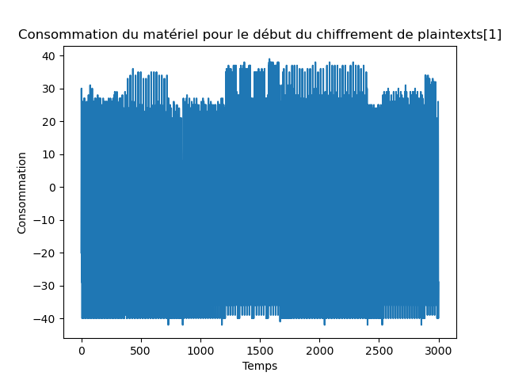
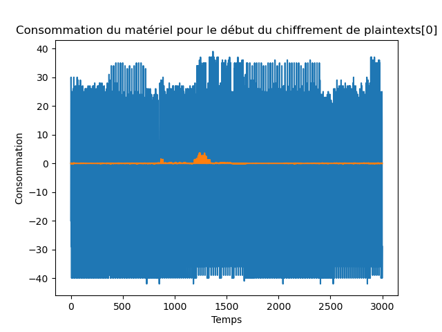

# Puisse Kocher être avec vous

> Nous avons pu interpeller un membre de Hallebarde qui envoyait des messages chiffrés dans toute la France. En fouillant chez lui nous avons trouvé les outils qu'il utilisait pour envoyer ses messages, cependant il nous est impossible d'en extraire directement la clef de chiffrement. Nous avons donc collecté des informations sur le dispositif en analysant sa consommation d'énergie lors du début du chiffrement mais nous avons besoin de votre aide pour en déduire la clef ! Si vous arrivez à déchiffrer ses messages, ce serait une grande avancée pour nous !
>
> Pour chaque texte en clair de plaintext.npy, vous trouverez dans traces.npy la consommation que nous avons récupérée lors du chiffrement (les résultats de ce chiffrement se trouvent dans ciphertext.npy).
>
> Voici l'un des messages qu'il vous faut déchiffrer : 13 ec 78 ae 78 5a 96 a5 63 06 a0 48 2a 77 24 6a 2e 1b e5 48 07 5e c6 d4 8d 76 d2 59 12 37 3d 87

## Description

On obtient des traces de consommation énergétique de l'algorithme de chiffrement. La première chose à faire est d'afficher ces traces.



On remarque déjà qu'il s'agit d'un chiffrement complexe, avec plusieurs étapes qu'on peut voir à l'oeil nu.

Compte tenu du titre et de l'absence de code source, on peut supposer qu'il s'agit d'un algorithme de chiffrement connu et que Kocher a effectué une analyse de side-channel attack dessus.

Il s'agit après quelques recherches d'AES, et plus particulièrement du premier round de l'encryption.

## Fonctionnement d'AES

Pour comprendre comment fonctionne l'attaque, il faut d'abord s'intéresser à comment fonctionne AES.

AES contient un état interne qui est initialisé au texte à chiffrer.
Puis cet état va subir 10 rondes comme décrit ci-dessous:


Nous avons ici affaire au premier round.

Il y a 3 étapes qui nous intéressent:
- `Add round key`: il s'agit pour cette première étape d'un simple XOR entre le texte clair et la clé
- `Substitutive bytes`: il s'agit d'une étape de substitution en utilisant une table de correspondances.
- `Shift Row, Mix Columns`: il s'agit d'opérations linéaires.

La dernière partie est importante, car c'est justement sur cette partie que s'effectue la différentiation au niveau de la consommation électrique.
En effet, plus un byte aura un nombre de bits à 1, plus la consommation électrique sera élevée pour effectuer l'opération linéaire.

Pour tout byte `x`, notons `H(x)` son nombre de bits à 1 (aussi appelé poids de Hamming).

## Principe de l'attaque

Supposons que le premier byte de la clé soit `x`.

Alors il y a deux types de textes clairs:
- ceux qui vont donner un état entre l'étape 2 et l'étape 3 dont le premier byte `w` vérifiera `H(w) < 4`;
- ceux pour lequel l'état sera `H(w) >= 4`.

Entre chaque groupe de texte clairs, il y a une différence significative de consommation électrique.

Notons `H0` et `H1` ces deux groupes.

En revanche, si on prend deux groupes `A` et `B` au hasard, alors avec forte probabilité il y aura dans chaque groupe quelques éléments de `H0` et quelques éléments de `H1`.
Ainsi, pas de différence significative de consommation électrique.

L'attaque est donc la suivante: pour chaque byte de la clé, on va supposer qu'il est égal à une valeur `y`, puis séparer les textes clairs en deux groupes `A` et `B`.

On peut alors calculer la différence de consommation électrique pour ces deux groupes.

Le byte qui donne la plus grande différence sera le bon byte.

Voici un exemple de différence de consommation électrique avec le bon byte:



L'attaque complète:

```python
import numpy as np
import matplotlib.pyplot as plt
from Crypto.Cipher import AES

plaintexts=np.load('plaintext.npy')
traces=np.load('traces.npy')
ciphertext=np.load('ciphertext.npy')

# sbox copiée sur internet
sbox = [0x63, 0x7c, 0x77, 0x7b, 0xf2, 0x6b, 0x6f, 0xc5, 0x30, 0x01, 0x67, 0x2b, 0xfe, 0xd7, 0xab, 0x76,
0xca, 0x82, 0xc9, 0x7d, 0xfa, 0x59, 0x47, 0xf0, 0xad, 0xd4, 0xa2, 0xaf, 0x9c, 0xa4, 0x72, 0xc0,
0xb7, 0xfd, 0x93, 0x26, 0x36, 0x3f, 0xf7, 0xcc, 0x34, 0xa5, 0xe5, 0xf1, 0x71, 0xd8, 0x31, 0x15,
0x04, 0xc7, 0x23, 0xc3, 0x18, 0x96, 0x05, 0x9a, 0x07, 0x12, 0x80, 0xe2, 0xeb, 0x27, 0xb2, 0x75,
0x09, 0x83, 0x2c, 0x1a, 0x1b, 0x6e, 0x5a, 0xa0, 0x52, 0x3b, 0xd6, 0xb3, 0x29, 0xe3, 0x2f, 0x84,
0x53, 0xd1, 0x00, 0xed, 0x20, 0xfc, 0xb1, 0x5b, 0x6a, 0xcb, 0xbe, 0x39, 0x4a, 0x4c, 0x58, 0xcf,
0xd0, 0xef, 0xaa, 0xfb, 0x43, 0x4d, 0x33, 0x85, 0x45, 0xf9, 0x02, 0x7f, 0x50, 0x3c, 0x9f, 0xa8,
0x51, 0xa3, 0x40, 0x8f, 0x92, 0x9d, 0x38, 0xf5, 0xbc, 0xb6, 0xda, 0x21, 0x10, 0xff, 0xf3, 0xd2,
0xcd, 0x0c, 0x13, 0xec, 0x5f, 0x97, 0x44, 0x17, 0xc4, 0xa7, 0x7e, 0x3d, 0x64, 0x5d, 0x19, 0x73,
0x60, 0x81, 0x4f, 0xdc, 0x22, 0x2a, 0x90, 0x88, 0x46, 0xee, 0xb8, 0x14, 0xde, 0x5e, 0x0b, 0xdb,
0xe0, 0x32, 0x3a, 0x0a, 0x49, 0x06, 0x24, 0x5c, 0xc2, 0xd3, 0xac, 0x62, 0x91, 0x95, 0xe4, 0x79,
0xe7, 0xc8, 0x37, 0x6d, 0x8d, 0xd5, 0x4e, 0xa9, 0x6c, 0x56, 0xf4, 0xea, 0x65, 0x7a, 0xae, 0x08,
0xba, 0x78, 0x25, 0x2e, 0x1c, 0xa6, 0xb4, 0xc6, 0xe8, 0xdd, 0x74, 0x1f, 0x4b, 0xbd, 0x8b, 0x8a,
0x70, 0x3e, 0xb5, 0x66, 0x48, 0x03, 0xf6, 0x0e, 0x61, 0x35, 0x57, 0xb9, 0x86, 0xc1, 0x1d, 0x9e,
0xe1, 0xf8, 0x98, 0x11, 0x69, 0xd9, 0x8e, 0x94, 0x9b, 0x1e, 0x87, 0xe9, 0xce, 0x55, 0x28, 0xdf,
0x8c, 0xa1, 0x89, 0x0d, 0xbf, 0xe6, 0x42, 0x68, 0x41, 0x99, 0x2d, 0x0f, 0xb0, 0x54, 0xbb, 0x16]

def hamming(x):
    c = 0
    for i in range(8):
        if x&(1<<i):
            c += 1
    return c

def find_byte_of_key(b):
    maximum = 0
    index_of_max = 0
    for key in range(256):
        hamming_high = []
        hamming_low = []
        for i in range(len(plaintexts)):
            if hamming(sbox[plaintexts[i][b] ^ key]) >= 4:
                hamming_high.append(traces[i].copy())
            else:
                hamming_low.append(traces[i].copy())
        hamming_high_trace = np.zeros(len(hamming_high[0]))
        for trace in hamming_high:
            hamming_high_trace = hamming_high_trace + trace
        hamming_high_trace /= len(hamming_high)
        hamming_low_trace = np.zeros(len(hamming_low[0]))
        for trace in hamming_low:
            hamming_low_trace = hamming_low_trace + trace
        hamming_low_trace /= len(hamming_low)
        difference = hamming_high_trace - hamming_low_trace
        diff = max(difference) - min(difference)
        if diff > maximum:
            maximum = diff
            index_of_max = key
    return index_of_max

key = []
for i in range(16):
    key.append(find_byte_of_key(i))
print(key)

ciphertext = bytes.fromhex("13ec78ae785a96a56306a0482a77246a2e1be548075ec6d48d76d25912373d87")
cipher = AES.new(key, AES.MODE_ECB)
print(cipher.decrypt(ciphertext))
```

Flag: `404CTF{P3r50nn3_p3ut_n0u5_l1r3!}`