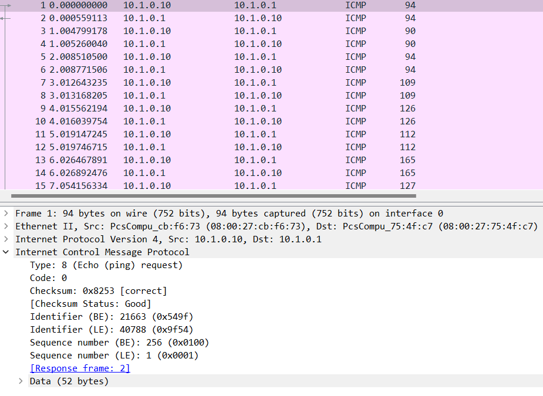

# Ping pong

> Nous avons repéré une communication bizarre provenant des serveurs de Hallebarde. On soupçonne qu'ils en aient profité pour s'échanger des informations vitales. Pouvez-vous investiguer ?

## Description

On nous fournit une capture réseau contenant des paquets ICMP (ping).



On remarque que les tailles des paquets sont différentes, alors que les ping sont censés être de même taille.

De plus, on voit les tailles des premiers paquets: 94, 90, 94: le premier et troisième paquet ont la même longueur, et le second est 4 de moins, comme les codes ASCII de `404`.

En regardant de plus près, la taille du payload du paquet est exactement le code ASCII de `404`, donc le flag est probablement caché ici.

## Solution

Le script Python suivant permet de récupérer le flag:

```python
from scapy.all import *

flag = []

for packet in rdpcap('ping.pcapng'):
    if packet['IP'].src != "10.1.0.10":
        continue
    flag.append(len(packet) - 42)

print("".join([chr(x) for x in flag]))
```

Flag: `404CTF{Un_p1ng_p0ng_p4s_si_1nn0c3nt}`.