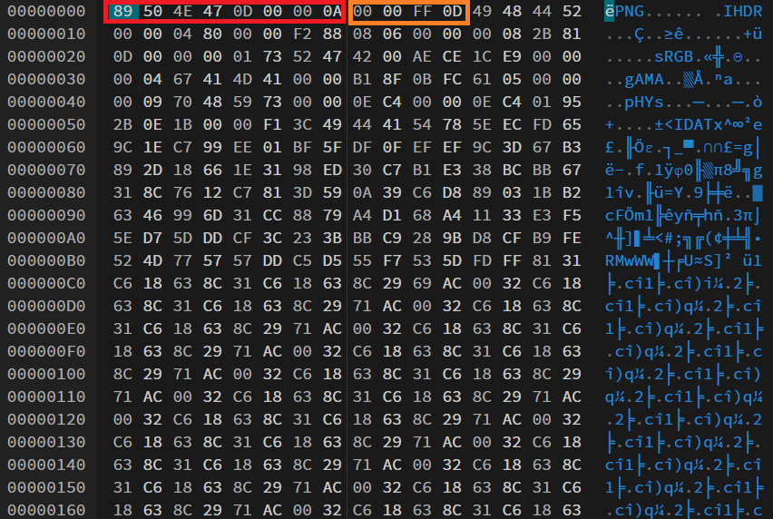
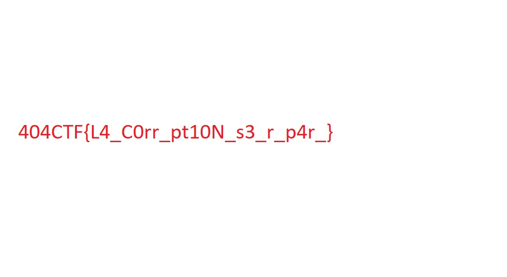

# SOS RAID

Le challenge est décomposé en deux parties qui se suivent.

## Partie 1

> Nous avons réussi à infiltrer Hallebarde et à exfiltrer des données. Cependant nos agents se sont fait repérer durant la copie et ils n'ont pas pu copier l'intégralité des données. Pouvez-vous analyser ce qu'ils ont réussi à récupérer ?

On nous donne deux fichiers `disk0.img` et `disk1.img` ainsi qu'un manuel:

> Type de RAID : 5
>
> Taille des blocs : 1 octet
>
> https://fr.wikipedia.org/wiki/RAID_(informatique)#RAID_5_:_volume_agr%C3%A9g%C3%A9_par_bandes_%C3%A0_parit%C3%A9_r%C3%A9partie

### Description

Comme conseillé par le manuel, je vais voir la page Wikipedia.

J'y apprends la structure d'un volume RAID: la donnée à sauvegarder est découpée en blocs.
Puis, s'il y a N disques, alors la donnée est découpée en paquets de N-1 blocs.

Pour chaque paquet de N-1 blocs, un disque est choisi (d'abord le disque N-1, puis N-2, etc...). Les autres disques vont contenir chaque bloc, et le disque choisi contient la somme des N-1 blocs.

Ainsi, la perte d'un seul disque permet de retrouver la donnée.

On nous donne ici 2 disques, et vu leur nom on sait qu'on a les disques 0 et 1, donc on suppose qu'il manque le disque 2, et on va reconstruire la donnée.

### Solution

Si la donnée initiale est composée des blocs `B0, B1, B2, ...`, alors la répartition dans les disques est faite ainsi:

| Disque 0 | Disque 1 | Disque 2 |
|----------|----------|----------|
|    B0    |    B1    |  B0 ^ B1 |
|    B2    |  B2 ^ B3 |    B3    |
|    ...   |    ...   |    ...   |

On peut donc reconstruire le disque original ainsi:

```python
with open("disk0.img", "rb") as f:
    disk0 = f.read()
with open("disk1.img", "rb") as f:
    disk1 = f.read()

disk2 = []
for i in range(len(disk0)):
    disk2.append(disk0[i] ^ disk1[i])
disk2 = bytes(disk2)

disks = [disk0, disk1, disk2]

current_save = 2
with open("disk.img", "wb") as f:
    for i in range(len(disk0)):
        for j in range(3):
            if j == current_save:
                continue
            f.write(bytes([disks[j][i]]))
        current_save -= 1
        if current_save < 0:
            current_save += 3
```

On obtient alors le disque original. 
J'extrais les fichiers à l'intérieur grâce à `binwalk -e disk.img`: il y a deux archives ZIP, et l'archive contenant `flag.txt` contient le flag.

Flag: `404CTF{RAID_5_3st_p4s_tr3s_c0mpl1qu3_1abe46685ecf}`

## Partie 2

> Bravo, vous avez réussi à récupérer les données. Cependant, il s'avère que l'un des fichiers a été corrompu pendant la copie. Pouvez-vous le réparer pour en extraire des informations ?

### Description

La seconde archive contient une image cassée `flag_c0rr_pt3d.png`. Il s'agit de réparer l'image.

Pour ce faire, j'ouvre l'image avec un [éditeur héxadécimal](https://hexed.it/).

### Rappel sur la structure PNG

Un fichier PNG est composé au minimum [[1]](https://fr.wikipedia.org/wiki/Portable_Network_Graphics):
- d'une signature `89 50 4E 47 0D 0A 1A 0A`;
- d'un chunk `IHDR` (header);
- de chunks `IDAT` (données);
- d'un chunk `IEND` (fin).

Il peut également avoir des chunks supplémentaires.

Chaque chunk est composé:
- de la longueur de son contenu encodée sur 4 octets
- des 4 octets indiquant sa signature
- de son contenu
- d'une somme de contrôle CRC sur 4 octets.

### Solution

On remarque que le fichier est mal formé:



On a une mauvaise signature (encadré rouge) et la mauvaise longueur pour la header `IHDR`, qui devrait être `00 00 00 0D`. Je remplace donc ces octets et j'exporte l'image.

J'obtiens alors une image toute en hauteur (la hauteur est probablement fausse), mais si je zoom j'obtiens le flag.

Image complète :


Image zoomée :



Flag: `404CTF{L4_C0rr_pt10N_s3_r_p4r_}`