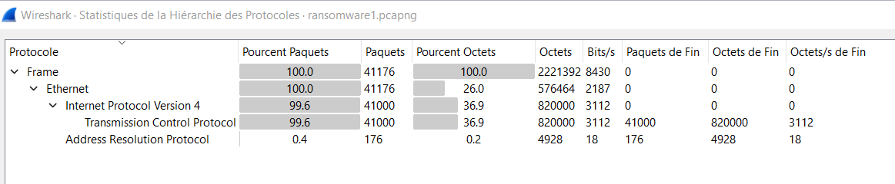
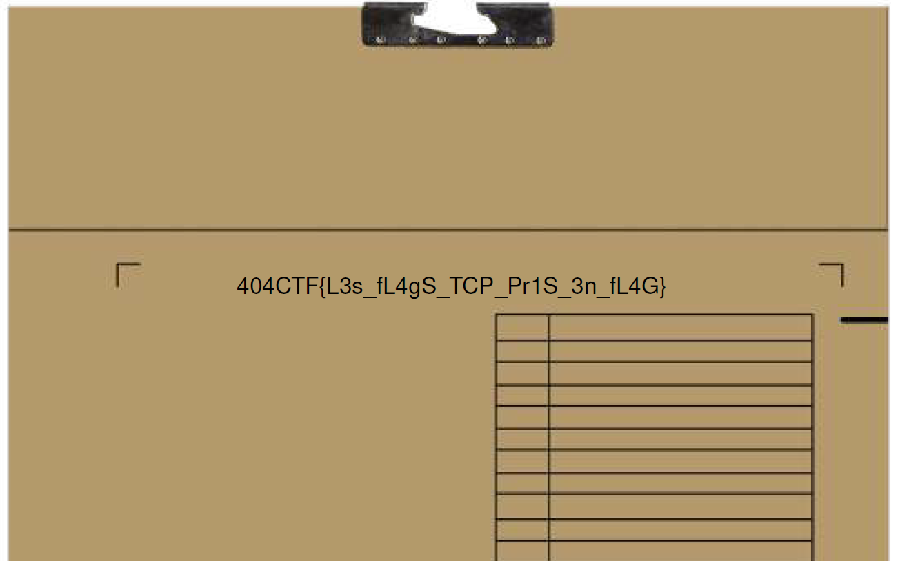

# Hackllebarde ransomware [1/4]

> Alerte, nous sommes attaqués ! Un ransomware vient de frapper l'infrastructure de notre centre de commandement ! Hors de question de payer la rançon.
>
> Comme vous êtes notre meilleur élément, nous vous chargeons de la gestion de cette crise. Nous pourrions faire une simple réinstallation avec nos sauvegardes, mais nous souhaitons récupérer avant tout le plus d'informations. Avant de nous intéresser à l'origine de ce malware, nous devons trouver si des informations confidentielles ont été exfiltrées afin de prendre les mesures appropriées. Nous avons pu enregistrer un trafic réseau suspect, mais impossible de savoir ce qu'il contient. Jetez-y un oeil !

On nous donne une capture réseau à analyser. Je commence par analyser les protocoles présents dans la capture en allant dans le menu `Statistiques -> Hiérarchie des protocoles`.



C'est une capture étrange, il n'y a presque que des paquets TCP, mais pas de protocoles de plus haut niveau.

Par ailleurs, je remarque que la plupart des paquets sont en rouge dans la capture. Cela est dû aux flags TCP qui n'ont pas l'air corrects...

Mon avis est que ces flags sont utilisés pour exfiltrer la donnée.

Les paquets font un aller-retour entre deux hôtes, 
je décide de récupérer ces flags (pour une seule direction, et pour les deux). Le code suivant permet de récupérer le bon fichier:

```python
from scapy.all import *

with open("output", "wb") as f:
    for packet in rdpcap('ransomware1.pcapng'):
        if 'IP' not in packet or packet['IP'].src != "172.17.0.1":
            continue
        f.write(bytes([bytes(packet)[0x2f]]))
```

Il s'agit d'un PDF, je l'ouvre et je trouve le flag.



Flag: `404CTF{L3s_fL4gS_TCP_Pr1S_3n_fL4G}`