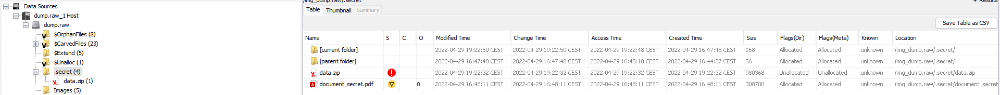
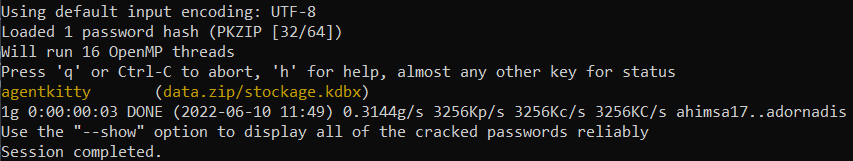
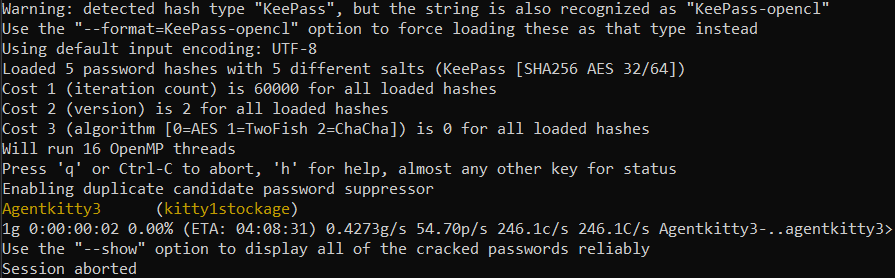
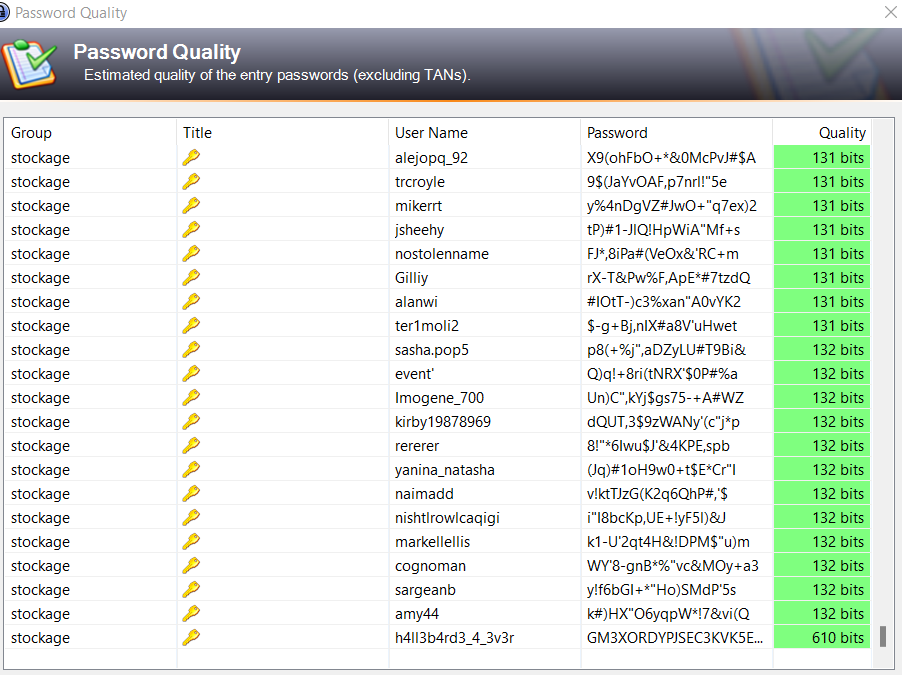
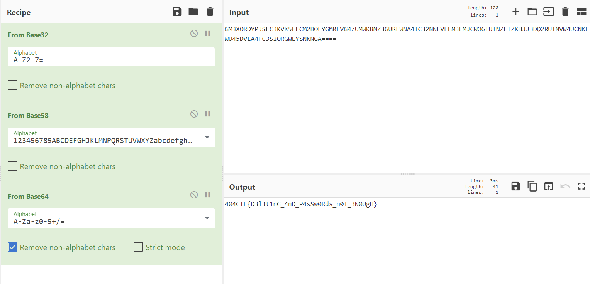

# Hackllebarde ransomware [3/4]

> Alors que nous enquêtions sur ce ransomware, les agents de sécurité du batiment ont arrêté un individu suspect qui tentait de s'enfuir de notre complexe. Nous avons trouvé une clé USB sur lui, mais elle ne semble rien contenir d'intéressant, vous pouvez vérifier ?

## Description

On nous donne le dump d'une clé USB.
Je l'ouvre avec Autopsy pour voir ce qu'il y a dedans.



On trouve quelques fichiers intéressants:
- 3 images de chat
- 1 autre image de chat nommée `document_secret.pdf`
- 1 fichier ZIP `data.zip`

## Partie 1: casser le ZIP

Le fichier ZIP est protégé par mot de passe, donc j'essaie de l'ouvrir avec [JohntheRipper](https://www.openwall.com/john/).

Pour cela, j'extrais le hash du mot de passe:
```bash
~/john/run/zip2john data.zip > johndata.zip
```

Puis je cracke le mot de passe avec une liste de mots de passe:
```bash
~/john/run/john  --wordlist=rockyou.txt johnzip
```



On obtient donc le mot de passe, et on peut extraire le contenu de l'archive.

On obtient une base de donnée de mots de passe `stockage.kdbx`.

## Partie 2: ouvrir la base de données

J'ai d'abord tenté d'ouvrir la base de données avec `rockyou.txt`, mais cela n'a rien donné.

Après quelques jours passés à chercher si un mot de passe n'était pas caché dans les images ou le reste de la clé USB, j'ai finalement abandonné et acheté un indice:

> Une fois que vous avez cassé un mot de passe, pas besoin de repartir de zéro...

Ah, donc il faut probablement partir du mot de passe trouvé ! Mes idées pour le cracker:
- trouver des variations de ce mot de passe
- faire une liste avec 2 mots anglais attachés
- faire une liste avec les mots que j'ai trouvé sur le clé USB (cute, kitty, kitten, etc...).

Aucune de ces méthodes ne marchant, j'ai acheté le second indice:

> Un fichier keepass ne s'ouvre pas forcément qu'avec un mot de passe...

Mais bien sûr... Keepass peut également demander un fichier supplémentaire en addition du mot de passe.


Je retente donc mes méthodes, cette fois-ci en ajoutant les différentes images trouvées dans la clé comme key file, par exemple:

```bash
echo -n "kitty1" >> johnkdbx && ~/john/run/k
eepass2john -k kitty_cute1.jpg stockage.kdbx >> johnkdbx
```

Je mets tous les hash pour chaque key file possible dans le même fichier.

Enfin, je crée une wordlist avec seulement `agentkitty` dedans, et cherches toutes les variations de mot de passe:

```bash
~/john/run/john --wordlist=agentkitty --rule
s=All johnkdbx
```



Super, donc maintenant on peut ouvrir la base de données !

## Partie 3: trouver le flag

Le problème est qu'on a vraiment beaucoup, beaucoup de mots de passe.

J'ai essayé de faire une recherche avec 404CTF, flag ou même hallebarde mais sans succès.

Puis j'ai tenté de voir s'il n'y avait pas de mot de passe faible: dans `Find -> Password Quality`.



Tiens tiens, un mot de passe à 610 bits. Je pense que j'ai trouvé mon flag.

Je le mets dans [Cyberchef](https://gchq.github.io/CyberChef) et voilà le flag (Cyberchef trouve tout seul le bon encodage avec l'outil magique).



Flag: `404CTF{D3l3t1nG_4nD_P4sSw0Rds_n0T_3N0UgH}`