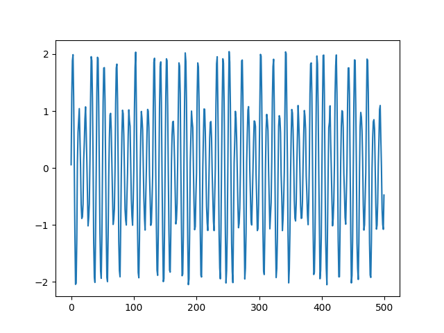

# 8 vers 10

> Bonjour agent,
>
> Nous avons intercepté un message d'un membre de Hallebarde. Trouvez les informations qu'il a envoyé le plus vite possible.
>
> Au fait, certains de leurs agents ne chiffrent pas leurs messages, et je pense que celui-ci en fait partie.
>
> Bonne chance !

On nous donne un fichier avec un nombre flottant par ligne.

Je décide alors de tracer le signal:

```python
import matplotlib.pyplot as plt

with open("8vers10.txt") as f:
    data = [float(x) for x in f.read().strip().split("\n")]

plt.figure()
plt.plot(data[:500])
plt.show()
```



On remarque très vite des bits 1 ou 0, un bit 0 étant transmis avec une amplitude de 2V et un bit 1 avec une amplitude de 4V.

Je récupère donc les bits:

```python
bits = []
maximum = 0
for i in range(len(data)-1):
    if data[i] < 0 and data[i+1] >= 0:
        bits.append(str(int(maximum >= 1.5)))
        maximum = 0
    maximum = max(maximum, data[i])
bits.append(str(int(maximum >= 1.5)))
```

Cependant, ce n'est pas de l'ASCII.
Je vois cependant qu'il y a 330 bits.
Je me tourne alors vers le titre du challenge: 8 vers 10, sachant qu'un caractère ASCII est codé sur 8 bits, et que là j'ai un multiple de 10 bits, peut être qu'il existe un encodage de caractères sur 10 bits.

Après quelques recherches, je tombe sur le [codage 8b/10b](https://fr.wikipedia.org/wiki/Codage_8b/10b).

Il a même une [bibliothèque Python](https://github.com/olagrottvik/encdec8b10b).

Je peux donc décoder:

```python
from encdec8b10b import EncDec8B10B

groups = ["".join(bits[i:i+10]) for i in range(0,len(bits), 10)]

decoded = []
for x in groups:
    decoded.append(EncDec8B10B.dec_8b10b(int(x, 2))[1])
print(bytes(decoded))
```

Flag: `404CTF{d3C0d3r_l3_8b10b_c_f4c1l3}`.