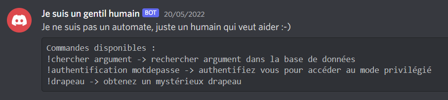
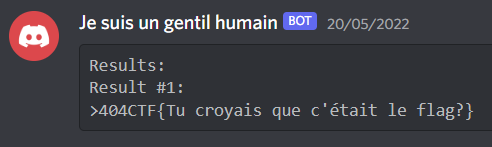
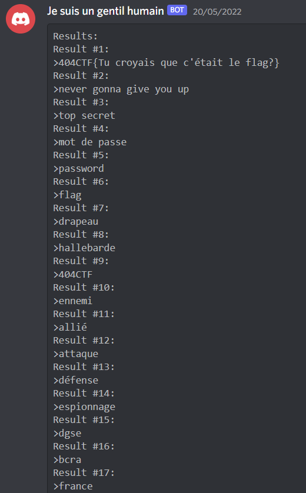
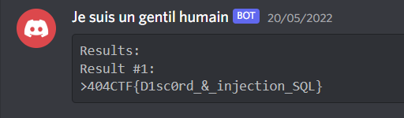
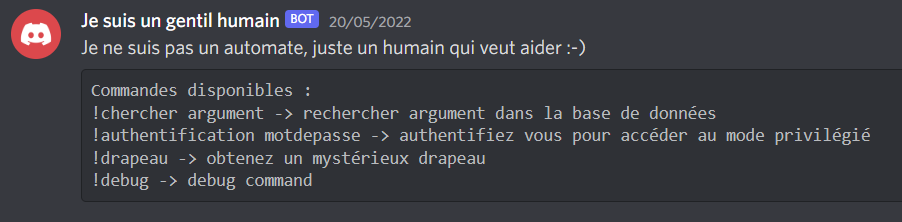
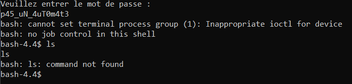
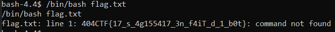

# Un utilisateur suspicieux

Ce challenge est décomposé en deux parties qui se suivent.

## Partie 1

> Il semblerait qu'il y ait un utilisateur suspicieux sur le serveur discord du 404CTF. Allez voir ce que veut Je suis un gentil humain#0364

### Description

En parlant au bot, il nous indique de taper `!aide` pour obtenir la liste de commandes, ce que l'on fait.

Bien sûr la commande `!drapeau` requiert d'être authentifié.
Il ne semble pas y avoir de vulnérabilité sur la commande authentification.

En revanche, `chercher` indique que le bot effectue des recherches dans une base de données, et si je tape `!chercher 404CTF` par exemple j'obtiens:

J'imagine qu'il s'agit d'une requête SQL du type `SELECT phrase FROM tableau WHERE phrase LIKE "%{my_input}%"`.

Pour en être sûr, je donne un `%` comme argument, et j'obtiens alors bien toutes les phrases de la base de données.

Je vais donc tenter une injection SQL.

### Solution

De même, j'entre `!chercher '#` et `!chercher "#`.
Le second me renvoie tous les résultats.

Je cherche donc à avoir le type de SQL utilisé, je tente `!chercher " UNION SELECT version()#` et cela me renvoie la version utilisée.

> 10.6.7-MariaDB

Après des recherches infructeuses sur comment retrouver le nom des tables et de colonnes, je me suis dit qu'on cherche un mot de passe, et donc qu'il est peut-être dans une base de données `password`.

Je lance donc la commande `!chercher " UNION SELECT * FROM password#`, et j'obtiens le flag.

Flag: `404CTF{D1sc0rd_&_injection_SQL}`.

## Partie 2

Je peux donc m'authentifier et une nouvelle commande apparaît.

La commande `debug` nous donne juste le message suivant:

On se connecte alors avec `nc challenge.404ctf.fr 31337`.

On se retrouve sur un bash avec peu de commandes disponibles.

Je tente quelques commandes usuelles, et je vois que `pwd` et `echo` marchent.
Je vois aussi que `/bin/bash` existe.
`cd` marche aussi, mais sortir de `/app` indique `Bad system call` et ferme la connection.

Me doutant que le flag est dans le fichier actuel, je tente de l'exécuter: `/bin/bash flag.txt`.

Flag: `404CTF{17_s_4g155417_3n_f4iT_d_1_b0t}`.

*Note: Même si `/bin/bash` n'était pas accessible, la commande `$(<flag.txt)` aurait également fonctionné.*