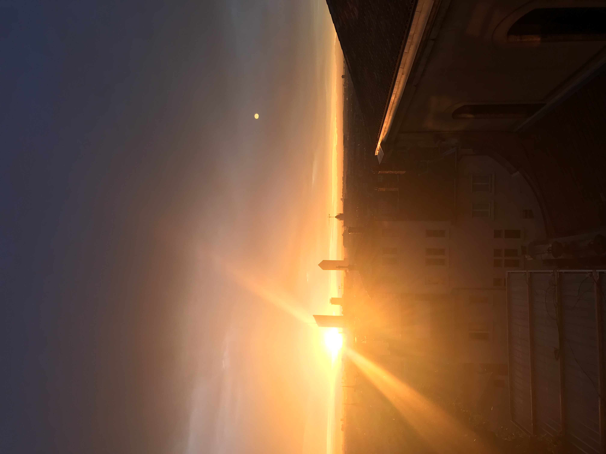
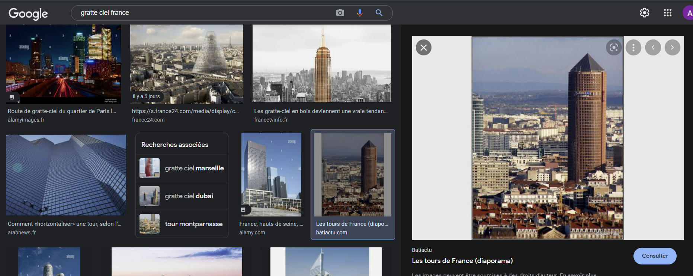
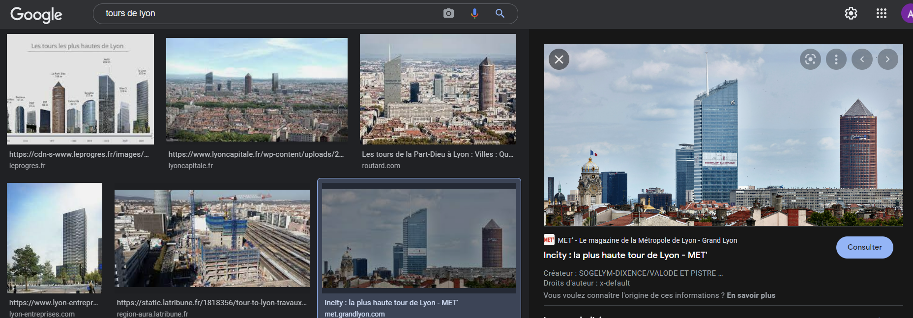
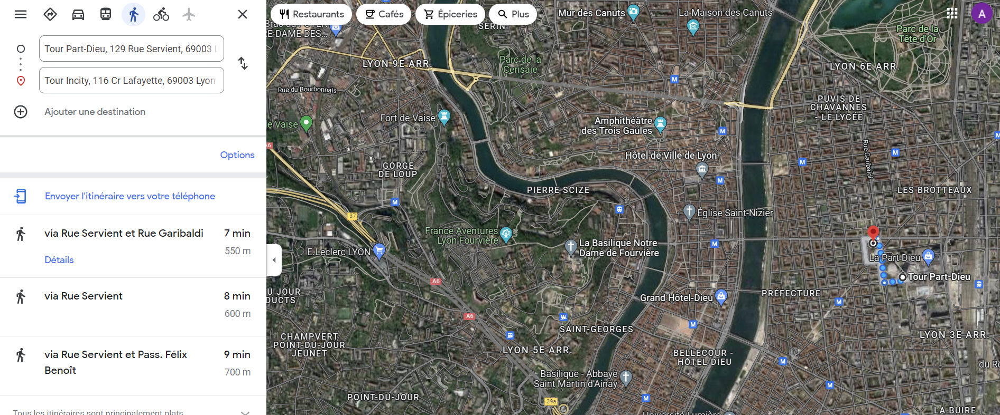
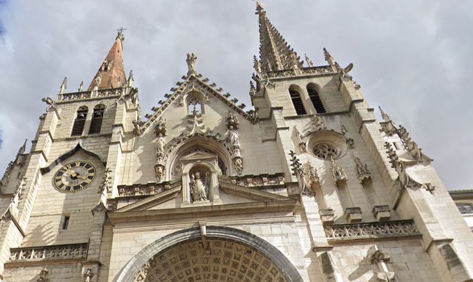
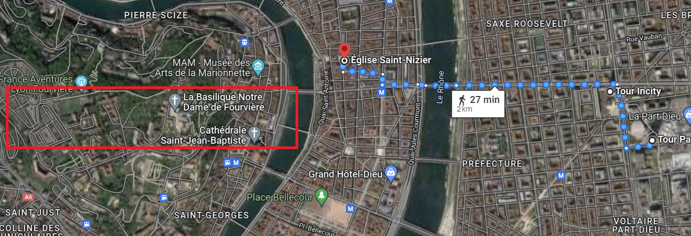
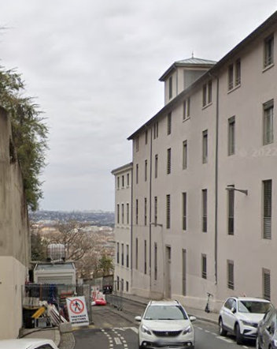

# A l'aube d'un échange

> Nouvelle recrue ! Nous avons besoin de toi par ici. Un de nos agents vient d'intercepter une courte conversation téléphonique entre deux agents de Hallebarde. Un important échange de documents confidentiels doit avoir lieu et pour indiquer l'endroit du rendez-vous, l'un des agents ennemis a envoyé la photo ci-dessous à son collègue tout en précisant ceci :
>
> > Quel beau lever de soleil n'est-ce pas ? J'attendrai dans la rue qui sépare le bâtiment au premier plan de ceux au second plan. Rendez-vous ce soir, 22h00.
>
> Nous avons moins d'une journée pour découvrir le nom de ladite rue et empêcher l'échange !
>
> Format du flag : 404CTF{md5 du nom complet de la rue}
Le nom de la rue doit être en minuscule, inclure le type de rue ( ex : avenue, rue, boulevard... ), sans accents, sans abréviation, et tous les espaces doivent être remplacés par des tirets. Par exemple : si la rue est l'Avenue de Saint-Mandé à Paris, le flag correct est 404CTF{129af9edde5659143536427f9a5f659a}.

## Trouver la ville

On cherche en premier lieu à trouver la ville où a été prise la photo, et pour cela je cherche à identifier l'un des gratte ciel.

En supposant qu'il s'agit d'une ville française, je tape `gratte ciel France` sur Google Images.

J'obtiens un résultat qui semble prometteur:

En cliquant sur le site, j'apprends que la tour en question est peut être la tour Part-Dieu à Lyon.

Je recherche donc les tours de Lyon:

J'ai trouvé la bonne ville, reste maintenant à identifier la bonne rue.

## Trouver la rue

D'après la description, et sachant que le Soleil se lève à l'Est, je sais que la rue que je cherche est à l'Ouest de l'axe formé par la tour Part-Dieu et Incity.

De plus, la rue a l'air d'être assez en hauteur.

Par ailleurs en zoomant sur la photo, je vois sur la gauche deux clochers qui semblent appartenir à la même église ou cathédrale. Je cherche donc les églises à l'Ouest des tours.

Je pense qu'il s'agit de l'Eglise Saint-Nizier.

Je cherche donc plus haut et plus à l'Ouest que cette église.

Je cherche également sur la vision satellite un toit en tôle.

Au vu de la distance sur la photo, nous sommes probablement de l'autre côté du fleuve.

Je réduis donc ma zone de recherche au cadre rouge.

En ragardant tous les toits en tôle, je finis par trouver la maison qui se trouve au second plan:

Nous sommes donc Montée Saint-Barthélémy, ce qui donne le flag grâce à CyberChef.

Flag: `404CTF{eb66c65861da9fe667f26667b3427d2c}`.