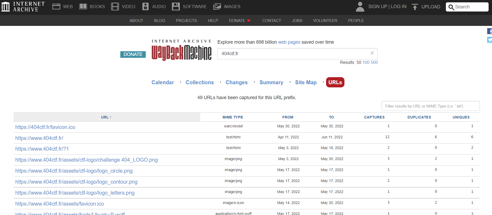
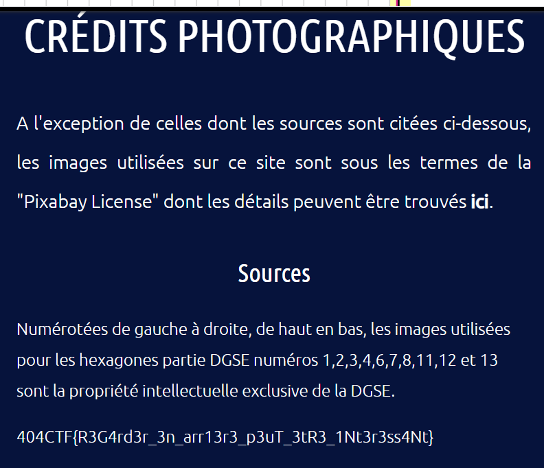

# Collaborateur suspect

> Nous avons eu vent d'une activité étrange qui aurait eu lieu sur la page qui mène à cette interface de mission. Nous soupçonnons une tentative de la part de Hallebarde de nous discréditer, ils nous ont peut-être infiltrés. Des informations confidentielles auraient été brièvement diffusées avant d'être retirées. Pourriez-vous nous dire lesquelles ?
>
> > Attention, https://www.404ctf.fr ne fait PAS partie de la zone de jeu sur laquelle vous pouvez utiliser des méthodes offensives. Il s'agit d'un challenge d'OSINT ! Aucune action ou attaque particulière sur le site web en question n'est nécessaire pour réussir ce challenge.

## Solution

Il s'agit de retrouver une information qui a été effacée sur le site Web.

Pour cela, on va chercher dans les archives du Web:
- [Wayback Machine](https://web.archive.org/)
- [Webpage archive](https://archive.today/)

La page `https://ctf.404ctf.fr/challenges` ne donne rien. Je cherche donc l'information pour l'ensemble du domaine `404ctf.fr`, et je regarde les URL disponibles.

Je trouve finalement le flag sur [l'une des page](https://web.archive.org/web/20220411084948/https://www.404ctf.fr/credit.html).

Flag: `404CTF{R3G4rd3r_3n_arr13r3_p3uT_3tR3_1Nt3r3ss4Nt}`