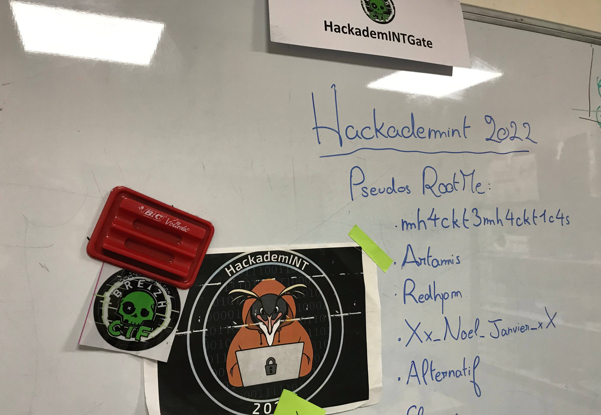

# Nous sommes infiltrés !

> Nouvelle recrue, je peux vous parler en privé ? C'est très urgent...
>
> Nous avons eu vent de nouvelles pratiques de Hallebarde particulièrement insidieuses. Dans le but d'inflitrer la DGSE, Hallebarde recrute de jeunes étudiants en école d'ingénieur. Quel est le lien me direz-vous ? Ils envoient ces étudiants s'inscrire dans les clubs de cybersécurité de ces écoles, et au terme de leur scolarité, ces étudiants sont potentiellement embauchés par nos équipes, sans que l'on se doute de quoi que ce soit !
>
> Nous soupçonnons notamment le club de cybersécurité HackademINT de Télécom SudParis de s'être fait infiltrer en cette fin d'année scolaire. Nous avons récupéré une photo de leur local assez récente. Utilisez la pour identifier le ou les nouveaux membres du club et dénicher une preuve de leur appartenance à Hallebarde.

## Trouver le profil RootMe

Grâce au Discord, je sais déjà que mh4ckt3mh4ckt1c4s, Artamis, Redhpm et Alternatif sont des organisateurs du CTF.

Reste donc Xx_Noel_Janvier_xX, et je trouve son [profil RootMe](https://www.root-me.org/Xx_Noel_Janvier_xX?lang=fr).

On trouve sur cette page son [site Web](https://e10pthes.github.io/about/).

On peut voir sur son site Web son pseudo et son [compte Twitter](https://twitter.com/e10pthes).

Par ailleurs, le site Web est un github.io, donc on peut probablement trouver les sources sur Github.

Grâce au nouveau pseudo trouvé, j'arrive à trouver son [compte Github](https://github.com/e10Pthes).

On voit en particulier deux repos. Le [dernier commit](https://github.com/e10Pthes/about/commit/0e92db3b1cfc38c06225e4fcd8036bca6f86924e) du repo `About` donne un lien vers le [site de hallebarde](http://hallebarde.duckdns.org/).

Cela me permet de trouver le flag.

Flag: `404CTF{Att3nt10n_AU8_V13ux_C0mMiT5}`.