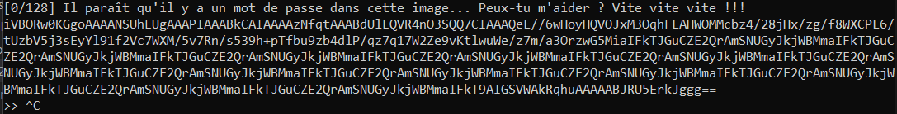
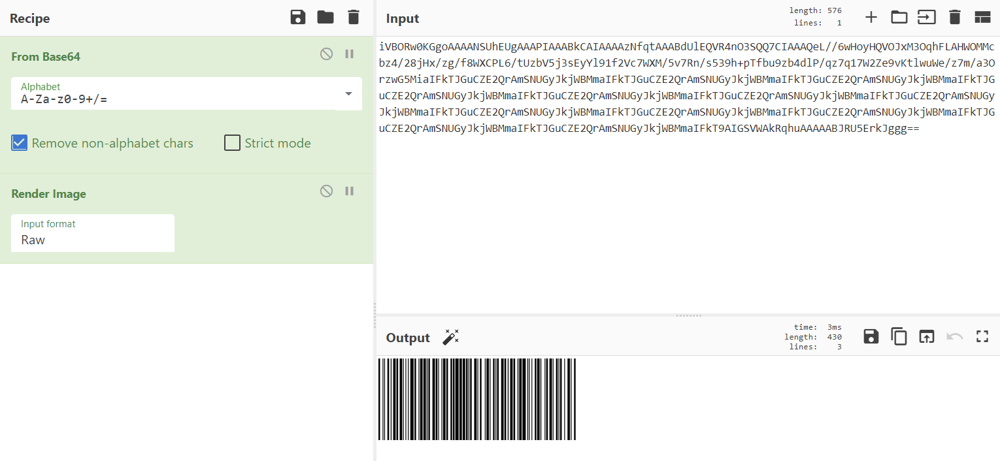

> Nous avons envoyé un agent infiltrer un entrepôt suspect. Hélas le voilà désormais bloqué dans un dédale de portes ! Il semblerait que ces portes ne s'ouvrent qu'avec un code étrange que seuls les robots tueurs patrouillant dans le secteur semblent capables de déchiffrer... Heureusement, cet agent est en contact avec vous ! Aidez-le à décoder ces images et à ouvrir les portes pour qu'il puisse s'échapper ! Attention, si vous êtes trop lent ou que vous faites la moindre erreur, l'alarme retentira... Bonne chance !

> nc challenge.404ctf.fr 30566

## Description

On se connecte, et on nous donne une image encodée en base 64.
Une information est cachée à l'intérieur, et il faudra également réussir l'épreuve 128 fois.



Je la convertis en image grâce à CyberChef pour comprendre de quoi il en retourne.



Il s'agit d'un code barre à déchiffrer.
Au vu du titre du challenge, il s'agit probablement de [code128](https://fr.wikipedia.org/wiki/Code_128#:~:text=Le%20code%20128%20consiste%20en,totale%20est%20de%2011%20unit%C3%A9s.).

J'essaie donc de déchiffrer le code-barre [en ligne](https://products.aspose.app/barcode/fr/recognize/code128#), cependant le code-barre n'est pas détecté...
Le créateur du challenge a probablement enlevé les parties qui permettent de reconnaître le code-barre et gardé uniquement la partie données.

## Code 128

Comme décrit par l'article Wikipedia cité plus haut, le code 128 encode chaque caractère par 11 bits, commençant par une barre noire (bit 1) et se terminant par un espace (bit 0).

Il y a 3 types de codes, donc on peut juste tous les tester pour savoir lequel est utilisé.

## Solution

Le code suivant récupère la donnée du programme, la convertit en image, puis récupère le texte caractère par caractère, avec l'assomption que:
- la data commence directement
- 1 pixel correspond à 1 bit
- l'image est identique à sa première ligne.

```python
from pwn import *
from PIL import Image
from io import BytesIO
import base64
import numpy as np

# Copied from http://en.wikipedia.org/wiki/Code_128
# Value Weights 128A    128B    128C
CODE128_CHART = """
0       212222  space   space   00
1       222122  !       !       01
2       222221  "       "       02
3       121223  #       #       03
4       121322  $       $       04
5       131222  %       %       05
6       122213  &       &       06
7       122312  '       '       07
8       132212  (       (       08
9       221213  )       )       09
10      221312  *       *       10
11      231212  +       +       11
12      112232  ,       ,       12
13      122132  -       -       13
14      122231  .       .       14
15      113222  /       /       15
16      123122  0       0       16
17      123221  1       1       17
18      223211  2       2       18
19      221132  3       3       19
20      221231  4       4       20
21      213212  5       5       21
22      223112  6       6       22
23      312131  7       7       23
24      311222  8       8       24
25      321122  9       9       25
26      321221  :       :       26
27      312212  ;       ;       27
28      322112  <       <       28
29      322211  =       =       29
30      212123  >       >       30
31      212321  ?       ?       31
32      232121  @       @       32
33      111323  A       A       33
34      131123  B       B       34
35      131321  C       C       35
36      112313  D       D       36
37      132113  E       E       37
38      132311  F       F       38
39      211313  G       G       39
40      231113  H       H       40
41      231311  I       I       41
42      112133  J       J       42
43      112331  K       K       43
44      132131  L       L       44
45      113123  M       M       45
46      113321  N       N       46
47      133121  O       O       47
48      313121  P       P       48
49      211331  Q       Q       49
50      231131  R       R       50
51      213113  S       S       51
52      213311  T       T       52
53      213131  U       U       53
54      311123  V       V       54
55      311321  W       W       55
56      331121  X       X       56
57      312113  Y       Y       57
58      312311  Z       Z       58
59      332111  [       [       59
60      314111  \       \       60
61      221411  ]       ]       61
62      431111  ^       ^       62
63      111224  _       _       63
64      111422  NUL     `       64
65      121124  SOH     a       65
66      121421  STX     b       66
67      141122  ETX     c       67
68      141221  EOT     d       68
69      112214  ENQ     e       69
70      112412  ACK     f       70
71      122114  BEL     g       71
72      122411  BS      h       72
73      142112  HT      i       73
74      142211  LF      j       74
75      241211  VT      k       75
76      221114  FF      l       76
77      413111  CR      m       77
78      241112  SO      n       78
79      134111  SI      o       79
80      111242  DLE     p       80
81      121142  DC1     q       81
82      121241  DC2     r       82
83      114212  DC3     s       83
84      124112  DC4     t       84
85      124211  NAK     u       85
86      411212  SYN     v       86
87      421112  ETB     w       87
88      421211  CAN     x       88
89      212141  EM      y       89
90      214121  SUB     z       90
91      412121  ESC     {       91
92      111143  FS      |       92
93      111341  GS      }       93
94      131141  RS      ~       94
95      114113  US      DEL     95
96      114311  FNC3    FNC3    96
97      411113  FNC2    FNC2    97
98      411311  ShiftB  ShiftA  98
99      113141  CodeC   CodeC   99
100     114131  CodeB   FNC4    CodeB
101     311141  FNC4    CodeA   CodeA
102     411131  FNC1    FNC1    FNC1
103     211412  StartA  StartA  StartA
104     211214  StartB  StartB  StartB
105     211232  StartC  StartC  StartC
106     2331112 Stop    Stop    Stop
""".split()

CODE128A = dict(zip(CODE128_CHART[1::5], CODE128_CHART[3::5]))

def convert(data):
    im = Image.open(BytesIO(base64.b64decode(data)))

    image_data = np.array(im)[0,:im.width,0]

    decoded = [""] * (len(image_data) // 11)
    for i in range(0,len(image_data),11):
        current = 1
        for j in range(1,11):
            if image_data[i+j] == image_data[i+j-1]:
                current += 1
            else:
                decoded[i//11] += str(current)
                current = 1
        decoded[i//11] += str(current)

    return "".join([CODE128A[x] for x in decoded])

sh = remote("challenge.404ctf.fr", 30566)

for i in range(128):
    print(sh.recvline().decode())
    data = sh.recvline().decode()
    converted = convert(data)
    sh.recvuntil(b">> ")
    sh.sendline(converted.encode())
    sh.recvline()
sh.interactive()
```

On obtient alors le flag.

Flag: `404CTF{W0w_c0d3_128_4_pLUs_4uCuN_s3cr3t_p0uR_t01}`.