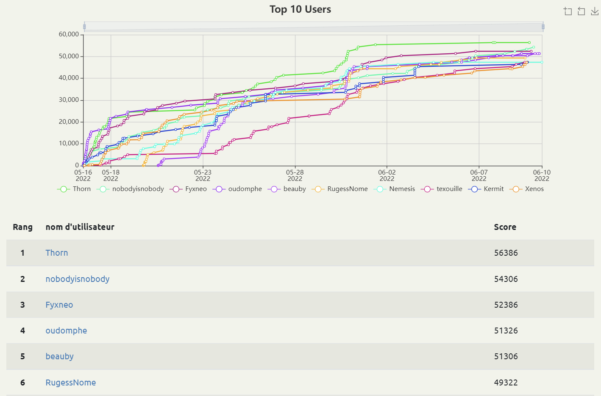

# 404CTF 2022

Challenge [404CTF](https://www.404ctf.fr/) organisé par Télécom SudParis et la DGSE.

Je suis arrivé 6e (sur 2459) avec 49322 points.

## Épreuves par catégorie

### Analyse forensique

| Épreuve | Points | Résolu |
|:-------:|:------:|:------:|
| Floppy  | 100 | :white_check_mark: |
| [Ping Pong](Forensics/PingPong.md) | 832 | :white_check_mark: |
| [Un agent compromis](Forensics/AgentCompromis.md) | 867 + 919 + 989 | :white_check_mark: |
| [SOS RAID](Forensics/RAID.md) | 960 + 981 | :white_check_mark: |
| [Hackllebarde ransomware 1](Forensics/Ransomware1.md) | 968 | :white_check_mark: |
| [Hackllebarde ransomware 2](Forensics/Ransomware2.md) | 997 | :white_check_mark: |
| [Hackllebarde ransomware 3](Forensics/Ransomware3.md) | 1000 | :white_check_mark: |

### Rétro-ingénierie

| Épreuve | Points | Résolu |
|:-------:|:------:|:------:|
| Mot de passe | 100 | :white_check_mark: |
| [Renverse la tour](Reverse/Tour.md) | 866 + 982 | :white_check_mark: |
| [Mise à jour](Reverse/MaJ.md) | 978 + 992 | :white_check_mark: |
| Frida-Me | 999 | :white_check_mark: |
| Nos amies les portes | 1000 | :white_check_mark: |
| [Changement d'architecture 1](Reverse/Archi.md) | 1000 | :white_check_mark: |
| Fourchette | 1000 | :white_check_mark: |

### Stéganographie

| Épreuve | Points | Résolu |
|:-------:|:------:|:------:|
| La plume à la main | 100 | :white_check_mark: |
| [PNG](Stegano/PNG.md) | 359 + 931 + 991 + 1000 | :white_check_mark: |
| [Stéréographie](Stegano/Stereographie.md) | 996 | :white_check_mark: |
| La méthode française | 1000 | :x: |

### Web

| Épreuve | Points | Résolu |
|:-------:|:------:|:------:|
| Fiché JS | 100 | :white_check_mark: |
| [Le braquage](Web/Braquage.md) | 876 | :white_check_mark: |
| [Du gâteau](Web/Gateau.md) | 993 | :white_check_mark: |
| En construction | 1000 | :x: |

### Cryptanalyse

| Épreuve | Points | Résolu |
|:-------:|:------:|:------:|
| Une lettre bien mystérieuse | 1000 | :x: |
| Un RSA incassable | 100 | :white_check_mark: |
| [Un Simple Oracle](Crypto/SimpleOracle.md) | 981 + 991 | :white_check_mark: |
| [Weak Signature](Crypto/WeakSignature.md) | 994 | :white_check_mark: |
| [Un point c'est tout](Crypto/UnPointCestTout.md) | 1000 | :white_check_mark: |
| [La fonte des hashs](Crypto/FontedesHash.md) | 979 | :white_check_mark: |
| [Enigma](Crypto/Enigma.md) | 999 | :white_check_mark: |
| [Hackllebarde ransomware 4](Crypto/Ransomware4.md) | 1000 | :white_check_mark: |
| [Puisse Kocher être avec vous](Crypto/Kocher.md) | 1000 | :white_check_mark: |
| [Dégâts collatéraux](Crypto/DegatsCollateraux.md) | 1000 | :white_check_mark: |

### Renseignement en sources ouvertes

| Épreuve | Points | Résolu |
|:-------:|:------:|:------:|
| Equipement désuet | 100 | :white_check_mark: |
| [Collaborateur suspect](OSINT/Collaborateur.md) | 928 | :white_check_mark: |
| [A l'aube d'un échange](OSINT/Aube.md) | 549 | :white_check_mark: |
| [Nous sommes infiltrés !](OSINT/Infiltres.md) | 862 | :white_check_mark: |
| Nom d'une nouvelle recrue ! | 987 | :x: |

### Programmation

| Épreuve | Points | Résolu |
|:-------:|:------:|:------:|
| Compression | 100 | :white_check_mark: |
| [Découpé](Programmation/Decoupe.md) | 791 | :white_check_mark: |
| [128code128](Programmation/128code128.md) | 977 | :white_check_mark: |
| [Données corrompues](Programmation/DonneesCorrompues.md) | 983 | :white_check_mark: |

### Exploitation de binaires

| Épreuve | Points | Résolu |
|:-------:|:------:|:------:|
| Trop facile | 100 | :white_check_mark: |
| [Sans protection](Pwn/SansProtection.md) | 977 | :white_check_mark: |
| [Cache-cache](Pwn/CacheCache.md) | 989 | :white_check_mark: |
| [Patchwork](Pwn/Patchwork.md) | 995 | :white_check_mark: |
| Coffre-fort | 1000 | :x: |
| Changement d'architecture 2 | 1000 | :x: |

### Divers

| Épreuve | Points | Résolu |
|:-------:|:------:|:------:|
| Bienvenue | 50 | :white_check_mark: |
| Discord | 50 | :white_check_mark: |
| Pierre-papier-hallebarde | 100 | :white_check_mark: |
| Je suis une théière | 899 | :white_check_mark: |
| [Par câble](Misc/Cable.md) | 984 | :white_check_mark: |
| Gogolfplex | 990 | :white_check_mark: |
| Un utilisateur suspicieux | 981 + 986 | :white_check_mark: |
| [8 vers 10](Misc/8vers10.md) | 999 | :white_check_mark: |
| Joutes, arches, vallées & arbalètes | 1000 | :x: |

### Web3

| Épreuve | Points | Résolu |
|:-------:|:------:|:------:|
| Pense-bête | 100 | :white_check_mark: |
| [La guerre des contrats](Web3/GuerreContrats.md) | 995+1000 | :white_check_mark: |
| Clé publique | 997 | :white_check_mark: |