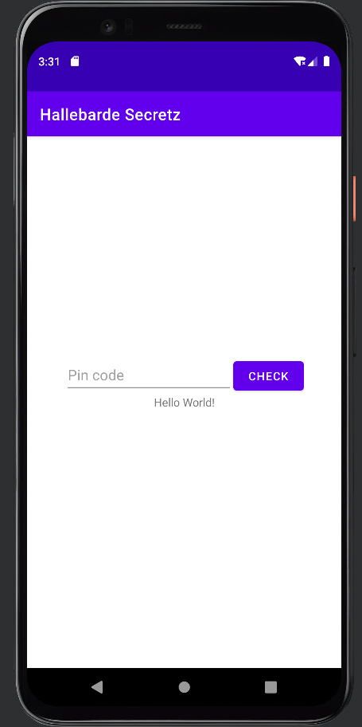
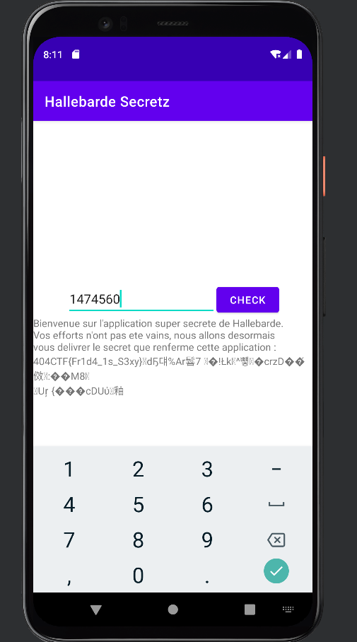

# Frida Me

> Nous avons récupéré une application utilisée par Hallebarde, cependant ses secrets semblent protégés par un code PIN.
>
> Essayez de le cracker !

## Description

On nous fournit une application APK.
Je lance [Android Studio](https://developer.android.com/studio) pour avoir accès à un émulateur et explorer l'application rapidement.

Après ouverture, je choisis l'option `Profile or Debug APK` et je sélectionne l'APK.
Avec l'émulateur par défaut, je lance l'application.



On nous demande un code PIN, je vais donc regarder comment ce code PIN est vérifié.
Pour ce faire, j'ouvre l'APK avec le décompilateur [jadx-gui](https://github.com/skylot/jadx).

Le fichier `Resources/AndroidManifest.xml` permet de connaître l'activité principale:

```xml
<?xml version="1.0" encoding="utf-8"?>
<manifest xmlns:android="http://schemas.android.com/apk/res/android" android:versionCode="1" android:versionName="1.0" android:compileSdkVersion="32" android:compileSdkVersionCodename="12" package="de.hallebar.secretz" platformBuildVersionCode="32" platformBuildVersionName="12">
    <uses-sdk android:minSdkVersion="21" android:targetSdkVersion="32"/>
    <application android:theme="@style/Theme_HallebardeSecretz" android:label="@string/app_name" android:icon="@drawable/ic_launcher" android:allowBackup="true" android:supportsRtl="true" android:fullBackupContent="@xml/backup_rules" android:appComponentFactory="androidx.core.app.CoreComponentFactory" android:dataExtractionRules="@xml/data_extraction_rules">
        <activity android:name="de.hallebar.secretz.MainActivity" android:exported="true">
            <intent-filter>
                <action android:name="android.intent.action.MAIN"/>
                <category android:name="android.intent.category.LAUNCHER"/>
            </intent-filter>
        </activity>
        <provider android:name="androidx.startup.InitializationProvider" android:exported="false" android:authorities="de.hallebar.secretz.androidx-startup">
            <meta-data android:name="androidx.emoji2.text.EmojiCompatInitializer" android:value="androidx.startup"/>
            <meta-data android:name="androidx.lifecycle.ProcessLifecycleInitializer" android:value="androidx.startup"/>
        </provider>
    </application>
</manifest>
```

Je regarde donc l'activité `de.hallebar.secretz.MainActivity`:

```java
package de.hallebar.secretz;

import android.os.Bundle;
import android.view.View;
import android.widget.Button;
import android.widget.EditText;
import androidx.appcompat.app.AppCompatActivity;
import de.hallebar.secretz.databinding.ActivityMainBinding;
import java.util.Objects;
import kotlin.Metadata;
import kotlin.jvm.internal.DefaultConstructorMarker;
import kotlin.jvm.internal.Intrinsics;

/* compiled from: MainActivity.kt */
@Metadata(d1 = {"\u0000,\n\u0002\u0018\u0002\n\u0002\u0018\u0002\n\u0002\b\u0002\n\u0002\u0018\u0002\n\u0000\n\u0002\u0010\u000e\n\u0000\n\u0002\u0010\b\n\u0000\n\u0002\u0010\u0002\n\u0000\n\u0002\u0018\u0002\n\u0002\b\u0002\u0018\u0000 \r2\u00020\u0001:\u0001\rB\u0005¢\u0006\u0002\u0010\u0002J\u0011\u0010\u0005\u001a\u00020\u00062\u0006\u0010\u0007\u001a\u00020\bH\u0086 J\u0012\u0010\t\u001a\u00020\n2\b\u0010\u000b\u001a\u0004\u0018\u00010\fH\u0014R\u000e\u0010\u0003\u001a\u00020\u0004X\u0082.¢\u0006\u0002\n\u0000¨\u0006\u000e"}, d2 = {"Lde/hallebar/secretz/MainActivity;", "Landroidx/appcompat/app/AppCompatActivity;", "()V", "binding", "Lde/hallebar/secretz/databinding/ActivityMainBinding;", "complicatedCheckerPleaseDontReverse", "", "pinCode", "", "onCreate", "", "savedInstanceState", "Landroid/os/Bundle;", "Companion", "app_release"}, k = 1, mv = {1, 6, 0}, xi = 48)
/* loaded from: classes.dex */
public final class MainActivity extends AppCompatActivity {
    public static final Companion Companion = new Companion(null);
    private ActivityMainBinding binding;

    public final native String complicatedCheckerPleaseDontReverse(int i);

    /* JADX INFO: Access modifiers changed from: protected */
    @Override // androidx.fragment.app.FragmentActivity, androidx.activity.ComponentActivity, androidx.core.app.ComponentActivity, android.app.Activity
    public void onCreate(Bundle bundle) {
        super.onCreate(bundle);
        ActivityMainBinding inflate = ActivityMainBinding.inflate(getLayoutInflater());
        Intrinsics.checkNotNullExpressionValue(inflate, "inflate(layoutInflater)");
        this.binding = inflate;
        if (inflate == null) {
            Intrinsics.throwUninitializedPropertyAccessException("binding");
            inflate = null;
        }
        setContentView(inflate.getRoot());
        View findViewById = findViewById(R.id.button);
        Objects.requireNonNull(findViewById, "null cannot be cast to non-null type android.widget.Button");
        View findViewById2 = findViewById(R.id.pincode);
        Objects.requireNonNull(findViewById2, "null cannot be cast to non-null type android.widget.EditText");
        final EditText editText = (EditText) findViewById2;
        ((Button) findViewById).setOnClickListener(new View.OnClickListener() { // from class: de.hallebar.secretz.MainActivity$$ExternalSyntheticLambda0
            @Override // android.view.View.OnClickListener
            public final void onClick(View view) {
                MainActivity.m20onCreate$lambda0(editText, this, view);
            }
        });
    }

    /* JADX INFO: Access modifiers changed from: private */
    /* renamed from: onCreate$lambda-0  reason: not valid java name */
    public static final void m20onCreate$lambda0(EditText pincode_text, MainActivity this$0, View view) {
        Intrinsics.checkNotNullParameter(pincode_text, "$pincode_text");
        Intrinsics.checkNotNullParameter(this$0, "this$0");
        String obj = pincode_text.getText().toString();
        ActivityMainBinding activityMainBinding = null;
        if (obj.length() <= 8) {
            ActivityMainBinding activityMainBinding2 = this$0.binding;
            if (activityMainBinding2 == null) {
                Intrinsics.throwUninitializedPropertyAccessException("binding");
            } else {
                activityMainBinding = activityMainBinding2;
            }
            activityMainBinding.sampleText.setText(this$0.complicatedCheckerPleaseDontReverse(Integer.parseInt(obj)));
            return;
        }
        ActivityMainBinding activityMainBinding3 = this$0.binding;
        if (activityMainBinding3 == null) {
            Intrinsics.throwUninitializedPropertyAccessException("binding");
        } else {
            activityMainBinding = activityMainBinding3;
        }
        activityMainBinding.sampleText.setText("Pin code too long");
    }

    /* compiled from: MainActivity.kt */
    @Metadata(d1 = {"\u0000\f\n\u0002\u0018\u0002\n\u0002\u0010\u0000\n\u0002\b\u0002\b\u0086\u0003\u0018\u00002\u00020\u0001B\u0007\b\u0002¢\u0006\u0002\u0010\u0002¨\u0006\u0003"}, d2 = {"Lde/hallebar/secretz/MainActivity$Companion;", "", "()V", "app_release"}, k = 1, mv = {1, 6, 0}, xi = 48)
    /* loaded from: classes.dex */
    public static final class Companion {
        public /* synthetic */ Companion(DefaultConstructorMarker defaultConstructorMarker) {
            this();
        }

        private Companion() {
        }
    }

    static {
        System.loadLibrary("secretz");
    }
}
```

La fonction `m20onCreate$lambda0` est en charge de vérifier notre code PIN: on voit qu'il doit faire moins de 8 caractères, et la fonction `complicatedCheckerPleaseDontReverse` est utilisée pour vérifier si le PIN est valide.

Or, cette fonction vient de la bibliothèque compilée appelée avec `System.loadLibrary("secretz");`.

On pourrait probablement l'inverser, mais au vu du titre du challenge et la longueur du mot de passe on va plutôt brute forcer le mot de passe.

## Frida

Pour ce faire, j'installe [Frida](https://github.com/frida/frida/) sur ma machine avec `pip install frida-tools`.

Il s'agit du client Frida, il va falloir maintenant installer le serveur Frida sur le téléphone.

Pour ce faire, télécharger sur [cette page](https://github.com/frida/frida/releases) la bonne version de Frida server (nommée `frida-server-{version}-android-{arch}.xz` où arch est l'architecture du téléphone).

On peut ensuite l'extraire:

```bash
unxz frida-server-{version}-android-{arch}.xz
mv frida-server-{version}-android-{arch} frida-server
```

Pour une raison étrange, je n'ai pas réussi à faire fonctionner Frida avec une version Android supérieure à 10.
J'ai donc choisi un émulateur Android 9 sur Pixel 5 (architecture x86).
Pour ce faire, dans Android Studio, aller dans `Device Manager` puis `Create device` et choisir les options voulues.

Ensuite j'installe le serveur Frida. D'abord je vérifie que mon émulateur est bien attaché à ADB (Android Debug Bridge) avec `adb devices -l`, puis je lance les commandes suivantes pour installer et lancer le serveur:

```bash
adb root
adb push frida-server /data/local/tmp
adb shell "chmod 755 /data/local/tmp/frida-server"
adb shell "/data/local/tmp/frida-server &"
```

Normalement Frida devrait fonctionner, ce qu'on peut vérifier avec `frida-ps -U`.

## Solution

Il s'agit maintenant de brute-forcer le code PIN.
Pour ce faire, je vais écrire un script qui attends que l'activité principale soit chargée puis qui appelle la fonction de vérification avec tous les nombres de 0 à 100 000 000.

Pour cela, j'écris le fichier `frida.js`:

```js
if (Java.available) {
    setTimeout(function() {
        Java.perform(function() {
            console.log("[ * ] Starting PIN Brute-force, please wait...");

            // Wait for MainActivity
            Java.choose("de.hallebar.secretz.MainActivity", {
                onMatch: function(instance) {
                    console.log("[ * ] Instance found in memory");
                    for (var i = 0; i < 100000000; i++) {
                        if (i % 100000 === 0)
                            console.log("Trying " + i);
                        if (instance.complicatedCheckerPleaseDontReverse(i) !== "Wrong password") {
                            console.log("Found! " + i);
                            break;
                        }
                    }
                },
                onComplete: function() {}
            });
        });
    }, 3000);
}
```

Je lance le code avec la commande:

```
frida -U -f de.hallebar.secretz -l frida.js
```

Le code bugue à partir de 1400000, je change donc la fréquence de mon affichage pour savoir quand est le premier nombre qui bloque. Il s'agit de 1474560, je le teste dans l'application.



Flag: `404CTF{Fr1d4_1s_S3xy}`