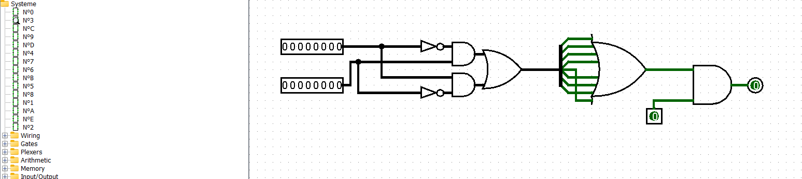
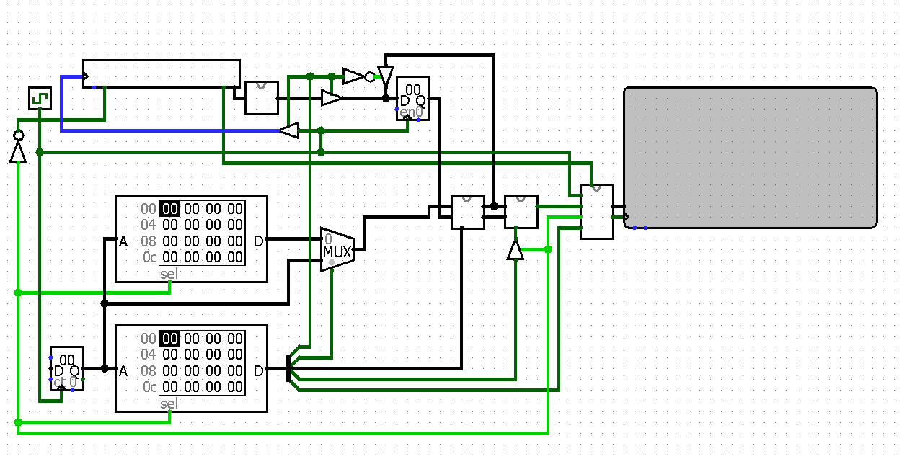
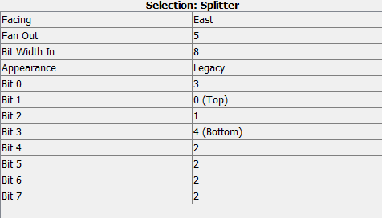
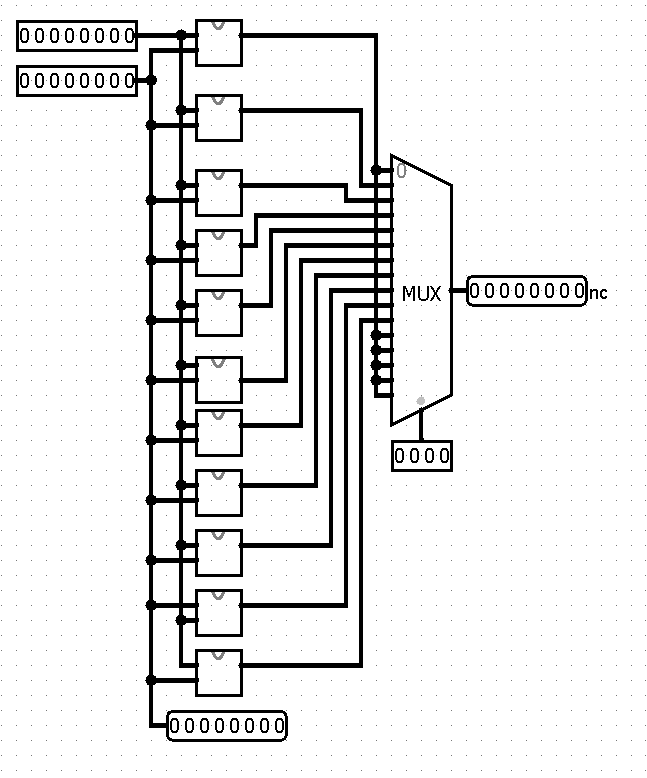
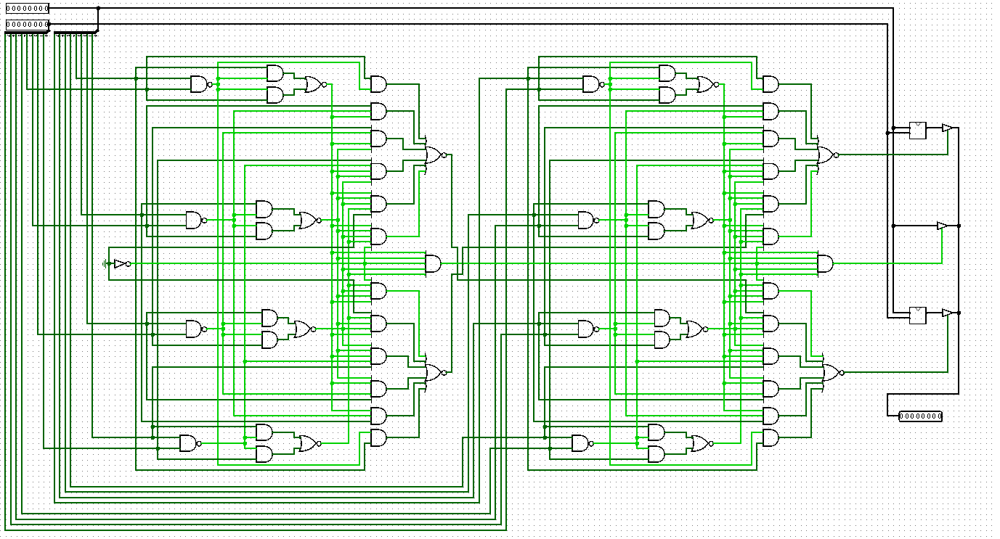

# Nos amies les portes

> Nous avons infiltré le QG de Hallebarde, cependant la dernière porte est verrouillée par un mot de passe.
>
> Heureusement les plans des circuits électriques ont été trouvés par les agents sur place.
>
> Votre mission est simple : retrouvez ce mot de passe dans les circuits imprimés. Vous en trouverez un schéma et une copie des données en mémoire.
>
> Faites vite, ils ne pourront pas attendre éternellement.
>
> Format du flag : 404CTF{le mot de passe}
>
> Par exemple, si le mot de passe est azerty, le flag est 404CTF{azerty}.

## Description

On nous fournit un fichier `.circ` et deux fichiers de donnée.

Le fichier `.circ` indique qu'il faut l'ouvrir avec [Logisim](https://www.cburch.com/logisim/).
Je télécharge donc le logiciel et j'ouvre le fichier.



On voit ici un circuit logique.
Seulement, il s'agit uniquement d'une partie du circuit complet (une fonction).
On peut trouver toutes les fonctions sur l'onglet à gauche.

Le circuit numéro 0 est le circuit principal.



On voit ici deux appareils de RAM: il s'agit de la donnée qui est fournie avec le fichier circ, on peut donc effectuer `Clic Droit -> Load Image` et charger la donnée.

On voit aussi une `clock` qui permet d'avoir une cadence et d'effectuer des opérations par cycle.
Elle incrémente un compteur (à gauche de la mémoire) qui va permettre de lire la mémoire case par case.

La barre blanche en haut est un clavier: on peut utiliser l'outil main pour cliquer dessus et entrer des caractères.

Enfin, la zone grise à droite est un écran sur lequel s'affiche le message d'erreur si le code est mauvais.

Pour comprendre le programme, on peut utiliser l'outil flèche pour voir à quoi correspondent chaque porte logique.
Par exemple le Splitter est expliqué à gauche (à quel fil correspond quoi):



On peut par ailleurs lancer le programme avec l'onglet `Simulation`.

Il y a 4 boîtes qui sont inconnues:
- la boîte après le clavier est juste une conversion de 7 bits vers 8 bits;
- la boîte après le multiplexeur. Il s'agit du circuit n°C qu'on va tâcher de reverse;
- la boîte après la C, qui est le circuit n°3, à inverser. Elle retourne un bit;
- la dernière boîte prend en entrée le bit de sortie de la précédente. Je ne l'ai pas vraiment inversée mais elle sert à afficher le message d'erreur et à arrêter le programme si le caractère est mauvais.

## Circuit 3

Le circuit 3 est le même que celui qui était affiché plus haut.

Il s'agit de portes logiques simples, et on voit qu'elle renvoie 1 si et seulement si le bit de contrôle est égal à 1 et si ses deux entrées sont égales.

Ce que j'en comprends en effectuant quelques simulations est que quand le bit de contrôle est à 1 (ce qui est décidé par un bit de la 2e zone mémoire), alors un check est effectué, et il faut que ce check vérifie entrée0 = entrée1, sinon on obtient le message d'erreur.

## Circuit C



Le circuit C est la fonction de comparaison. Il prend en entrée deux bitstrings `x` (l'entrée clavier ou l'ancien `x`) et `y` (qui sort du multiplexeur), ainsi qu'une entrée de contrôle sur 4 bits.

L'entrée de contrôle `c` permet de sélectionner la fonction `f_c` qui sera utilisée ce tour, et le circuit retourne `f_c(x, y), y`.

Il s'agit alors d'inverser chaque fonction, qui est un travail de longue haleine que j'ai effectué à la main.

Mes méthodes principales sont de comprendre comment ça se passe pour les circuits petits, et pour les plus gros je fais des tests bit à bit grâce à l'outil main.

Par exemple, avec le circuit A suivant:



Je vois à droite qu'il y a 3 cas possibles, et quand je change les valeurs des entrées, il n'y a qu'une seule case qui est allumée. Il s'agit donc d'un `if`, et en testant avec plein de valeurs je remarque que c'est une comparaison si `x > y`, `x < y` ou `x == y`, et qu'une opération différente est effectuée à chaque cas.

## Solution

Le code suivant permet de simuler le circuit, je brute force alors caractère par caractère.

```python
def load_data(filename):
    with open(filename) as f:
        f.readline()
        data = f.read().replace("\n", " ").strip()
    return [int(x, 16) for x in data.split(" ")]

data1 = load_data("set1")
data2 = load_data("set2")

z = 0

def permute(x, perm):
    y = 0
    for i in perm[::-1]:
        y = y << 1
        y |= (((x & (1 << i)) >> i) & 1)
    return y

def ror(x, n):
    mask = (1 << n) - 1
    return (x >> n) | ((x & mask) << (8-n))

def rol(x,n):
    return ror(x,8-n)

def func5(x,y):
    for i in range(7,-1,-1):
        if y&(1 << i):
            return rol(x,i)

def C(x,y,c):
    if c == 0 or c >= 11:
        return x
    if c == 1:
        return (x+y)&0xff
    if c == 2:
        return permute(x, [6,7,0,5,2,1,4,3])
    if c == 3:
        return ((x&0xf) * ((x&0xf0) >> 4)) & 0xff
    if c == 4:
        return x^y
    if c == 5:
        return func5(x,y)
    if c == 6:
        return (0xff - x) + 1
    if c == 7:
        return 0xff - x
    if c == 8:
        if x == y:
            return x
        if x < y:
            return x^y
        return (x+y)&0xff
    if c == 9:
        if x == y:
            return x
        if x > y:
            return x^y
        return (x+y)&0xff
    if c == 10:
        return permute(x, list(range(8))[::-1])
    print("C", c)

known = ''
alphabet = "ABCDEFGHIJKLMNOPQRSTUVWXYZ0123456789abcdefghijklmnopqrstuvwxyz_!"

def p(x):
    if x&(1 << 7):
        return x-0x100
    return x


def test(known):
    current = 0
    inputs = [ord(c) for c in known]
    for i in range(1,len(data1)):
        x = i if data2[i] & 4 else data1[i]
        if data2[i-1] & 2:
            y = inputs[current]
            current += 1
        else:
            y = z
        z = C(y,x,data2[i]>>4)
        if data2[i] & 1:
            if x != z:
                return False
            if current == len(known):

possibles = ['a']
while(len(possibles) > 0):
    possibles = []
    for i in range(33,128):
        if test(known + chr(i)):
            possibles.append(chr(i))
    if len(possibles) > 1:
        print(possibles)
    if len(possibles) > 0:
        known += possibles[0]
    print(known)
```

Flag: `404CTF{K33p_c4lM_4nD_r3VeRsE}`