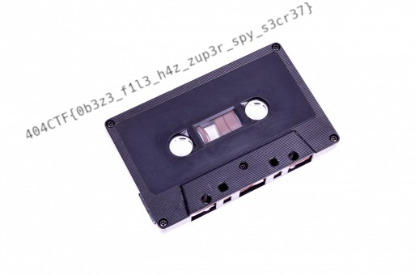
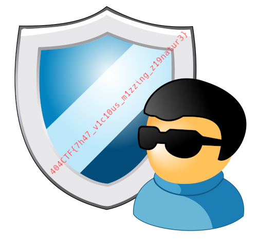
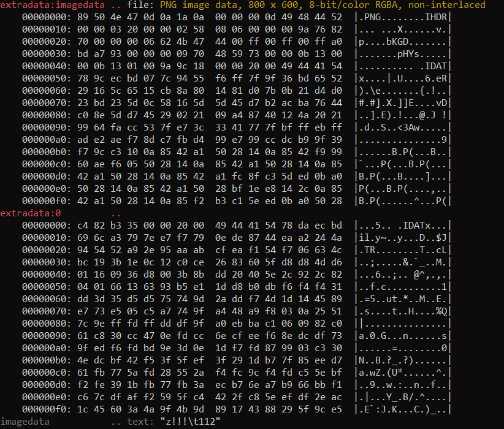
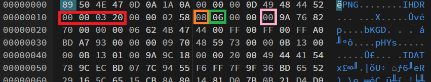

# PNG

Ce challenge est composé de quatre parties en poupées russes : on nous donne une image PNG, puis on va trouver quatre flags à l'intérieur plus ou moins emboîtés.

## PNG : Un logo obèse [1/4]

> L'heure est grave. Hallebarde ne se cache plus et échange des messages en toute liberté. Un tel manque de précautions de leur part est alarmant, et même presque suspect. Un logo a été utilisé dans l'un de leurs courriels et d'après de premières analyses, il pourrait avoir été employé pour ouvrir un canal de stéganographie. Pourriez-vous tirer cela au clair ?


On nous donne l'image ci-dessus. Au vu du titre du challenge, on suppose qu'il y a un fichier caché dedans. On lance donc `binwalk steg1.png`.

On voit qu'une archive ZIP est à l'intérieur, on l'extrait avec `binwalk -e steg1.png` et on obtient l'image 2.



Flag: `404CTF{0b3z3_f1l3_h4z_zup3r_spy_s3cr37}`

## PNG : Drôles de chimères [2/4]

> Il semblerait que votre dernière analyse ait été fructueuse, mais nos analystes trouvent encore à redire. Il faudrait aller plus loin dans vos recherches et comprendre pourquoi la structure du fichier que vous nous avez remis leur paraît étrange, même si elle est parfaitement valide.

On nous indique qu'il faut explorer la structure du fichier. Je regarde donc le fichier avec un éditeur hexadécimal, comme par exemple [HexEd.it](https://hexed.it/).

Pour rappel, la [structure d'un fichier PNG](https://en.wikipedia.org/wiki/Portable_Network_Graphics) est la suivante:
- signature du fichier (`89`, puis `PNG`, puis `0D 0A 1A 0A`);
- un chunk `IHDR` (header du fichier qui contient la taille et d'autres informations importantes);
- une série de chunks `IDAT` (qui contiennent les données);
- le chunk `IEND`.

Il peut également y avoir des chunks facultatifs.

On voit ici qu'il y a deux chunks `IHDR`, alors qu'il ne devrait y en avoir qu'un, le second étant caché dans un chunk `sTeG`:


On supprime donc le premier pour le remplacer par le second.

On obtient alors le flag.



Flag: `404CTF{7h47_v1c10us_m1zzing_z19natur3}`

## PNG : Toujours obèse [3/4]

> Nous avançons, mais la taille du dernier fichier n'est toujours pas cohérente statistiquement avec l'image elle-même. Il semblerait qu'il y ait beaucoup trop de données dans cette image. À vous de jouer.

Apparamment il y a encore trop de données dans le PNG.

Pour celui-ci, j'ai utilisé [zsteg](https://github.com/zed-0xff/zsteg).

En lançant `zsteg stage3.png`, on voit des données cachées:



On peut donc l'extraire: `zsteg -E "extradata:imagedata" stage3.png > stage4.png`


Flag: `404CTF{z71ll_0b3z3_&_st1ll_h4d_s3cr3tz_4_U}`

## PNG : Une histoire de filtres [4/4]

> Les statisticiens se plaignent toujours de la taille du fichier. Selon eux la compression devrait être plus efficace.
>
> Bonne chance.
>
> Image d'origine par Ed g2s (Wikimédia), license CC BY-SA 3.0 .

Comme l'indique le titre, le flag est caché dans les filtres.

Comme l'indique la spécification PNG, chaque `scanline` est filtrée, et la valeur du filtre est le premier octet de la scanline.

On peut donc extraire cet octet qui est compris entre 0 et 4, et cela nous donnera le flag.

Premièrement, on lit le `IHDR`: on voit que la largeur est de 800 pixels (voir encadré rouge), il n'y a pas d'entrelacement (encadré rose), donc on peut lire les scanlines une par une.

L'image est RGBA (pixel format 6, encadré vert), donc chaque pixel requiert 4 channel, et chaque channel est encodé sur 8 bits (encadré orange).



A noter qu'il faut d'abord réunir ensemble les chunks `IDAT`, puis décompresser le tout avant d'avoir accès à la donnée brute.

Une fois la donnée contenue dans le type de filtre récupérée, on les concatène pour avoir le flag.

```python
from Crypto.Util.number import bytes_to_long
from zlib import decompress

with open("stage4.png", "rb") as f:
    data = f.read()

W = 800
byte_per_pixel = 4 * 8 // 8

def recover_data(data):
    idat = b""
    cursor = 0
    while True:
        next_idat = data[cursor:].find(b"IDAT")
        if next_idat < 0:
            break
        cursor += next_idat
        chunklen = bytes_to_long(data[cursor-4:cursor])
        idat += data[cursor+4:cursor+4+chunklen]
        cursor += (4 + chunklen)
    return decompress(idat)

decompressed_data = recover_data(data)
hidden_data = ""
for i in range(0,len(decompressed_data),W*byte_per_pixel+1):
    hidden_data += format(decompressed_data[i], '02b')

print(hidden_data)
```

On entre la donnée reçue dans [CyberChef](https://gchq.github.io/CyberChef/) et on obtient:

> Secret code: 404CTF{7h3r3_15_n07h1n9_b4d_4b0u7_sc4nn3rz}

Flag: `404CTF{7h3r3_15_n07h1n9_b4d_4b0u7_sc4nn3rz}`