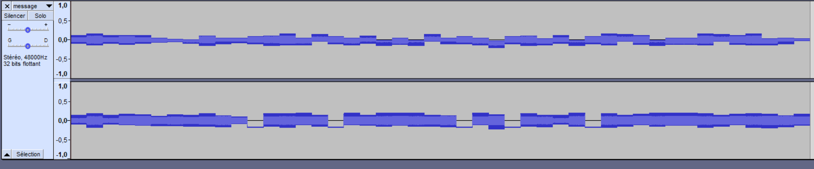
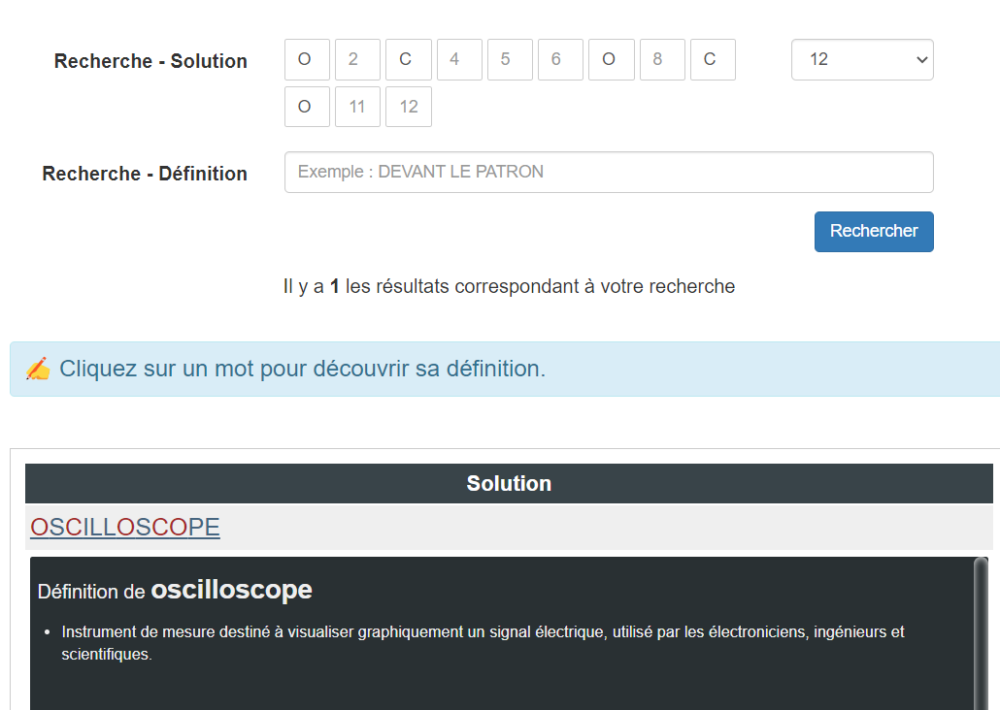
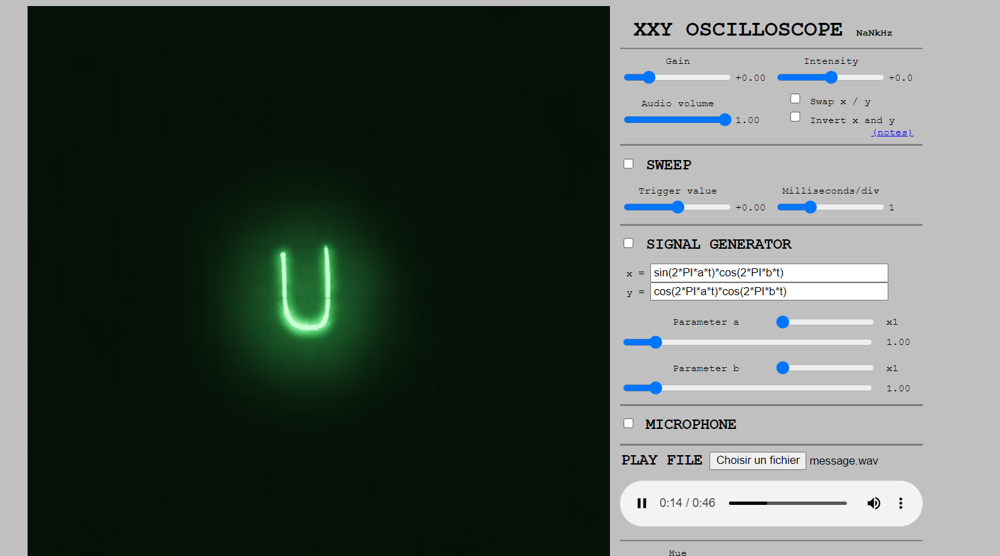

# Stéréographie

> Nous avons intercepté un étrange message, nous pensons qu'une communication de Hallebarde y est dissimulée.

## Description

On nous donne un .wav à analyser. Je l'ouvre avec Audacity.



On arrive à distinguer chaque caractère.

De plus, des caractères identiques ont le même représentation: je le vois puisque le flag commence par `404CTF{`.

J'ai ensuite tenté de trouver comment chaque caractère est encodé et comment je peux traduire le son en texte mais sans succès.

J'ai donc décidé de considérer le son comme un chiffrement monoalphabétique, et déduire le flag comme cela (au moins pour avoir une idée de la solution attendue, comme les flags des autres épreuves décrivent souvent la manière d'y parvenir).

```python
from scipy.io import wavfile
import matplotlib.pyplot as plt
import numpy as np

samplerate, data = wavfile.read('message.wav')

rmin = np.array([np.min(data[i:i+samplerate,0]) for i in range(0,len(data[:,0]), samplerate)])
rmax = np.array([np.max(data[i:i+samplerate,0]) for i in range(0,len(data[:,0]), samplerate)])
lmin = np.array([np.min(data[i:i+samplerate,1]) for i in range(0,len(data[:,0]), samplerate)])
lmax = np.array([np.max(data[i:i+samplerate,1]) for i in range(0,len(data[:,0]), samplerate)])

data = {}
alphabet = "40CTF{ABDEGHIJKLMNO}"
found = ""
j = 0
for i in range(len(rmin)):
    current = (rmin[i], lmin[i],rmax[i],lmax[i])
    if current not in data:
        data[current] = alphabet[j]
        j += 1
    found += data[current]
print(found)
```

J'obtiens le flag (chiffré) suivant : `404CTF{ABDEGB0HIGHJKLKIDGHMGBN4KG0ICKLL0IC0OD}`

Il y a des 0 et des 4 dans la partie intéressante du flag, sûrement parce qu'il est en leet. Les 0 sont probablement des O et les 4 des A.

Par ailleurs, l'un des caractère dans le graphe du son sort du lot avec une partie presque constante sur l'oreille droite. J'imagine qu'il s'agit de l'underscore.

Le flag est donc probablement de la forme: `404CTF{ABDE_B0HI_HJKLKID_HMGBN4K_0ICKLL0IC0OD}`

En particulier, le dernier mot est long et commence par un O (et en contient 3), et je suis également sûr que les C sont bons.
Je devrais pouvoir le trouver.

Pour ce faire, je lance un [solveur de mots fléchés](https://mots-croises-solutions.com/).



Oscilloscope ! Peut être qu'il y a un rapport avec la manière de résoudre le challenge ?

## Solution

Je cherche donc sur internet "Stéganographie oscilloscope". Il paraît donc que le fichier est en fait le signal d'un oscilloscope, avec la bande son gauche correspondant à l'axe des X est celle de droite à l'axe des Y.

On peut trouver en ligne un [oscilloscope virtuel lisant les .wav](https://dood.al/oscilloscope/)



Et le flag apparaît comme par magie.

Flag: `404CTF{AV3z_V0U5_U71L153_UN_VR41_05C1LL05C0P3}`