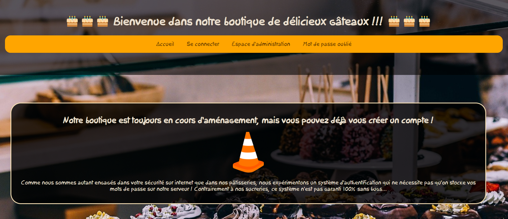
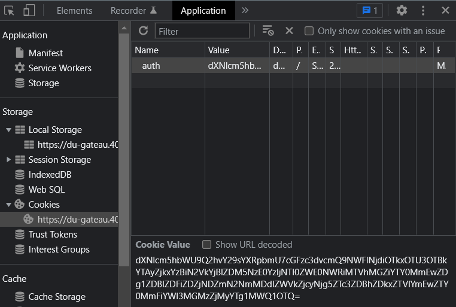
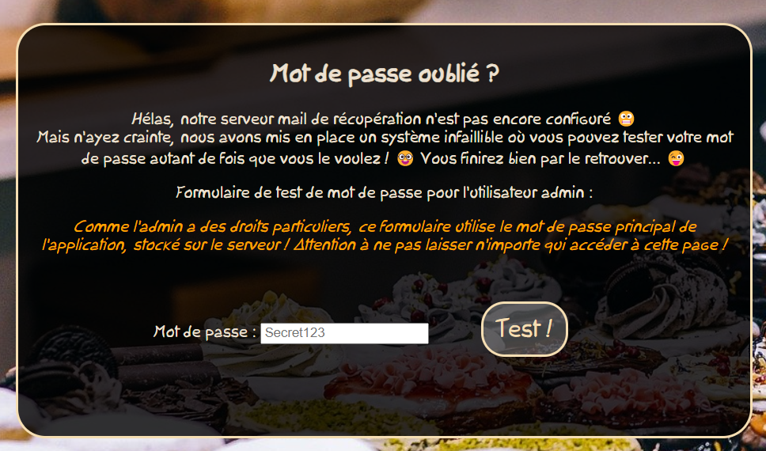
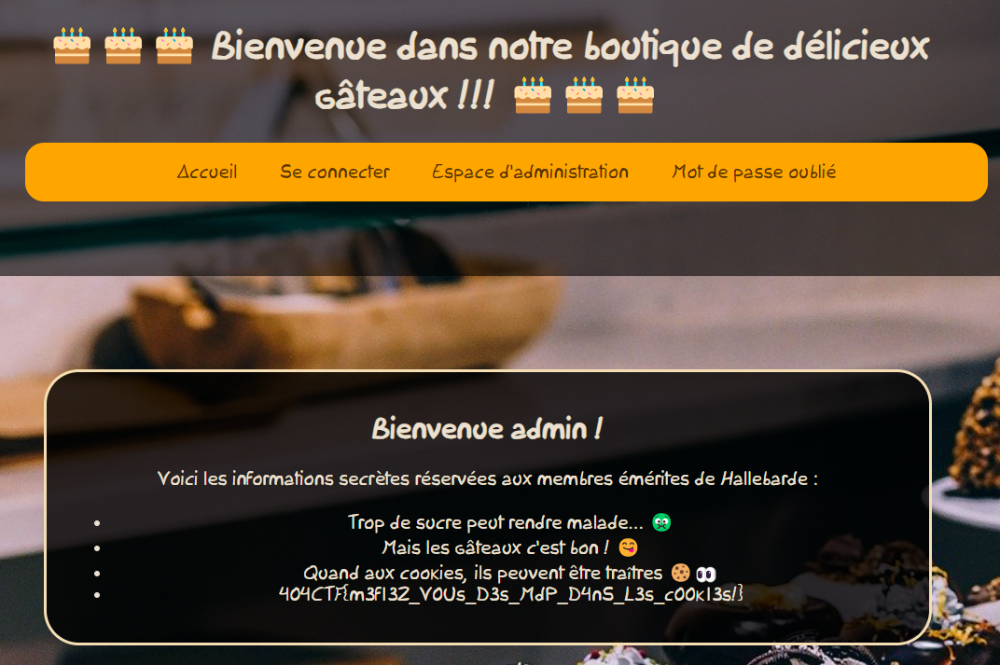

# Du gâteau

> Nous avons découvert que Hallebarde utilisait une pâtisserie comme couverture pour leurs activités criminelles. Visitez leur site web et voyez si vous pouvez accéder à leurs secrets.
>
> https://du-gateau.404ctf.fr/



## Description

Le site Web a 4 pages:
- une page d'accueil;
- une page pour se connecter;
- un espace d'administration;
- une page mot de passe oublié.

En allant sur la page d'accueil, on peut se connecter avec un login / mot de passe par défaut fourni: `Chocolatine / chocolatine>>painauchocolat`.

Cela nous donne un cookie:



C'est un cookie encodé en base 64 qui se déchiffre ainsi:

```
username=Chocolatine;password=5ae67b99195790da02f91c0b7edb0ed39714c9c524ea45db15a0fba642a0d85d0ed1bd6c46f7cf07eeedf72689e77d0ad91e5eba0e642abab70c3f32a851d594
```

Une fois connecté, l'espace d'administration nous indique que nous avons le mauvais mot de passe utilisateur.

La page `mot de passe oublié` quant à elle nous redirige vers la page `/forgot_password/Chocolatine`.

Il y a de plus une fonction pour vérifier si le mot de passe est correct:

```js
async function check_password() {
	var password = document.test.password.value;
	hashpassword = await sha512(password);
	hash = "5ae67b99195790da02f91c0b7edb0ed39714c9c524ea45db15a0fba642a0d85d0ed1bd6c46f7cf07eeedf72689e77d0ad91e5eba0e642abab70c3f32a851d594";
	text = document.getElementById("infomdp");
	if (hash === hashpassword) {
		text.style.color = "green";
		text.textContent = "Mot de passe correct !";
	}
	else {
		text.style.color = "red";
		text.textContent = "Mot de passe incorrect...";
	}
}
```

On peut donc effectuer plusieurs remarques :
- le cookie n'est absolument pas authentifié, on peut donc le changer comme bon nous semble
- le cookie est composé du nom d'utilisateur et du mot de passe haché, qui est disponible sur la page mot de passe oublié.

L'objectif est donc d'accéder à la page mot de passe oublié en tant qu'admin, récupérer le mot de passe haché, puis modifier le cookie pour accéder à l'espace d'administration.

## Solution

La première chose à faire est d'accéder à la page "Mot de passe oublié" en tant qu'admin.

Juste changer l'URL à `/forgot_password/admin` nous renvoie un message d'erreur:

> Tu serais pas en train de jouer avec l'URL par hasard ?

On change donc également le cookie pour avoir `username=admin`, mais ici également un message d'erreur:

> Filtre de sécurité infaillible ! Personne ne peut jouer avec le mot de passe de l'admin !

Il faut donc trouver autre chose. Après divers essais, j'ai tenté de mettre plusieurs noms d'utilisateurs, avec `username=Chocolatine;username=admin`, et cela a marché.



On récupère donc le haché du mot de passe admin, et on change notre cookie pour refléter cela:

```
username=admin;password=66651013935b4c2c31d9baba8fa5d37b809b10da453f293ec8f9a7fbb2ab2e2c1d69dc8d80969508028b5ec14e9d1de585929a4c0d534996744b495c325e3f3d
```

Mais si on accède à la page `/admin`, on nous fournit un nouveau message d'erreur :

> Filtre de sécurité infaillible ! Le cookie exact de l'admin a été temporairement bloqué suite à une activité suspecte détectée sur le site !

Il suffit d'inverser l'ordre des champs, et on a le flag.



Flag: `404CTF{m3f13Z_V0Us_D3s_MdP_D4nS_L3s_c00k13s!}`