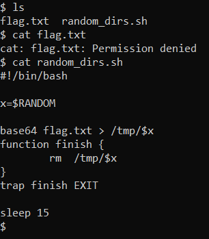
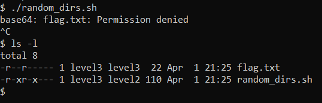

# Bash 2

## Description 

> sh challenges.auctf.com -p 30040 -l level2
> 
> password is the flag of the previous Bash challenge

## Solution

Let's connect to the challenge.



We see a flag and a script. Sadly we cannot see the flag as we do not have enough permissions. But the script can read the flag, and puts it encoded with `base64` in a random file in `/tmp`. After 15s, the encoded flag is deleted.

When we try to run the script, we can run it! But the script does not have permission to read the flag... Let's see what permissions those files have:



We see that owner of `flag.txt` and the script is user `level3`. Let's try to launch the script as `level3`:

```bash
sudo -u level3 ./random_dirs.sh
```

It works! So we can just open another terminal, log in and check all files in `/tmp`:
```bash
cat /tmp/*
```

Once we have the `base64` encoded flag, we decode it with [ascii2hex](https://www.asciitohex.com/)

Flag: `auctf{g0tt@_muv_fas7}`