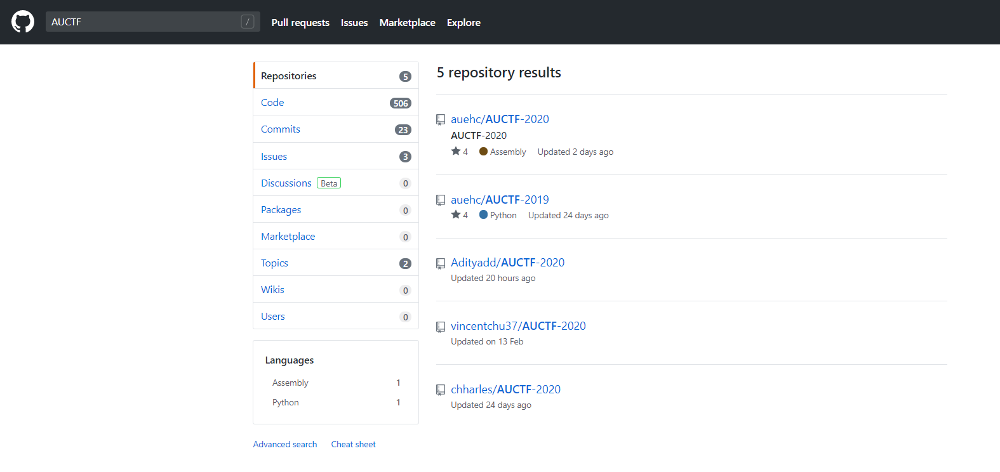
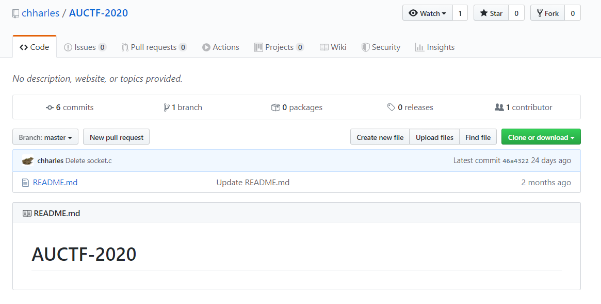
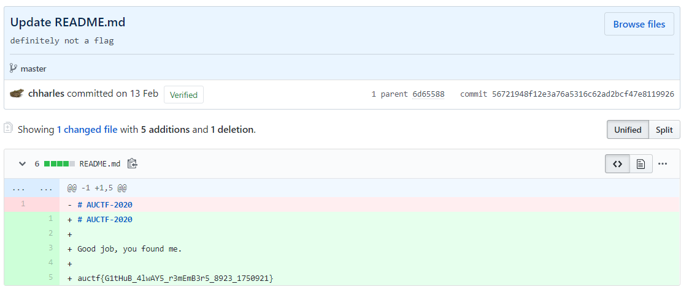

# Who made me

## Description

> One of the developers of this CTF worked really hard on this challenge.
> 
> note: the answer is not the author's name
> 
> Author: c

## Solution

I've looked at Github repositories with AUCTF in it, using search in Github. There were not a lot at the time of the challenge.

I've looked at them one by one, and repo by `chharles` looks suspicious because empty.

Yet we see 6 commits, so let's look at them. In one of them we see the flag.

Flag: `auctf{G1tHuB_4lwAY5_r3mEmB3r5_8923_1750921}`