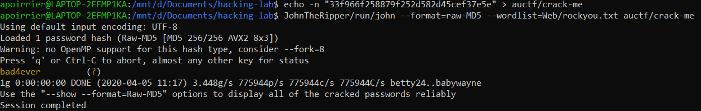

# Crack me

## Description

> Here's an easy one.
> 
> Hash: 33f966f258879f252d582d45cef37e5e
> 
> NOTE: The flag is NOT in the standard auctf{} format

## Solution

Hash has size 16 bytes, and description says it is easy: this is probably a MD5 hashed password.

Let's use [John](https://www.openwall.com/john/) to crack it, using the standard [rockyou](https://github.com/brannondorsey/naive-hashcat/releases/download/data/rockyou.txt) password list.

Flag: `bad4ever`