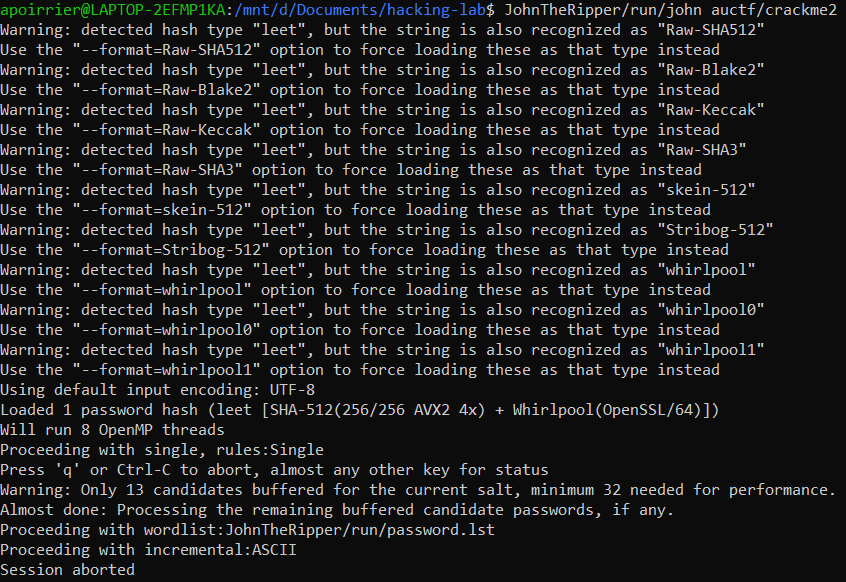
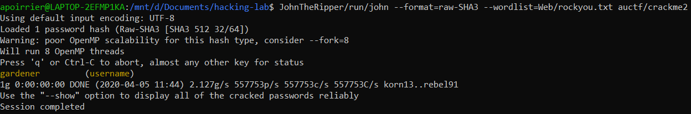

# Crack me 2

## Description

> Here's another one.
> 
> Hash: b1ee3fbc44b4ba721273699ac4511fa1631257f37da7bede3d5ba7bda5e7f96f1bab30e206caf47a5ce8c6587d0fbd6306e70b08a3a7e7233bb707bf21752c33
> 
> NOTE: The flag is NOT in the standard auctf{} format

## Solution

Let's use [John](https://www.openwall.com/john/) to crack it, using the standard [rockyou](https://github.com/brannondorsey/naive-hashcat/releases/download/data/rockyou.txt) password list.

First we'll need to know what kind of hash has been used. Let's format a file with our hash. Then run `john` on it.

Several options are offered by `john`. Let's try the most common ones: `SHA-512`, `SHA-3`, `Whirpool`, ...

Launching with `SHA-3` gives us the password.

Flag: `gardener`