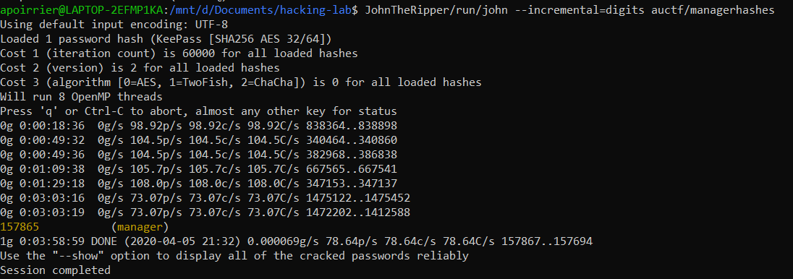
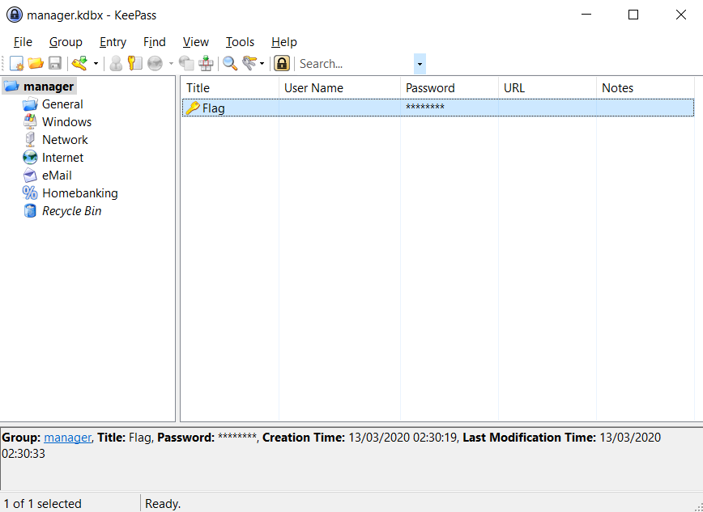

# Manager

## Description

> There might be a flag inside this file. The password is all digits.
> 
> NOTE: The flag is NOT in the standard auctf{} format

The given file is a `.kdbx` file which corresponds to a password manager file.

## Solution

Let's crack the password with [John](https://www.openwall.com/john/). 

First, we need to extract the hash from the password database with the command:

```bash
keepass2john auctf/manager.kdbx > auctf/managerhashes
```

Then we brute force the password, knowing it is composed of digits:



We then open the database with [Keepass2](https://keepass.info/) with the cracked master password and find the flag.




Flag: `y0u4r34r34lh4ck3rn0w#!$1678`