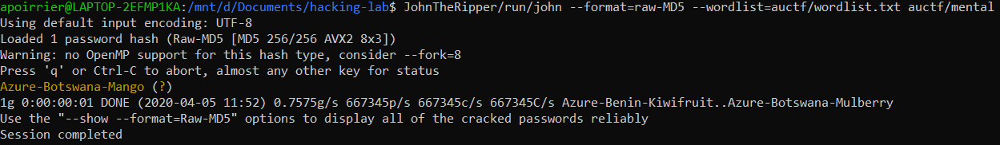

# Mental

## Description

> Password Format: Color-Country-Fruit
> 
> Hash: 17fbf5b2585f6aab45023af5f5250ac3
> 
> NOTE: The flag is NOT in the standard auctf{} format

## Solution

This looks like a fun password cracking challenge. We are given a password format (therefore standard password list probably do not include the password). But then it looks like a MD5 hash. 

So let's try to create our own password list. First we download:
- a color list: [colors.txt](https://github.com/k-kawakami/colorfulnet/blob/master/example_data/wikipedia-list-of-colors.txt)
- a country list: [countries.txt](https://gist.github.com/kalinchernev/486393efcca01623b18d)
- a fruit list: [fruits.txt](https://gist.githubusercontent.com/lasagnaphil/7667eaeddb6ed0c565f0cb653d756942/raw/e05dbc73062aa1679b733e8f9f9b32e003c59d0e/fruits.txt)

Then using this Python script, we combine them to create a wordlist:

```python
colors = []
with open("colors.txt", "r") as f:
    for l in f:
        colors.append(l.replace('\n', '-'))

countries = []
with open("countries.txt", "r") as f:
    for l in f:
        countries.append(l.replace('\n', '-'))

fruits = []
with open("fruits.txt", "r") as f:
    for l in f:
        fruits.append(l)

with open("wordlist.txt", "w") as i:
        for l1 in colors:
                for l2 in countries:
                        for l3 in fruits:
                                i.write(l1 + l2 + l3)
```

Finally we run [John](https://www.openwall.com/john/) to crack the password using our custom list.



Flag: `Azure-Botswana-Mango`