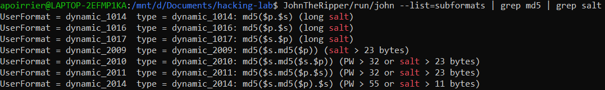
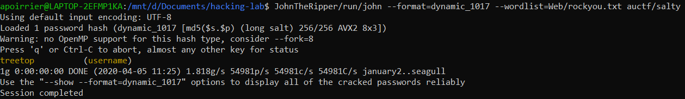

# Salty

## Description

> You might need this: 1337
> 
> Hash: 5eaff45e09bec5222a9cfa9502a4740d
> 
> NOTE: The flag is NOT in the standard auctf{} format

## Solution

Given the name of the challenge (and once again, the size of the hash), this is probably a salted password hashed with MD5.

Let's use [John](https://www.openwall.com/john/) to crack it, using the standard [rockyou](https://github.com/brannondorsey/naive-hashcat/releases/download/data/rockyou.txt) password list.

First, let's configure the hash file in the format:

```
username:hash$salt
```

Then we look for a predifined format which uses MD5 with salt:



Here type `dynamic_1014` or `dynamic_1017` can suit our needs. Most common use is to prepend the salt, so let's try it with `dynamic_1017`.



Flag: `treetop`