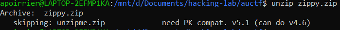
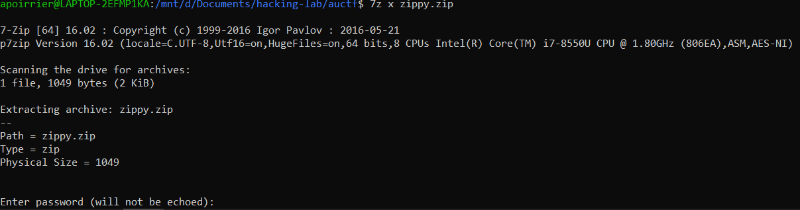
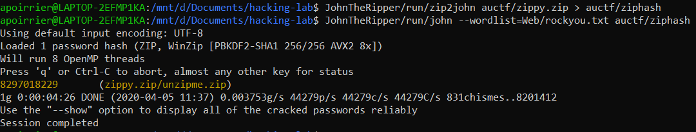

# Zippy

## Description

> Have fun!
> 
> NOTE: The flag is NOT in the standard auctf{} format

Attached is a zip file.

## Solution

Let's try to unzip it:

A quick Google search tells us to unzip it with `7z`. But then we're asked for a password:

Let's use [John](https://www.openwall.com/john/) to crack it, using the standard [rockyou](https://github.com/brannondorsey/naive-hashcat/releases/download/data/rockyou.txt) password list.

First we need to convert the zip to a hash file for John. We can do this using `zip2john`. Then we crack it.

This allow us to unzip the file. Following are 5 or 6 zip files, which we can open using the same dictionnary attack. 

Flag: `y0ud1d17#15789`