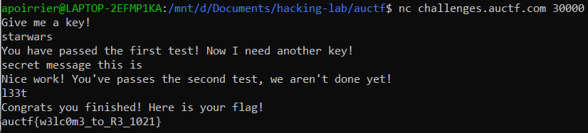

# Cracker Barrel

## Description

> I found a USB drive under the checkers board at cracker barrel. My friends told me not to plug it in but surely nothing bad is on it?
> 
> I found this file, but I can't seem to unlock it's secrets. Can you help me out?
> 
> Also.. once you think you've got it I think you should try to connect to challenges.auctf.com at port 30000 not sure what that means, but it written on the flash drive..

A binary is given.

## Solution

When we connect to `challenges.auctf.com:30000`, we are asked for a key. Let's reverse the binary with [Ghidra](https://ghidra-sre.org/).

```c
ulong main(void)
{
  int iVar1;
  
  setvbuf(stdout,(char *)0x0,2,0);
  iVar1 = check();
  if (iVar1 == 0) {
    puts("That\'s not it!");
  }
  else {
    print_flag();
  }
  return (ulong)(iVar1 == 0);
}
```

The `main` function just calls `check`, and if doesn't return 0 it prints the flag. 

```c
undefined8 check(void)
{
  int iVar1;
  undefined8 uVar2;
  long in_FS_OFFSET;
  char local_2018 [8200];
  long local_10;
  
  local_10 = *(long *)(in_FS_OFFSET + 0x28);
  puts("Give me a key!");
  fgets(local_2018,0x2000,stdin);
  remove_newline(local_2018);
  iVar1 = check_1(local_2018);
  if (iVar1 != 0) {
    puts("You have passed the first test! Now I need another key!");
    fgets(local_2018,0x2000,stdin);
    remove_newline(local_2018);
    iVar1 = check_2(local_2018);
    if (iVar1 != 0) {
      puts("Nice work! You\'ve passes the second test, we aren\'t done yet!");
      fgets(local_2018,0x2000,stdin);
      remove_newline(local_2018);
      iVar1 = check_3(local_2018);
      if (iVar1 != 0) {
        puts("Congrats you finished! Here is your flag!");
        uVar2 = 1;
        goto LAB_00101450;
      }
    }
  }
  uVar2 = 0;
LAB_00101450:
  if (local_10 != *(long *)(in_FS_OFFSET + 0x28)) {
                    /* WARNING: Subroutine does not return */
    __stack_chk_fail();
  }
  return uVar2;
}
```

The `check` function takes three inputs, and checks them using `check_i` functions with `i` from 1 to 3. 

```c
undefined8 check_1(char *param_1)
{
  int iVar1;
  undefined8 uVar2;
  
  iVar1 = strcmp(param_1,"starwars");
  if (iVar1 == 0) {
    iVar1 = strcmp(param_1,"startrek");
    if (iVar1 == 0) {
      uVar2 = 0;
    }
    else {
      uVar2 = 1;
    }
  }
  else {
    uVar2 = 0;
  }
  return uVar2;
}
```

`check_1` checks if the input is `starwars`.

```c
ulong check_2(char *param_1)
{
  int str_len;
  size_t sVar1;
  char *__s1;
  int i;
  
  sVar1 = strlen(param_1);
  str_len = (int)sVar1;
  __s1 = (char *)malloc((long)(str_len + 1) << 3);
  i = 0;
  while (i < str_len) {
    __s1[i] = "si siht egassem terces"[(str_len + -1) - i];
    i = i + 1;
  }
  str_len = strcmp(__s1,param_1);
  return (ulong)(str_len == 0);
}
```

`check_2` reads the string backwards and verifies if it is `si siht egassem terces`.

```c
ulong check_3(char *param_1)
{
  bool wrong;
  size_t str_len;
  void *tab;
  long in_FS_OFFSET;
  int i;
  int j;
  int pwd [4];
  undefined4 local_38;
  undefined4 local_34;
  undefined4 local_30;
  undefined4 local_2c;
  undefined4 local_28;
  undefined4 local_24;
  long local_20;
  
  local_20 = *(long *)(in_FS_OFFSET + 0x28);
  pwd[0] = 0x7a;
  pwd[1] = 0x21;
  pwd[2] = 0x21;
  pwd[3] = 0x62;
  local_38 = 0x36;
  local_34 = 0x7e;
  local_30 = 0x77;
  local_2c = 0x6e;
  local_28 = 0x26;
  local_24 = 0x60;
  str_len = strlen(param_1);
  tab = malloc(str_len << 2);
  i = 0;
  while (str_len = strlen(param_1), (ulong)(long)i < str_len) {
    *(uint *)((long)tab + (long)i * 4) = (int)param_1[i] + 2U ^ 0x14;
    i = i + 1;
  }
  wrong = false;
  j = 0;
  while (str_len = strlen(param_1), (ulong)(long)j < str_len) {
    if (*(int *)((long)tab + (long)j * 4) != pwd[j]) {
      wrong = true;
    }
    j = j + 1;
  }
  if (local_20 != *(long *)(in_FS_OFFSET + 0x28)) {
                    /* WARNING: Subroutine does not return */
    __stack_chk_fail();
  }
  return (ulong)!wrong;
}
```

`check_3` takes the input, adds `2` and xors the result with `0x14`, then verifies if this is equal to the numbers defined in `pwd`.

Those functions are quite easy to invert, and we find the passwords:




Flag: `auctf{w3lc0m3_to_R3_1021}`