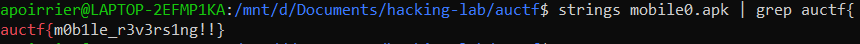

# Mobile 0

## Description

> Hey, look its an android file. Can you find the flag?
> 
> https://drive.google.com/open?id=1rX6W8xC5VCmzsFLO9r5yPCFKt4LMU5sc

The downloadable file is an apk file.

## Solution

Surely a not intended solution, but basic reversing procedure is to call `strings` on the executable.

Flag: `auctf{m0b1le_r3v3rs1ng!!}`