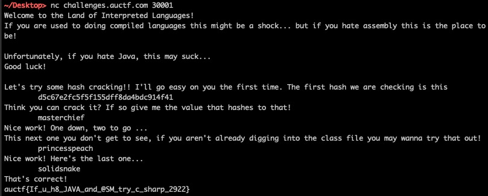

# Mr Game and Watch

## Description

> My friend is learning some wacky new interpreted language and different hashing algorithms. He's hidden a flag inside this program but I cant find it...
> 
> He told me to connect to challenges.auctf.com 30001 once I figured it out though.

We are given a `.class` file.

## Solution

Let's reverse it using an online [Java decompiler](http://www.javadecompilers.com/).

```java
import java.security.MessageDigest;
import java.io.IOException;
import java.io.Reader;
import java.io.BufferedReader;
import java.io.FileReader;
import java.util.Arrays;
import java.util.Scanner;

// 
// Decompiled by Procyon v0.5.36
// 

public class mr_game_and_watch
{
    public static String secret_1;
    public static int[] secret_2;
    public static int[] secret_3;
    public static int key_2;
    public static int key_3;
    
    public static void main(final String[] array) {
        System.out.println("Welcome to the Land of Interpreted Languages!");
        System.out.println("If you are used to doing compiled languages this might be a shock... but if you hate assembly this is the place to be!");
        System.out.println("\nUnfortunately, if you hate Java, this may suck...");
        System.out.println("Good luck!\n");
        if (crackme()) {
            print_flag();
        }
    }
    
    private static boolean crackme() {
        final Scanner scanner = new Scanner(System.in);
        if (crack_1(scanner) && crack_2(scanner) && crack_3(scanner)) {
            System.out.println("That's correct!");
            scanner.close();
            return true;
        }
        System.out.println("Nope that's not right!");
        scanner.close();
        return false;
    }
    
    private static boolean crack_1(final Scanner scanner) {
        System.out.println("Let's try some hash cracking!! I'll go easy on you the first time. The first hash we are checking is this");
        System.out.println(invokedynamic(makeConcatWithConstants:(Ljava/lang/String;)Ljava/lang/String;, mr_game_and_watch.secret_1));
        System.out.print("Think you can crack it? If so give me the value that hashes to that!\n\t");
        return hash(scanner.nextLine(), "MD5").compareTo(mr_game_and_watch.secret_1) == 0;
    }
    
    private static boolean crack_2(final Scanner scanner) {
        System.out.println("Nice work! One down, two to go ...");
        System.out.print("This next one you don't get to see, if you aren't already digging into the class file you may wanna try that out!\n\t");
        return hash(scanner.nextLine(), "SHA1").compareTo(decrypt(mr_game_and_watch.secret_2, mr_game_and_watch.key_2)) == 0;
    }
    
    private static boolean crack_3(final Scanner scanner) {
        System.out.print("Nice work! Here's the last one...\n\t");
        return Arrays.equals(encrypt(hash(scanner.nextLine(), "SHA-256"), mr_game_and_watch.key_3), mr_game_and_watch.secret_3);
    }
    
    private static int[] encrypt(final String s, final int n) {
        final int[] array = new int[s.length()];
        for (int i = 0; i < s.length(); ++i) {
            array[i] = (s.charAt(i) ^ n);
        }
        return array;
    }
    
    private static String decrypt(final int[] array, final int n) {
        String s = "";
        for (int i = 0; i < array.length; ++i) {
            s = invokedynamic(makeConcatWithConstants:(Ljava/lang/String;C)Ljava/lang/String;, s, (char)(array[i] ^ n));
        }
        return s;
    }
    
    private static void print_flag() {
        final String fileName = "flag.txt";
        try {
            final BufferedReader bufferedReader = new BufferedReader(new FileReader(fileName));
            try {
                String line;
                while ((line = bufferedReader.readLine()) != null) {
                    System.out.println(line);
                }
                bufferedReader.close();
            }
            catch (Throwable t) {
                try {
                    bufferedReader.close();
                }
                catch (Throwable exception) {
                    t.addSuppressed(exception);
                }
                throw t;
            }
        }
        catch (IOException ex) {
            System.out.println("Could not find file please notify admin");
        }
    }
    
    public static String hash(final String s, final String algorithm) {
        String string = null;
        try {
            final byte[] digest = MessageDigest.getInstance(algorithm).digest(s.getBytes("UTF-8"));
            final StringBuilder sb = new StringBuilder(2 * digest.length);
            final byte[] array = digest;
            for (int length = array.length, i = 0; i < length; ++i) {
                sb.append(String.format("%02x", array[i] & 0xFF));
            }
            string = sb.toString();
        }
        catch (Exception ex) {
            System.out.println("broke");
        }
        return string;
    }
    
    static {
        mr_game_and_watch.secret_1 = "d5c67e2fc5f5f155dff8da4bdc914f41";
        mr_game_and_watch.secret_2 = new int[] { 114, 118, 116, 114, 113, 114, 36, 37, 38, 38, 120, 121, 33, 36, 37, 113, 117, 118, 118, 113, 33, 117, 121, 37, 119, 34, 118, 115, 114, 120, 119, 114, 36, 120, 117, 120, 38, 114, 35, 118 };
        mr_game_and_watch.secret_3 = new int[] { 268, 348, 347, 347, 269, 256, 348, 269, 256, 256, 344, 271, 271, 264, 266, 348, 257, 266, 267, 348, 269, 266, 266, 344, 267, 270, 267, 267, 348, 349, 349, 265, 349, 267, 256, 269, 270, 349, 268, 271, 351, 349, 347, 269, 349, 271, 257, 269, 344, 351, 265, 351, 265, 271, 346, 271, 266, 264, 351, 349, 351, 271, 266, 266 };
        mr_game_and_watch.key_2 = 64;
        mr_game_and_watch.key_3 = 313;
    }
}
```

To win the game, we need to provide three correct passwords. For the first password, the hash is given, and we know it is hashed using MD5. A simple Google search yields `masterchief`.

The second password is verified as follow:

```
SHA1(input) ?= decrypt(secret_2, key_2)
```

To get the hash of the password, we need to decrypt the secret with the given key. From the decrypt function, decryption is a simple Caesar cipher (we need to XOR each value with `key_2`).

```python
secret = [114, 118, 116, 114, 113, 114, 36, 37, 38, 38, 120, 121, 33, 36, 37, 113, 117, 118, 118, 113, 33, 117, 121, 37, 119, 34, 118, 115, 114, 120, 119, 114, 36, 120, 117, 120, 38, 114, 35, 118]
hash = [c ^ 64 for c in secret]
print(''.join([chr(c) for c in hash]))
```

Then we can pass it to [John](https://www.openwall.com/john/) to reverse it:

```bash
john --format=raw-SHA1 --wordlist=rockyou.txt hash.txt
```

Result: `princesspeach`

Third password is actually recovered with the same method, except that the key changes and the hash function is SHA-256. Password: `solidsnake`.

Let's connect to the service and enter the passwords:



Flag: `auctf{If_u_h8_JAVA_and_@SM_try_c_sharp_2922}`