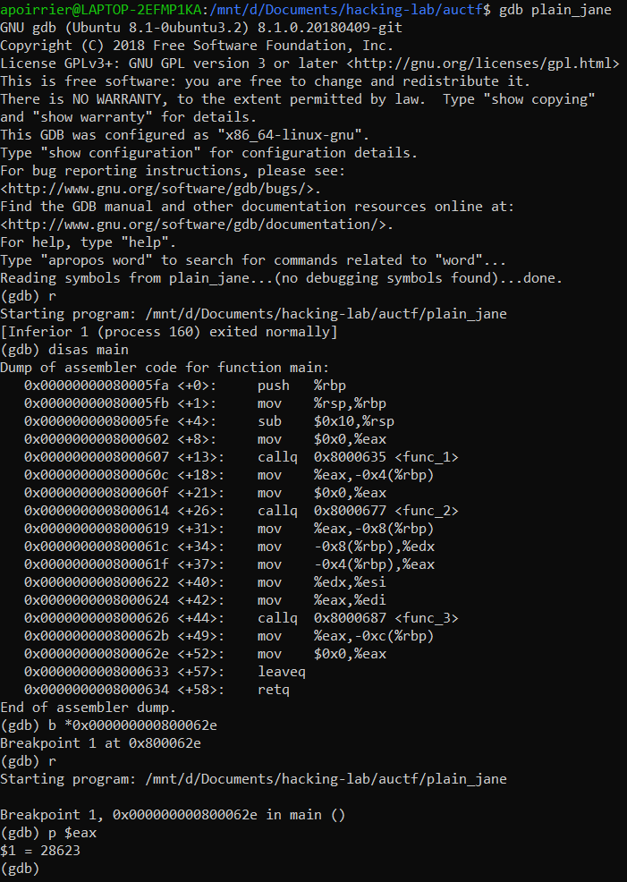

# Plain Jane

## Description

> I'm learning assembly. Think you can figure out what this program returns?
> 
> Note: Not standard flag format. Please provide either the unsigned decimal equivalent or hexadecimal equivalent.

The following `.s`file is given:

```assembly
	.file	"plain_asm.c"
	.intel_syntax noprefix
	.text
	.globl	main
	.type	main, @function
main:
.LFB6:
	.cfi_startproc
	push	rbp
	.cfi_def_cfa_offset 16
	.cfi_offset 6, -16
	mov	rbp, rsp
	.cfi_def_cfa_register 6
	sub	rsp, 16
	mov	eax, 0
	call	func_1
	mov	DWORD PTR -4[rbp], eax
	mov	eax, 0
	call	func_2
	mov	DWORD PTR -8[rbp], eax
	mov	edx, DWORD PTR -8[rbp]
	mov	eax, DWORD PTR -4[rbp]
	mov	esi, edx
	mov	edi, eax
	call	func_3
	mov	DWORD PTR -12[rbp], eax
	mov	eax, 0
	leave
	.cfi_def_cfa 7, 8
	ret
	.cfi_endproc
.LFE6:
	.size	main, .-main
	.globl	func_1
	.type	func_1, @function
func_1:
.LFB7:
	.cfi_startproc
	push	rbp
	.cfi_def_cfa_offset 16
	.cfi_offset 6, -16
	mov	rbp, rsp
	.cfi_def_cfa_register 6
	mov	BYTE PTR -1[rbp], 25
	mov	DWORD PTR -8[rbp], 0
	jmp	.L4
.L5:
	mov	eax, DWORD PTR -8[rbp]
	add	eax, 10
	mov	edx, eax
	mov	eax, edx
	sal	eax, 2
	add	eax, edx
	lea	edx, 0[0+rax*4]
	add	eax, edx
	add	BYTE PTR -1[rbp], al
	add	DWORD PTR -8[rbp], 1
.L4:
	cmp	DWORD PTR -8[rbp], 9
	jle	.L5
	movzx	eax, BYTE PTR -1[rbp]
	mov	DWORD PTR -12[rbp], eax
	mov	eax, DWORD PTR -12[rbp]
	pop	rbp
	.cfi_def_cfa 7, 8
	ret
	.cfi_endproc
.LFE7:
	.size	func_1, .-func_1
	.globl	func_2
	.type	func_2, @function
func_2:
.LFB8:
	.cfi_startproc
	push	rbp
	.cfi_def_cfa_offset 16
	.cfi_offset 6, -16
	mov	rbp, rsp
	.cfi_def_cfa_register 6
	mov	DWORD PTR -4[rbp], 207
	mov	eax, DWORD PTR -4[rbp]
	pop	rbp
	.cfi_def_cfa 7, 8
	ret
	.cfi_endproc
.LFE8:
	.size	func_2, .-func_2
	.globl	func_3
	.type	func_3, @function
func_3:
.LFB9:
	.cfi_startproc
	push	rbp
	.cfi_def_cfa_offset 16
	.cfi_offset 6, -16
	mov	rbp, rsp
	.cfi_def_cfa_register 6
	mov	DWORD PTR -36[rbp], edi
	mov	DWORD PTR -40[rbp], esi
	cmp	DWORD PTR -36[rbp], 64
	jg	.L10
	mov	eax, 24
	jmp	.L11
.L10:
	cmp	DWORD PTR -40[rbp], 211
	jle	.L12
	mov	eax, 20
	jmp	.L11
.L12:
	cmp	DWORD PTR -36[rbp], 0
	je	.L13
	cmp	DWORD PTR -40[rbp], 0
	jne	.L13
	mov	eax, 120
	jmp	.L11
.L13:
	cmp	DWORD PTR -36[rbp], 0
	jne	.L14
	cmp	DWORD PTR -40[rbp], 0
	je	.L14
	mov	eax, 220
	jmp	.L11
.L14:
	mov	eax, DWORD PTR -36[rbp]
	or	eax, DWORD PTR -40[rbp]
	mov	DWORD PTR -12[rbp], eax
	mov	eax, DWORD PTR -36[rbp]
	and	eax, DWORD PTR -40[rbp]
	mov	DWORD PTR -16[rbp], eax
	mov	eax, DWORD PTR -36[rbp]
	xor	eax, DWORD PTR -40[rbp]
	mov	DWORD PTR -20[rbp], eax
	mov	DWORD PTR -4[rbp], 0
	mov	DWORD PTR -8[rbp], 0
	jmp	.L15
.L16:
	mov	eax, DWORD PTR -16[rbp]
	sub	eax, DWORD PTR -8[rbp]
	mov	edx, eax
	mov	eax, DWORD PTR -12[rbp]
	add	eax, edx
	add	DWORD PTR -4[rbp], eax
	add	DWORD PTR -8[rbp], 1
.L15:
	mov	eax, DWORD PTR -8[rbp]
	cmp	eax, DWORD PTR -20[rbp]
	jl	.L16
	mov	eax, DWORD PTR -4[rbp]
.L11:
	pop	rbp
	.cfi_def_cfa 7, 8
	ret
	.cfi_endproc
.LFE9:
	.size	func_3, .-func_3
	.ident	"GCC: (Debian 9.2.1-22) 9.2.1 20200104"
	.section	.note.GNU-stack,"",@progbits
```

## Solution

If we quickly read the main function, we see that computations are performed, saved into `-12[rbp]` and then the function returns 0. The value in `-12[rbp]` is what we're looking for.

Because I'm lazy, instead of reversing the code I just compile it and execute it.

```bash
gcc -c plain_jane.s -o plain_jane.o
gcc plain_jane.o -o plain_jane
```

Then I use `gdb` to read the value.



Flag: `28623`