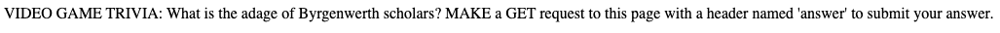
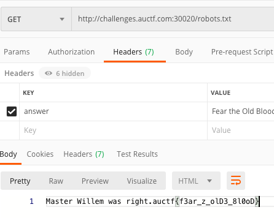

# Miyazaki Trivia

## Description

> http://challenges.auctf.com:30020
> 
> Here's a bit of trivia for you vidya game nerds.

## Solution

On the website, only says
 
 > Find the special file

 So I look if I can acces some files, and http://challenges.auctf.com:30020/index.html works. I then go to one of the common existing files `robots.txt`, and we see

So I fire up Postman and make a GET request to http://challenges.auctf.com:30020/robots.txt, and add the header `answer: Fear the Old Blood`. This gives us the flag.

Flag: `auctf{f3ar_z_olD3_8l0oD}`