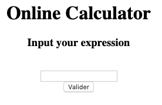

# Quick Maths

## Description

> http://challenges.auctf.com:30021
>
> two plus two is four minus three that's one quick maths

## Solution

The website is an online calculator. We give it an expression and it gives us the answer. From this I deduce that a function `eval` is used. Since I can give it a string and returns it to me, the input is not sanitized, and can be exploited.

I find that the backend is in PHP since the file `index.php` leads back to the page.

I try to give it `system('ls')`and it works, I see that there is no `flag.txt`. But trying `system('cat index.php')` and looking at the source code, we see the flag defined here.

Flag: `auctf{p6p_1nj3c7i0n_iz_k3wl}`