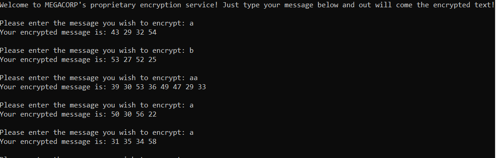

# B007l3G CRYP70

> While doing a pentest of a company called MEGACORP's network, you find these numbers laying around on an FTP server: 
> `41 36 37 27 35 38 55 30 40 47 35 34 43 35 29 32 38 37 33 45 39 30 36 27 32 35 36 52 72 54 39 42 30 30 58 27 37 44 72 47 28 46 45 41 48 39 27 27 53 64 32 58 43 23 37 44 32 37 28 50 37 19 51 53 30 41 18 45 79 46 40 42 32 32 46 28 37 30 43 31 26 56 37 41 61 68 44 34 26 24 48 38 50 37 27 31 30 38 34 58 54 39 30 33 38 18 33 52 34 36 31 33 28 36 34 45 55 60 37 48 57 55 35 60 22 36 38 34`
> 
> Through further analysis of the network, you also find a network service running. Can you piece this information together to find the flag?
> 
> Challenge instance ready at 88.198.219.20:26071.

## Description

When connecting to the resource given, we can encrypt some data. 



This is an encryption oracle, which enables us to understand how the cipher works. First we remark that a single character is encrypted using 4 integers. Moreover, encryption is not deterministic (see that `a` has several ciphertexts). Also, encrypting a 2 letter plaintext gives 8 integers in the ciphertext, so probably characters are encrypted one by one.

The next thing to look at is to find similarities between ciphertexts corresponding to the same ciphertext. Here I have remarked that all ciphertexts for `a` give the same sum. 

## Solution

Once I am there, deducing the actual cipher is easy: the sum of the four integers correspond to the complementary of the ASCII character. The following Python code recovers the flag:

```python
ct = "41 36 37 27 35 38 55 30 40 47 35 34 43 35 29 32 38 37 33 45 39 30 36 27 32 35 36 52 72 54 39 42 30 30 58 27 37 44 72 47 28 46 45 41 48 39 27 27 53 64 32 58 43 23 37 44 32 37 28 50 37 19 51 53 30 41 18 45 79 46 40 42 32 32 46 28 37 30 43 31 26 56 37 41 61 68 44 34 26 24 48 38 50 37 27 31 30 38 34 58 54 39 30 33 38 18 33 52 34 36 31 33 28 36 34 45 55 60 37 48 57 55 35 60 22 36 38 34"
ciphertext = [int(s) for s in ct.split(" ")]

pt = []
for i in range(0, len(ciphertext), 4):
    pt.append(255 - ciphertext[i] - ciphertext[i+1] - ciphertext[i+2] - ciphertext[i+3])
print("".join([chr(c) for c in pt]))
```

Flag: `ractf{d0n7_r0ll_y0ur_0wn_cryp70}`