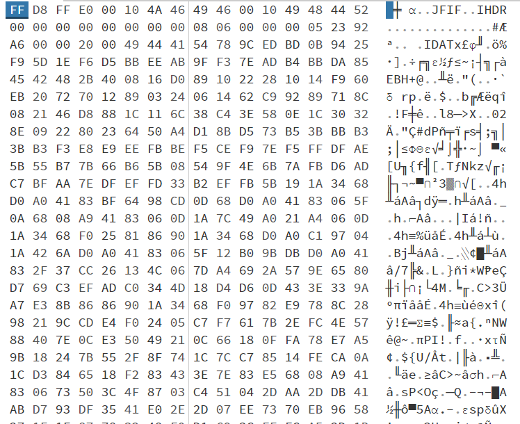

# Cheap Facades

> We've found a JPEG, but it doesn't seem to open in any of our editors. Can you see what's going on?

A file `flag.jpg` is provided.

## Description

If we execute `file flag.jpg`, we get the following answer:

```
flag.jpg: JPEG image data, JFIF standard 16.73, density 17490x0, segment length 16
```

So this is truly a JPEG image data. However density seems really off, so probably the header is broken. Let's have a look at the hex data. I'm using the online tool [hexed.it](https://hexed.it/) to open the file and modify it.



Here I see something strange: I see the IHDR and IDAT tags, which normally are in PNG files and not JPEG! Plus at the end there is an IEND tag... So probably this is actually a PNG image which header has been changed to a JPEG header.

## Solution

Let's modify the header. From the [specification](https://en.wikipedia.org/wiki/Portable_Network_Graphics#File_format), I know the first 8 bytes are `89 50 4E 47 0D 0A 1A 0A`. 

Then there is the IHDR chunk: 
- 4 bytes for the size: `00 00 00 0D`
- the IHDR tag: `49 48 44 52`
- 4 bytes for the width: here it is 0, I need to change it
- 4 bytes for the height: once again this is 0, I need to change it
- 5 bytes holding bit depth, color type, compression method, filter method and interlace method: `08 06 00 00 00`. They seem ok
- 4 bytes CRC (this is a checksum): `05 23 92 A6`.

To find the correct size of the image, I apply the same method than in [Dimensionless](Dimensionless.md). This allow me to find the flag:


Flag: `ractf{D0n't_judg3_4_f1le_6y_it5_h34d3r}`