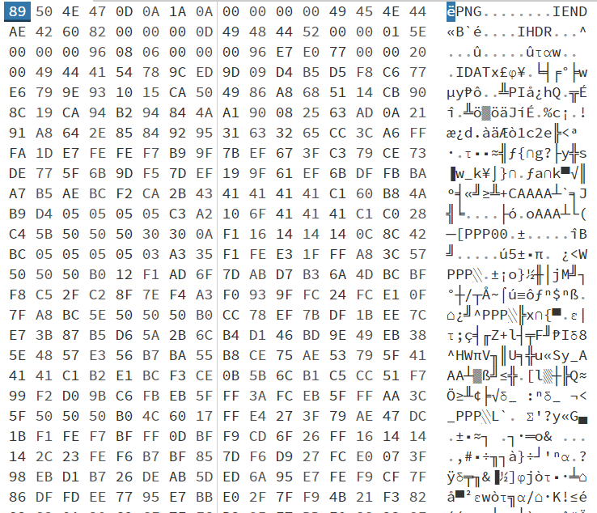
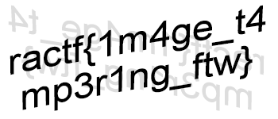

# Cut short

> This image refuses to open in anything, which is a bit odd. Open it for the flag!

A file `flag.png` is provided.

## Description

When using `file flag.png`, we get the answer `data`. So let's use a hex editor to have a look at it. I'm using [hexed.it](https://hexed.it/).

It looks like a PNG all right, but here we have an IEND tag right at the beginning!

## Solution

Let's remove it. Following the [PNG specification](https://en.wikipedia.org/wiki/Portable_Network_Graphics#File_format), we know the first 8 bytes are ok, and the next expected 4 bytes are `00 00 00 0D` which we find on line 2. So let's remove the bytes `00 00 00 00 49 45 4E 44 AE 42 60 82`.

This gives us the flag.

Flag: `ractf{1m4ge_t4mp3r1ng_ftw}`