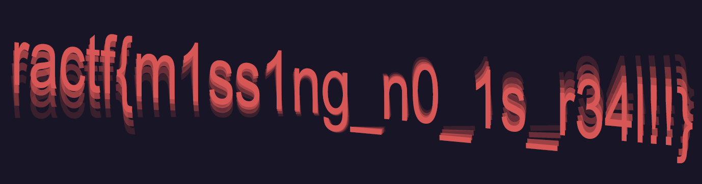

# Dimensionless Loading

> This PNG looks to be valid, but when we open it up nothing loads. Any ideas?

We are provided with a file `flag.png`.

## Description

`file flag.png` returns the following: 

```
flag.png: PNG image data, 0 x 0, 8-bit/color RGBA, non-interlaced
```

It's a PNG image all right, but here the size is 0x0. Using a [hex editor](https://hexed.it/), I confirm this looks like a PNG image with size 0x0.

Let's recall from the [PNG specification](https://en.wikipedia.org/wiki/Portable_Network_Graphics#File_format) how the size of the image is determined. The image size is determined in the IHDR chunk, using 4 bytes for the width and 4 bytes for the height. Moreover, each chunk is validated using a CRC checksum. 

## Solution

My solution is to bruteforce the size until I get the checksum that is present in the original image. The image size (in bytes) gives a rough estimate on the upper bound on the image dimensions. 

The following Python code performs this bruteforce:

```python
import binascii

def compute_crc(w, h):
    hexw = "{:08x}".format(w)
    hexh = "{:08x}".format(h)
    return hex(binascii.crc32(bytes.fromhex("49484452{}{}0806000000".format(hexw, hexh))))


for w in range(2000):
    for h in range(2000):
        crc = compute_crc(w,h)
        if crc == "0x5b8af030":
            print(hex(w),hex(h))
```

This gives the flag:



Flag: `ractf{m1ss1ng_n0_1s_r34l!!}`
