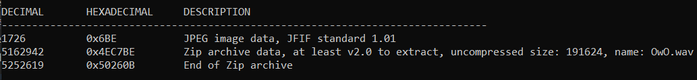
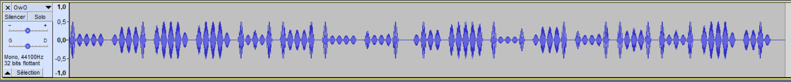
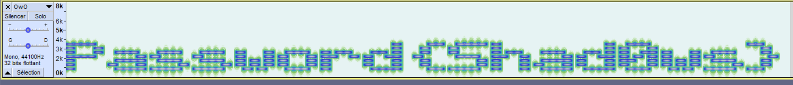
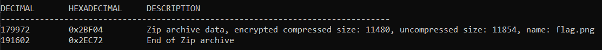

# Monster issue

> Agent,
> 
> We've got a case of industrial espionage, quite an unusual one at that.
An international building contractor - Hamilton-Lowe, has written to us
that they are having their private client contracts leaked.
> 
> After conducting initial incident response, they managed to find a hidden
directory on one of their public facing web-servers. However, the strange
thing is, instead of having any sensitive documents, it was full of mp3 music
files.
> 
> This is a serious affair as Hamilton-Lowe constructs facilities for high-profile clients such as the military, which means having building schematics leaked from
them could lead to a lapse in national security.
> 
> We have attached one of these mp3 files, can you examine it and see if there is any hidden information inside?

Attached is a file `aero_chord.mp3`.

## Description

`file aero_chord.mp3` says this is a valid `mp3` file. After looking a little bit at it in Audacity, I run `binwalk` on it.



Yes, I find a JPEG image and a Zip archive. 

## Solution

First I try to extract them using `binwalk -e aero_chord.mp3`. This extract the Zip archive but not the image. After extracting the image manually, I found out the image is just the album cover of the song.

Then I unzip the archive. A file `OwO.wav` is extracted. I open it in Audacity.



First it looked like some sort of 5-bit or 4-bit code, so I tried Baudot, morse or Bacon but had no result. Actually I needed to display the spectogram of the file in Audacity:



And yes, here I get a password! But I don't know where to input it yet. So I once again run `binwalk` on `Owo.wav`.



This looks good, some archive with a name `flag.png`! Let's extract the archive using `binwalk -e OwO.wav`. Then I try to unzip it with `unzip 2BF04.zip`, but I get the following error:

```
skipping: flag.png                need PK compat. v5.1 (can do v4.6)
```

Well this kind of errors come when a password needs to be given. So I try instead `7z x 2BF04.zip` and then I need to enter a password. I enter the password found earlier and here is the flag!


Flag: `ractf{M0nst3rcat_In5tin3t}`