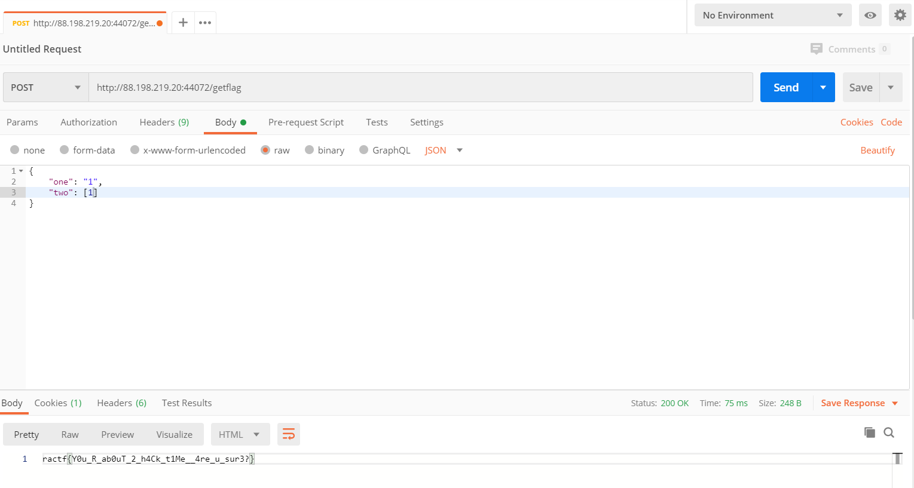

# C0llide

> A target service is asking for two bits of information that have the same "custom hash", but can't be identical. Looks like we're going to have to generate a collision?

When we go to the given website, we are greeted with the following source code:

```javascript
const bodyParser = require("body-parser")
const express = require("express")
const fs = require("fs")
const customhash = require("./customhash")

const app = express()
app.use(bodyParser.json())

const port = 3000
const flag = "flag"
const secret_key = "Y0ure_g01nG_t0_h4v3_t0_go_1nto_h4rdc0r3_h4ck1ng_m0d3"

app.get('/', (req, res) => {
    console.log("[-] Source view")
    res.type("text")
    return fs.readFile("index.js", (err,data) => res.send(data.toString().replace(flag, "flag")))
})

app.post('/getflag', (req, res) => {
    console.log("[-] Getflag post")
    if (!req.body) {return res.send("400")}
    let one = req.body.one
    let two = req.body.two
    console.log(req.body)
    if (!one || !two) {
        return res.send("400")
    }
    if ((one.length !== two.length) || (one === two)) {
        return res.send("Strings are either too different or not different enough")
    }
    one = customhash.hash(secret_key + one)
    two = customhash.hash(secret_key + two)
    if (one == two) {
        console.log("[*] Flag get!")
        return res.send(flag)
    } else {
        return res.send(`${one} did not match ${two}!`)
    }
})

app.listen(port, () => console.log(`Listening on port ${port}`))
```

## Description

For this challenge, we may post data to the `getflag` endpoint, with two inputs `one` and `two`. To get the flag back, those two inputs must collide under an unknown hash function. Another requirement is that our inputs should have the same length. As our inputs are salted, it will be difficult to find in reasonable time a real collision.

## Solution

Therefore we attack the `javascript` code itself. There are two checks performed to validate our inputs:
- `one.length !== two.length`
- `one === two`

If one of them is true, then we get an error message. Otherwise, the following code check if this is a collision: 

```javascript
one = customhash.hash(secret_key + one)
two = customhash.hash(secret_key + two)
if (one == two) ...
```

Here we can therefore exploit the javascript simplifications, as we can input integers for instance, which once concatenated with a string will be cast as a string. However `===` checks also the type, so if we input `'1'` and `1` (the first is a string, the second a number), we'll have `one !== two` but the hashes will be the same.

As for the length check, instead of inputing an integer we can input an array, which will also be casted as the same string using the `+` operator.

Using Postman we get the flag:



Flag: `ractf{Y0u_R_ab0uT_2_h4Ck_t1Me__4re_u_sur3?}`