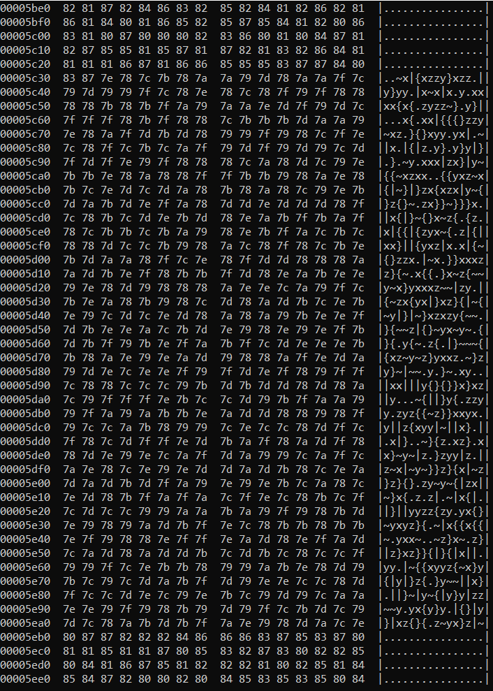
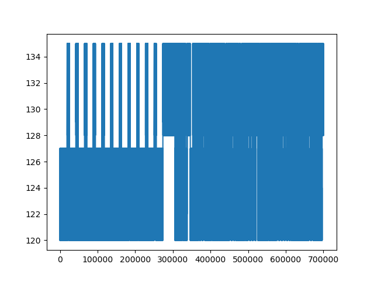
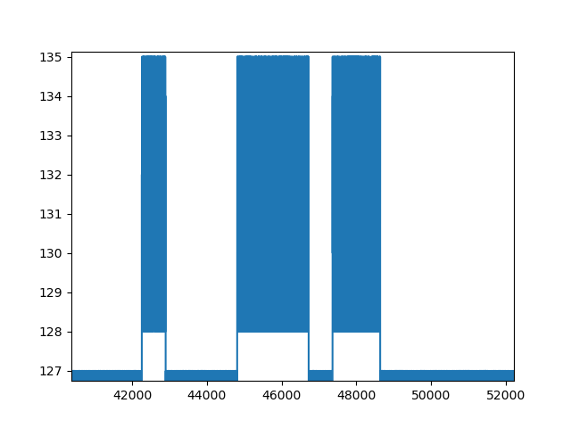
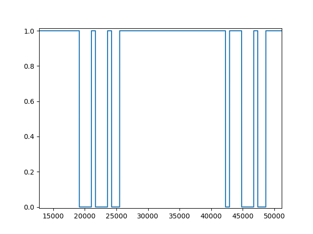

# ASCII UART

> Un informateur a intercepté un message binaire transmis sur un câble. Il a rapidement enregistré via la carte son d'un PC les données en 8 bits signés (ascii_uart.raw). Dans la précipitation, il a oublié de noter la fréquence d'échantillonnage. Retrouvez le message.
>
> Le flag est de la forme DGSESIEE{X} avec X le message


Le fichier `ascii_uart.raw` est donné.

Le fichier contient de la data. Au vu du titre du challenge et de la description, il s'agit d'une communication en UART qu'il faut décoder.

## A propos de UART

N'étant pas familier avec le protocole UART, je me renseigne sur le web. Le [premier résultat](https://www.circuitbasics.com/basics-uart-communication/#:~:text=UART%20stands%20for%20Universal%20Asynchronous,transmit%20and%20receive%20serial%20data.) explique très bien le protocole.

L'image la plus importante est la suivante:


Par défaut, la ligne est en haut voltage (bit 1).
Puis quand un paquet arrive, le ligne devient basse: c'est le start bit.
Suivent ensuite 5 à 9 bits de data, puis un partity bit qui agit comme code de validation, et enfin au moins un stop bit (un bit en voltage haut). Le parity bit contient le XOR de tous les data bits du paquet.

Cependant, un bit UART ne correspond pas à un bit de notre fichier ascii_uart.raw dont la fréquence d'échantillonnage est probablement beaucoup plus élevée. L'objectif est d'abord de trouver cette fréquence d'échantillonnage.

## Fréquence d'échantillonnage

En parcourant les bytes du fichier grâce à la commande `hexdump -C ascii_uart.raw`, j'observe qu'il y a des successions de groupes de bytes qui ont l'air de nature différente: les bytes au dessus et en dessous de 0x80.



Pour vérifier cela, je trace un graphe des bytes avec Python:

```python
import matplotlib.pyplot as plt
import numpy as np

with open("ascii_uart.raw", 'rb') as f:
    data = f.read()

plt.figure()
plt.plot(list(range(len(data))), list(data))
plt.show()
```



J'obtiens bien deux types de bytes. Comme le sujet indique que les bytes sont sur 8 bits signés, ceux supérieurs à 127 sont en fait négatifs et ceux inférieurs sont positifs. Cela concorde probablement avec le fait que la position de repos semble être les bits positifs.

Je remarque toutefois une zone qui semble étrange autour du byte 300000.

Pour vérifier mon hypothèse, je zoome autour d'un des pics.



Clairement cela ressemble à du UART (inversé). J'effectue donc la modification suivante:

```python
data = [1 if x <= 127 else 0 for x in data]
```

Cela me permet d'afficher, en zoomant, mes paquets:



En comptant, j'en déduis que sur l'image, le premier pic de 1 correspond à un bit UART, et que cela correspond au paquet `0 00100010 0 1`, avec 8 bits de data et un parity bit. De plus, la data en little endian correspond à `D`, et la data du second paquet correspond à `G`, ce qui est prometteur comme le flag commence par DGSESIEE.

On obtient donc une période de 638 bytes pour 1 bit UART.

## Automatiser le décryptage

Le code python suivant automatise le décodage. Tant que la ligne est à 1, on continue. Puis quand elle passe à 0, on vérifie si on a bien un startbit, et si c'est le cas on le décrypte. Si le bit de parité n'est pas correct, on drop complètement le paquet.

```python
import matplotlib.pyplot as plt
import numpy as np

import os
dir_path = os.path.dirname(os.path.realpath(__file__))
os.chdir(dir_path)
print(os.getcwd())

with open("ascii_uart.raw", 'rb') as f:
    data = f.read()

data = [1 if x <= 127 else 0 for x in data]

PERIOD = 638

i = 0
while i < len(data):
    while i < len(data) and data[i] == 1:
        i += 1
        continue
    if i >= len(data):
        print()
        break
    
    # start bit
    b = int(np.round(np.average(data[i:i+PERIOD])))
    if b != 0:
        # Faux start bit
        i += 1
        continue
    i += PERIOD

    # data
    parity = 0
    s = 0
    for j in range(8):
        b = int(np.round(np.average(data[i:i+PERIOD])))
        parity += b
        s += (b << j)
        i += PERIOD

    # Parity bit
    b = int(np.round(np.average(data[i:i+PERIOD])))
    if b != parity % 2: #Parity bit incorrect
        i += (2*PERIOD)
        continue
    i += PERIOD

    # Stop bit
    b = int(np.round(np.average(data[i:i+PERIOD])))
    i += PERIOD
    if b == 1:
        print(chr(s), end="")
```

Le programme nous écrit le flag.

Flag: `DGSESIEE{  -]b  \_(''/)_/  (^_-)   @}-;---    (*^_^*)  \o/ }`