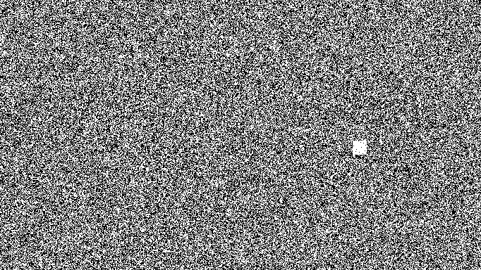
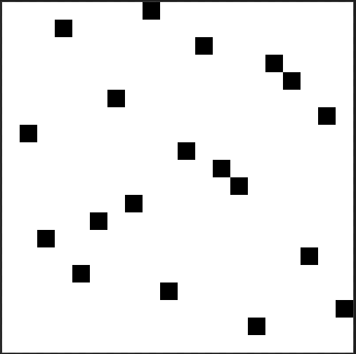

# Automatos

> Un de nos agents ne répond plus depuis quelques jours, nous avons reçu un mail avec une photo d'archives de Brigitte Friang. Cela ne peut pas être une coïncidence. Il a certainement cherché à cacher des informations dans l'image. Nous devons le secourir au plus vite, il est certainement en danger et sur écoute.
> 
> Le flag est juste une chaîne de caractères

L'image en question:


Clairement un challenge parmi les plus durs du CTF, le pauvre agent qui a envoyé l'image serait probablement mort le temps qu'on trouve son message... Avec pour seul indice que le titre peut aider, deviner la méthode de stéganographie est difficile.

## Trouver la matrice

Face à une épreuve de stéganographie, mes réflexes sont de vérifier le format du fichier (avec `file`), chercher des fichiers inclus dans le fichier (avec `binwalk`), de vérifier les chaînes de caractères (avec `strings`). J'ouvre aussi le fichier avec un éditeur hexa afin de voir s'il n'y a rien d'étrange.

Tout cela ne donne rien. Comme il s'agit d'une image, je check également les LSB avec `zsteg`, puis j'utilise [StegOnline](https://stegonline.georgeom.net/upload) pour observer les LSB et différents plans.

Et là bingo ! Je trouve une anomalie dans les bits plans rouge 0 à 4.



Le carré de taille 20x20 est aussi présent au même endroit dans les plans rouge 1 à 4.

## Exploiter le carré

Une fois celui-ci trouvé, j'ai passé des jours entiers à bloquer. Parmi les idées que j'ai essayées:
- trouver un automate cellulaire qui fasse passer la matrice du plan 0 vers la matrice du plan 1, etc...
- appliquer des automates cellulaires connus sur la matrice
- utiliser la matrice comme un masque, afin d'extraire des LSB sur le reste de l'image (ou bien toute l'image, ou les autres channels).

Finalement, en superposant les 5 matrices, j'obtiens la matrice suivante:



Et l'observation la plus importante que j'ai eue est qu'il n'y a qu'un point par ligne / colonne, comme une matrice de permutation.

Fort de ce constat, j'ai à nouveau tenté de nombreuses méthodes de décryptions, en appliquant cette matrice sur des portions de l'image et en cherchant les LSB, etc...

Finalement la solution était plus simple que cela: cette matrice représente un automate à 20 états. Chaque point sur ma matrice a en fait une valeur (que j'obtiens avec `valeur & 0b11111`), c'est le label sur mon automate, qui représente une transition. Je commence en état 0 (ligne 0), et je termine en état 19. 

Le code Python suivant donne la solution:

```python
import numpy as np
from PIL import Image

img = Image.open("brigitte.png")
array = np.array(img.getdata(), dtype=np.uint8).reshape(384,682,3)

interesting_part = array[200:220,500:520,0]
matrix = np.copy(interesting_part) & 0b11111
print(matrix)

alphabet = "0ABCDEFGHIJKLMNOPQRSTUVWXYZ"

i = 0
while True:
    j = 0
    while j < 20:
        if matrix[i,j] != 0:
            print(alphabet[matrix[i,j]], end="")
            i = j
            break
        j += 1
    if j == 20:
        break
print()
```

Flag: `ARBREDEPOIDSMINIMUM`