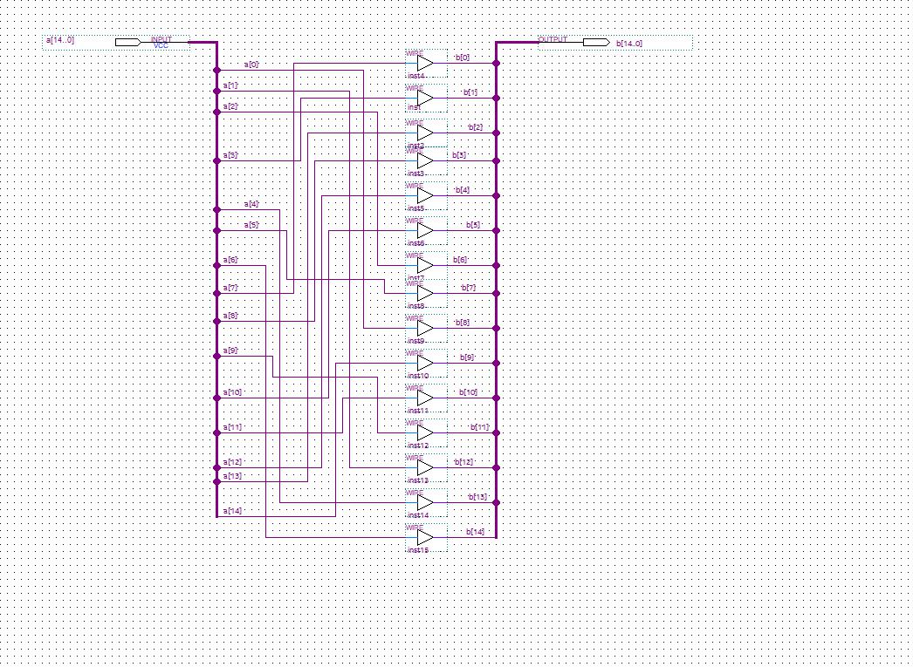
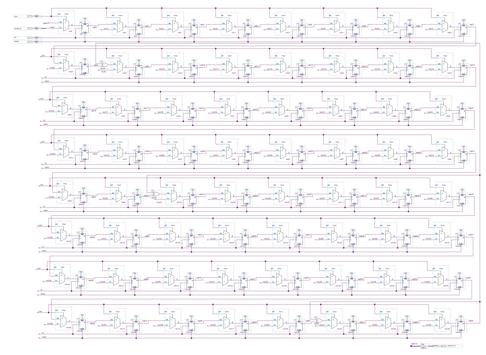
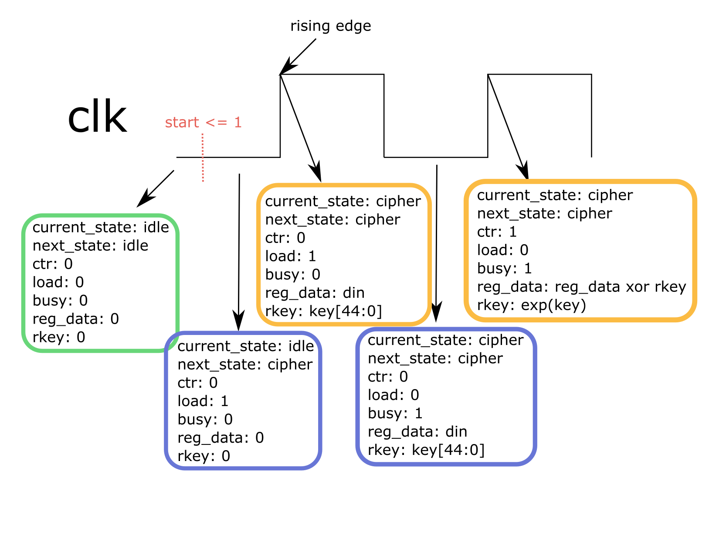

# Evil Cipher

> Evil Country a développé et implémenté sur FPGA son propre algorithme de chiffrement par blocs de 45 bits avec une clé de 64 bits. cipher.txt est un message chiffré avec la clé key=0x4447534553494545. Un agent a réussi à récupérer
> - le code VHDL de l'algorithme (evil_cipher.vhd)
> - la fin du package VHDL utilisé (extrait_galois_field.vhd)
> - le schéma de la fonction permutation15 (permutation15.jpg)
> - le schéma du composant key_expansion (key_expansion.jpg)
>
> Un exemple de texte chiffré se trouve dans le fichier evil_example.txt (dans l'archive zip)
> 
> Déchiffrez le message.
> 
> Le flag est de la forme DGSESIEE{x} avec x un hash

`cipher.txt` contient une suite de 0 et de 1.

Le code VHDL:

```vhdl
library ieee;
use ieee.std_logic_1164.all;
use ieee.numeric_std.all;
use work.galois_field.all;

--------------------------------------------
-- Operations dans GF(32)
-- avec le polynome : X^5+ X^2 +1
--------------------------------------------

entity evil_cipher is
  port (
    clk    : in  std_logic;
    resetn : in  std_logic;
    start  : in  std_logic;
    key    : in  std_logic_vector(63 downto 0);
    din    : in  std_logic_vector(44 downto 0);
    dout   : out std_logic_vector(44 downto 0);
    ready  : out std_logic 
  );
end entity;

architecture rtl of evil_cipher is
  type state is (idle, cipher);
  signal current_state : state;
  signal next_state    : state;
  signal reg_data      : std_logic_vector(din'range);
  signal rkey          : std_logic_vector(din'range);
  signal ctr           : natural range 0 to 5;
  signal load          : std_logic;
  signal busy          : std_logic;
  
begin
 ready <= not busy;
 dout <= (others => '0') when busy = '1'
         else reg_data;
 
 process(clk,resetn) is
 begin
   if resetn = '0' then
     current_state <= idle;     
     reg_data <= (others => '0');
     ctr      <= 0;
    
   elsif rising_edge(clk) then
     -- state register
     current_state <= next_state;
     
     -- counter
     if busy = '0' or ctr=5 then 
       ctr <= 0;
     else
       ctr <= ctr+1;
     end if;
     
     -- data register
     if busy = '1' then 
       if ctr = 0 then
         reg_data <= rkey xor reg_data;
       else 
          reg_data <= round(reg_data,rkey);
       end if;
     elsif load = '1' then 
       reg_data <= din;
     end if;
   end if; 
 end process;
 
 exp : entity work.key_expansion 
   port map (
     resetn => resetn,
     clk    => clk,
     load   => load,
     key    => key,
     rkey   => rkey
   );
   
   process (current_state, start, ctr) is
   begin
     case current_state is
       when idle =>
         if start = '1' then 
           next_state <= cipher;  
         else
           next_state <= idle;  
         end if;
         busy <= '0';
         load <= start;
       when cipher =>
         if ctr < 5 then 
           next_state <= cipher;  
         else
           next_state <= idle;  
         end if;
         busy <= '1';
         load <= '0';        
     end case;
   end process;

 
end architecture;
```

La fin du package `extrait_galois_field.vhd`:

```vhdl
--------------------------------------------
-- Operations dans GF(32)
-- avec le polynome : X^5+ X^2 +1
--------------------------------------------

  function permutation       (a : std_logic_vector(44 downto 0)) return  std_logic_vector is
    variable b : std_logic_vector(44 downto 0);
  begin
    b(14 downto  0) := permutation15(a(29 downto 15));
    b(29 downto 15) := permutation15(a(44 downto 30));
    b(44 downto 30) := permutation15(a(14 downto  0));
    return b;
  end permutation;
 
 function round (d : std_logic_vector(44 downto 0); key : std_logic_vector(44 downto 0)) return t_block is
   variable tmp  : std_logic_vector(44 downto 0);
   variable data : std_logic_vector(44 downto 0);
 begin
   tmp := permutation (d);   
   for i in 0 to 8 loop
      tmp(5*i+4 downto 5*i):= galois_inverse(tmp(5*i+4 downto 5*i));
   end loop;
      
   tmp := tmp xor key;
   
   for i in 0 to 2 loop
     data (15*i+4  downto 15*i   ) := 
       tmp (15*i+4  downto 15*i)   xor
       tmp (15*i+9  downto 15*i+5) xor
       galois_multiplication(tmp(15*i+14  downto 15*i+10), "00010");
                                    
     data (15*i+9  downto 15*i+5 ) := 
       tmp (15*i+4  downto 15*i) xor
       galois_multiplication(tmp (15*i+9  downto 15*i+5), "00010") xor
       tmp (15*i+14  downto 15*i+10);     
       
     data (15*i+14  downto 15*i+10 ) := 
       galois_multiplication(tmp (15*i+4  downto 15*i), "00010") xor
       tmp (15*i+9  downto 15*i+5) xor
       tmp (15*i+14  downto 15*i+10);                                   
   end loop;
     
   return data;  
 end round;
 
end galois_field;
```

Le schéma de la fonction `permutation15`:



Le schéma du composant `key_expansion`:



L'exemple:

```
Exemple de chiffrement avec la clé 0x4447534553494545

texte clair :
evil

bloc clair équivalent:
011001010111011001101001011011000000000000000

bloc chiffré:
000101110010110001110101010111010101001010100
```

C'est un challenge de cryptographie classique, où on nous donne une implémentation d'un cipher, un ciphertext et il faut reverse l'implémentation, l'inverser et récupérer le plaintext.

Comme nous ne disposons pas d'une FPGA pour programmer le circuit, nous devons également traduire le programme en un langage utilisable pour chiffrer et déchiffrer.

## Reverse engineering du cipher

N'ayant aucune connaissance du VHDL, je me réfère à des tutoriels sur Google. En particulier le [manuel de référence](https://www.ics.uci.edu/~jmoorkan/vhdlref/Synario%20VHDL%20Manual.pdf) est très bien expliqué.

Je comprends donc que j'ai une entité, `evil_cipher`, qui prend en entrée : la clock `clk`, une entrée `resetn` (qui de manière standard vaut 0 quand on veut reset la machine et 1 sinon), une entrée `start`, que je suppose valoir 1 quand on veut lancer l'encryption et 0 sinon, la clé `key` de 64 bits et le plaintext `din` de 45 bits. Les sorties sont le ciphertext `dout` de 45 bits et un bit `ready` qui vaut 1 quand la sortie est prête.

J'apprends également sur [cette page](https://insights.sigasi.com/tech/to-downto-ranges-vhdl/?fbclid=IwAR1jDo-41K_KtFnUapiVIIXoq97ODNO5EnzH1w2Ld60W9cMX7YfYhRcG9AM) que la notation `x downto 0` m'indique que les tableaux sont stockés en little endian, ce qui me donne le stockage de la clé.

L'idée est de comprendre comment est implémenté le cipher, ce qui est décrit par l'architecture.

L'architecture utilise différents signaux, qui sont des variables internes à l'entité. Elle est composée de plusieurs processus, qui relient les entrées aux sorties.

Le code en VHDL n'est pas linéaire: tout s'exécute en même temps. Cependant, certains process sont soumis au `rising_edge` et s'exécutent seulement une fois par cycle.
Le reste des processus s'éxecutent constamment.
En pratique, on a donc une sorte d'alternance entre les processus soumis au rising edge et les autres.

Les processus `ready <= not busy;` et `dout <= (others => '0') when busy = '1' else reg_data;` servent à mettre à jour les output une fois le travail terminé. Ils s'exécutent constamment.

Lorsque `resetn = 1` (ce qui nous intéresse), le processus qui commence par `process(clk,resetn) is` est soumis au rising edge: il s'exécute une fois par cycle.
Chaque opération à l'intérieur du processus s'exécute en même temps, donc les valeurs à droite des affectations sont les anciennes valeurs et celles à gauche les nouvelles valeurs. Appelons ce processus `Compute`.

Il va de pair avec le processus `process (current_state, start, ctr) is` qui lui s'exécute constamment et permet de contrôler l'état des signaux. Appelons ce processus le processus `State`.

En pratique, un opérateur utilise le système comme suit:
- il connecte un fil qui contient la clé vers l'entrée `key`
- il connecte le plaintext vers l'entrée `din`
- puis il passe la valeur de `start` à 1.
- une fois lancé, il repasse la valeur de `start à 0`.
- il attend que `ready` soit 1 pour récupérer la valeur `dout`.

La description de ce qui se passe est décrit sur la figure ci-après.



Le carré vert indique l'état de l'entité au repos. Puis, quand l'opérateur change la valeur de start, le nouvel état devient le premier carré bleu. C'est le processus `State` qui effectue ce changement.

Lorsque le rising edge arrive, les processus `exp` et `Compute` s'activent. L'état devient alors le premier carré orange. Ensuite comme certaines valeurs ont changé, le processus `State` entre en jeu immédiatement après, et l'état devient le second carré bleu.

Au rising edge suivant, les processus `exp` et `Compute` s'activent une nouvelle fois, et donnent le second état orange. On note en particulier que bien que `Compute` change la valeur de `ctr`, c'est bien l'ancienne valeur de `ctr` qui est utilisée dans le `if`, puisque ces deux blocs s'exécutent en même temps.

Pour vérifier l'ordre d'exécution, j'ai utilisé un simulateur en remplaçant les parties non implémentées par des print. La simulation que j'ai créée se trouve [ici](https://www.edaplayground.com/x/jwaU).

A ce niveau, je sais que le plaintext est d'abord XOR avec la clé, puis subit 5 fois la fonction `round`. Entre chaque `round`, la clé subit la fonction `key_expansion`.

Il s'agit de comprendre ce que font ces fonctions.

### Key expansion

On se réfère au schéma de la fontion donnée. En zoomant sur l'image, on obtient trois composants principaux:
- le multiplexeur, qui prend en entrée `A0`, `A1` et un bit de selection `b`, et retourne `Ab`
- le flip flop, qui met à jour sa valeur de sortie à chaque rising edge, et conserve cette valeur jusqu'au suivant
- une porte XOR.

Les multiplexeurs sont utiles uniquement pour charger la clé. Quand `load = 1`, ce qui n'arrive qu'au tout premier round, alors tous les multiplexeurs sélectionnent les bits de la clé qui sont transférés dans `reg`.

Aux rounds suivants, le registre `reg` subit un décalage de 1 bit vers la gauche et certains bits sont xor avec `reg[63]`.

La clé utilisée pour le round est la tronquature de `reg` pour obtenir 45 bits.

### Round

Un round du cipher est défini par la fonction `round` du fichier `extrait_galois_field.vhd`. L'entrée est d'abord coupée en 3 parties de 15 bits. Chaque partie subit alors l'opération `permutation15`, qui est décrite par l'image fournie. Puis ces parties sont permutées entre elles.

Ensuite le registre est coupé en 9 blocs de 5 bits. Ces bits sont considérés comme des membres de GF(32) avec le polynôme donné, et sont inversés sur place.

Ensuite le registre est xor avec la clé du round de 45 bits.

Puis le registre est à nouveau coupé en 9 blocs de 5 bits. Les blocs sont pris 3 par 3 pour faire un vecteur de 3 éléments du corps, et son multipliés par la matrice
> 1 1 2
>
> 1 2 1
> 
> 2 1 1

Maintenant qu'on a compris comment le cipher fonctionne, on peut passer à l'implémentation.

## Implémentation du cipher

J'utilise Python pour simuler le cipher, avec la librairie [pyfinite](https://github.com/emin63/pyfinite) pour les opérations dans le corps de Galois.

Je représente mes tableaux par des strings, avec la case 0 de ma string la case 0 du tableau VHDL (ce qui explique pourquoi je dois inverser la string du plaintext et ciphertext).

D'abord, je définis la clé et la schéma global pour l'encryption:

```python
def bin_format(x, n):
    return format(x, "0{}b".format(n))[::-1]

KEY = bin_format(0x4447534553494545, 64)

def encrypt_block(data):
    data = data[::-1]
    key = KEY
    data = xor(data, key[:45])
    key = key_expansion(key)
    for i in range(5):
        data = round(data, key[:45])
        key = key_expansion(key)
    data = data[::-1]
    return data
```

Les opérations sont décrites ci-après. Tout d'abord, les fonctions `xor` et `key_expansion`:

```python
def xor(a, b):
    assert(len(a) == len(b))
    return "".join(["0" if a[i] == b[i] else "1" for i in range(len(a))])

def key_expansion(key):
    reg = list(key)
    tmp = reg[63]
    for i in range(63, 0, -1):
        reg[i] = reg[i-1]
    reg[0] = tmp
    reg[9] = xor(reg[9], tmp)
    reg[34] = xor(reg[34], tmp)
    reg[61] = xor(reg[61], tmp)
    return "".join(reg)
```

Puis pour la fonction `round`, j'ai besoin d'implémenter la permutation et les opérations dans le corps de Galois. Cela se fait comme ceci:

```python
# Opérations dans le corps de Galois
from pyfinite import ffield, genericmatrix

GF = ffield.FField(5)
XOR = lambda x,y: x^y
MUL = lambda x,y: GF.Multiply(x,y)
DIV = lambda x,y: GF.Multiply(x, GF.Inverse(y))
m = genericmatrix.GenericMatrix(size=(3,3),zeroElement=0,identityElement=1,add=XOR,mul=MUL,sub=XOR,div=DIV)
alpha = 2
m.SetRow(0,[1,1,alpha])
m.SetRow(1,[1,alpha,1])
m.SetRow(2,[alpha,1,1])

# Conversion depuis string to int pour le corps de Galois
def toInt(x):
    return int(x[::-1], 2)

# Permutations

def permutation15(a):
    b = "".join([a[7], a[3], a[13], a[8], a[12], a[10], a[2], a[5], a[0], a[14], a[11], a[9], a[1], a[4], a[6]])
    return b

def permutation(a):
    b0 = permutation15(a[15:30])
    b1 = permutation15(a[30:45])
    b2 = permutation15(a[0:15])
    return b0 + b1 + b2

# Round
def round(data, key):
    tmp = permutation(data)
    tmp2 = ""
    for i in range(0, 45, 5):
        x = toInt(tmp[i:i+5])
        tmp2 += bin_format(GF.Inverse(x), 5)
    tmp = xor(tmp2, key)
    tmp2 = ""
    for i in range(0,45,15):
        x = [toInt(tmp[i+j:i+j+5]) for j in range(0,15,5)]
        y = m.LeftMulColumnVec(x)
        for j in range(3):
            tmp2 += bin_format(y[j], 5)
    return tmp2
```

Et ce code marche pour l'encryption.

## Inverser l'encryption

Vient maintenant l'étape de la décryption. Il s'agit d'inverser la fonction `round`, puis d'appliquer cette fonction `reverse_round` avec les clés dans le sens inverse. Le schéma global est donc le suivant:

```python
def decrypt_block(data):
    data = data[::-1]
    key = KEY
    keys = [KEY]
    for i in range(5):
        key = key_expansion(key)
        keys.append(key)
    for i in range(5,0,-1):
        data = reverse_round(data, keys[i][:45])
    data = xor(data, keys[0][:45])
    
    data = data[::-1]
    return data
```

Afin d'inverser la fonction `round`, je dois d'abord inverser la multiplication de matrice, ce qui se fait avec la la librairie. Je dois également inverser la permutation, les fonctions utiles sont les suivantes:

```python
def reverse_permutation15(a):
    b = "".join([a[8], a[12], a[6], a[1], a[13], a[7], a[14], a[0], a[3], a[11], a[5], a[10], a[4], a[2], a[9]])
    return b

def reverse_permutation(a):
    b0 = reverse_permutation15(a[30:])
    b1 = reverse_permutation15(a[:15])
    b2 = reverse_permutation15(a[15:30])
    return b0 + b1 + b2

def reverse_round(data, key):
    tmp = ""
    for i in range(0,45,15):
        y = [toInt(data[i+j:i+j+5]) for j in range(0,15,5)]
        x = m.Solve(y)
        for j in range(3):
            tmp += bin_format(x[j], 5)
    tmp2 = xor(tmp, key)
    tmp = ""
    for i in range(0, 45, 5):
        x = toInt(tmp2[i:i+5])
        tmp += bin_format(GF.Inverse(x), 5)
    tmp2 = reverse_permutation(tmp)
    return tmp2
```

Le code complet se trouve [ici](resources/machine.py).

Flag: `DGSESIEE{666bcd546262034826578452ffa448763b31010146999}`