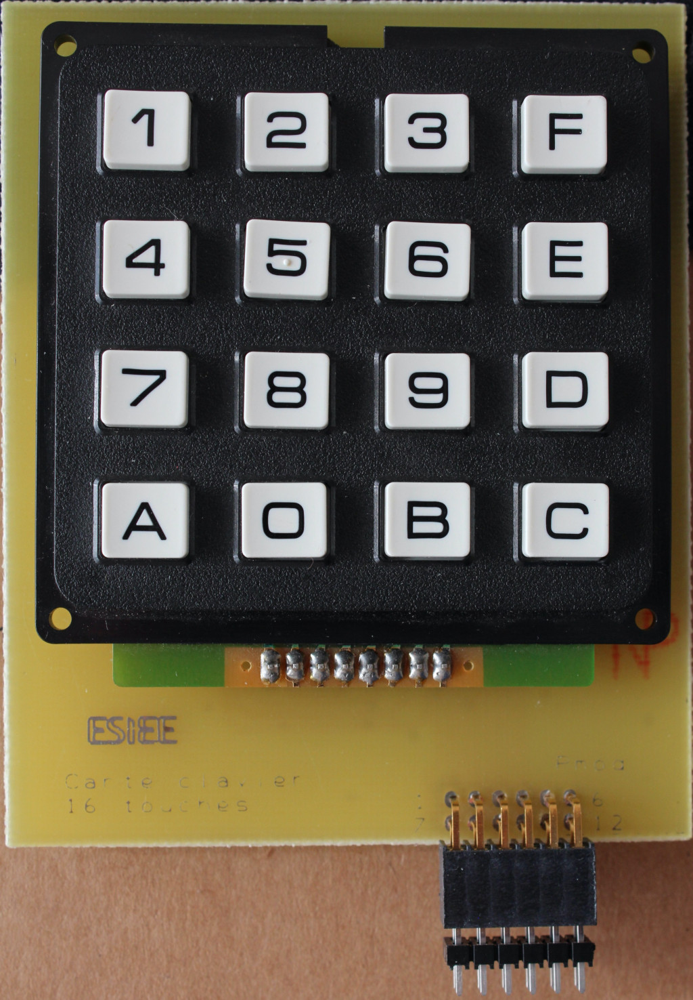
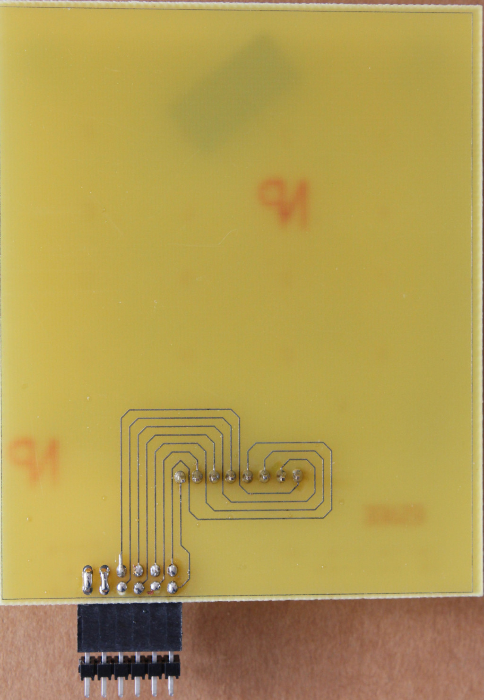
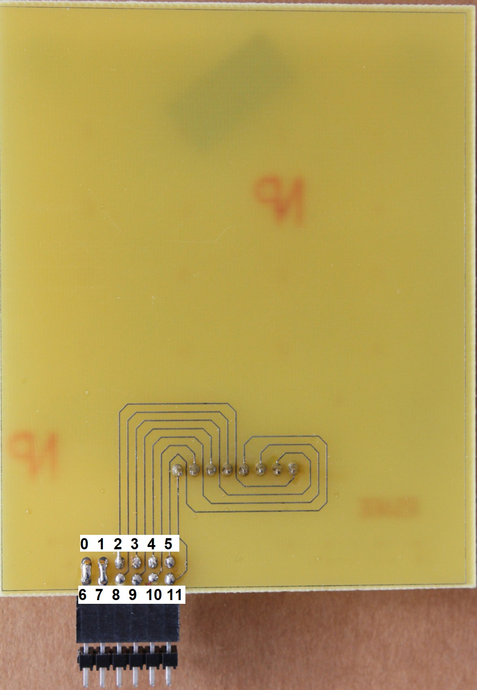
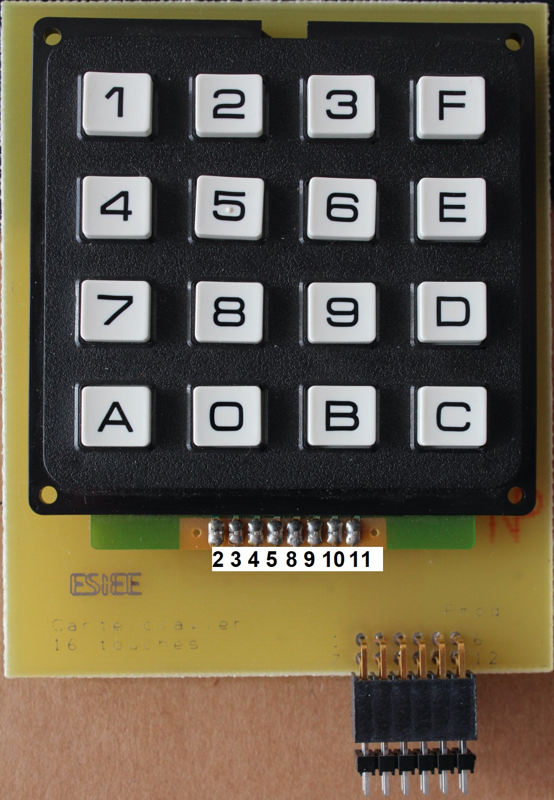

# Keypad Sniffer

> Le code d'accès d'un centre militaire de télécommunications est saisi sur un clavier. Un agent a accédé au matériel (Cf. photos face avant et face arrière du clavier) et a inséré un dispositif pour enregister les données binaires qui transitent sur le connecteur du clavier. Le fichier joint (keypad_sniffer.txt) comprend les données binaires (échantillonnées à une fréquence de 15 kHz) au moment où une personne autorisée rentrait le code d'accès. Retrouvez le code d'accès.
>
> Le flag est de la forme DGSESIEE{X} où X est le code saisi

`keypad_sniffer.txt` contient un grand nombre de lignes avec 12 bits sur chaque ligne.

On a également accès aux deux images suivantes:




## A quoi correspondent les bits

Sur les images on remarque qu'il y a 12 pins qui permettent de connecter le clavier. Chaque bit d'une ligne du fichier correspond donc à un des pin.

Grâce à la vue de dos, on voit que seulement 8 bits parmi les 12 sont intéressants et connectés au clavier, les 4 bits restants sont constants et connectés deux à deux.

Grâce au code Python suivant, on détecte quels sont ceux qui ne sont pas intéressants:

```python
constant = [True]*12
initial = "101111100111" # Première ligne du fichier

with open("keypad_sniffer.txt", "r") as f:
    for l in f:
        for i in range(12):
            if initial[i] != l[i]:
                constant[i] = False

print(constant)
```

On obtient que les bits 0, 1, 6 et 7 sont constants. De plus, `bit 0 = bit 6 = 1` et `bit 1 = bit 7 = 0`. Il est donc raisonnable de penser que les bits correspondent aux pins dans l'ordre suivant:



Grâce à la vue de dos, on peut ensuite connecter chaque bit à un pin du clavier.



## Sortie d'un clavier standard

En cherchant sur le net comment marche un tel clavier électronique, on comprend que l'appui d'une touche va changer deux bits: un bit qui correspond à la ligne du bouton enfoncé, et un bit pour la colonne. Cela permet avec 8 bits (4 pour les colonnes et 4 pour les lignes) de connaître quelle touche est enfoncée.


En regardant les valeurs de notre fichier, on voit que les bits sont à 1 au repos et 0 quand enfoncés. Cela nous permet d'avoir le programme de traduction suivant:

```python
touche = {
    "100111100111": "1",
    "101011100111": "4",
    "101101100111": "7",
    "101110100111": "A",
    "100111101011": "2",
    "101011101011": "5",
    "101101101011": "8",
    "101110101011": "0",
    "100111101101": "3",
    "101011101101": "6",
    "101101101101": "9",
    "101110101101": "B",
    "100111101110": "F",
    "101011101110": "E",
    "101101101110": "D",
    "101110101110": "C"

}

password = ""
last_letter = ""
with open("keypad_sniffer.txt", "r") as f:
    for l in f:
        if l.strip() not in touche:
            password += " "
        else:
            password += touche[l.strip()]

print(password)
```

En affichant le résultat, on voit des groupes de lettres et chiffres séparés par des espaces. Simplement supprimer les espaces et les doublons ne marche pas puisqu'on perd les doubles touches. 

Ma solution: définir un key_up comme une suite de 50 espaces.

```python
LIMIT = 50
last_letter = ""
n_espaces = 0
real_password = ""
for x in password:
    if last_letter == "" and x == " ":
        continue
    if last_letter == "":
        real_password += x
        last_letter = x
    elif x == " ":
        n_espaces += 1
        if n_espaces == LIMIT:
            last_letter = ""
            n_espaces = 0
    else:
        n_espaces = 0
print(real_password)
```

Flag: `DGSESIEE{AE78F55C666B23011924}`